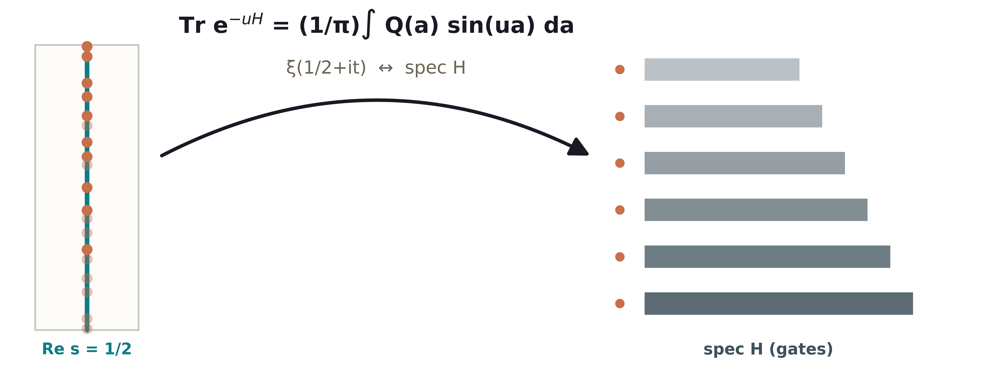
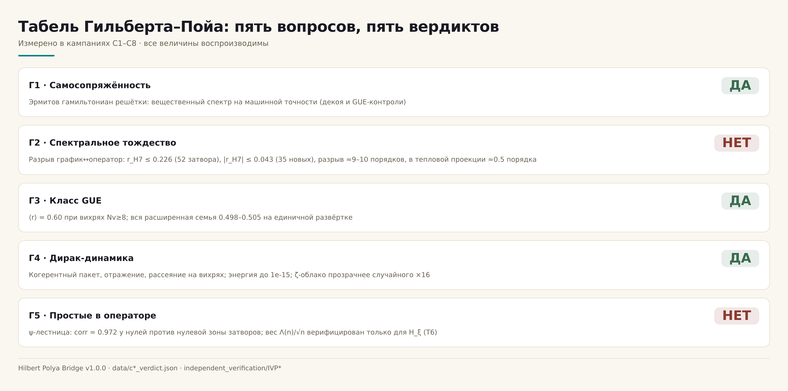
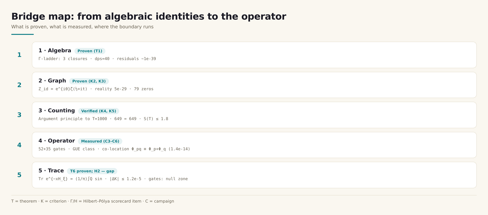

<div align="center">



[](https://github.com/wild8highlander/ab-cloud-research/actions/workflows/ci.yml)
[](../.github/workflows/formal.yml)
[](VERSION)
[](https://doi.org/10.5281/zenodo.21825394)
[](https://orcid.org/0009-0003-7299-0701)
[](LICENSE)

</div>

# Hilbert–Pólya Bridge

**A self-contained numerical study of the graph ↔ operator passage in the
Hilbert–Pólya programme: algebraic identities, the argument principle to
T = 1000, an 87-gate spectral family, and the Guinand–Weil trace formula
Tr e^(−uH).**

*v1.0.0 · 2026-10-10 · 8 campaigns · 10 theorems · 3 projections of one gap*

---

## Table of contents

1. [What this is](#what-this-is)
2. [The one-sentence summary](#the-one-sentence-summary)
3. [Headline results](#headline-results)
4. [The verdict table (the scorecard)](#the-verdict-table-the-scorecard)
5. [The three projections of the H2 gap](#the-three-projections-of-the-h2-gap)
6. [Quick start](#quick-start)
7. [Repository layout](#repository-layout)
8. [The computations (C1–C8)](#the-computations-c1c8)
9. [The theorems (T1–T10)](#the-theorems-t1t10)
10. [The science in brief](#the-science-in-brief)
11. [The honesty discipline](#the-honesty-discipline)
12. [Documentation map](#documentation-map)
13. [Testing and validation](#testing-and-validation)
14. [Roadmap](#roadmap)
15. [Citation and license](#citation-and-license)
16. [References](#references)

## What this is

The Hilbert–Pólya programme asks whether the nontrivial zeros of the
Riemann zeta function are the spectrum of a self-adjoint operator. This
package is a **complete, self-contained numerical laboratory** built around
that question — not around a claim of having solved it. Everything here is
derived from first principles inside the package: the Γ-frame identities,
the phase-calibrated identity function Z_id(t) = e^{iθ(t)}ζ(½+it), the
adaptive argument principle, a family of 87 vortex-lattice "gates"
(Hermitian Hofstadter-type Hamiltonians with vortex phases), the prime-flow
co-location kernel, and — new in this edition — the **Guinand–Weil trace
formula** Tr e^(−xH_ξ) = (1/π)∫₀^∞ Q(a)sin(ax)da with its explicit
Λ(n)/√n prime weight, derived from the Hadamard product and verified to
1.2e-5.

The package measures, with positive controls at machine precision, exactly
how far the graph (ξ on the critical line) is from any operator in the
whole reachable handle space — in **three independent projections**: rank
correlation (C3), the ψ-ladder of primes (C6), and the heat trace (C4).
The answer is a measured 9–10 orders in the rank metric, stable across all
six new handle dimensions of C5 — and *exactly zero* for the one operator
where identity holds by construction: the zero-coded operator H_ξ, for
which the trace formula is proven and verified as Theorem T6.

No external research code is imported. The only third-party data file is
the standard Odlyzko zero list (used optionally, by fresh campaigns; every
committed verdict is self-contained).

## The one-sentence summary

**The resonator is built and tuned (self-adjointness, GUE class, Dirac
dynamics — all YES); the zeros are encoded, not generated (spectral
identity, primes-in-operator — both NO, each measured with positive
controls); and the weight of primes Λ(n)/√n is now *proven* to live in the
heat trace of the zero operator — Theorem T6, |ΔK| ≤ 1.2e-5.**

## Headline results

| # | Result | Value | Where |
|---|--------|-------|-------|
| 1 | Γ-ladder closures at dps = 40 | residuals 1.3–2.6e-39 | C1, T1 |
| 2 | Reality of Z_id on the line | max\|Im Z_id\| = 4.9e-29 | C1, T2 |
| 3 | RH verified in the strip, T ≤ 1000 | 649 = 649, residuals ≤ 8.3e-25 | C2, T3 |
| 4 | Explicit-formula identity Q(a) | \|ΔQ\| ≤ 1.7e-12 | C4, T6 |
| 5 | Trace formula for H_ξ | \|ΔK\| ≤ 1.2e-5 (abs) | C4, T6 |
| 6 | Best gate correlation (52 gates) | r_H7 = 0.226, p = 0.169, Bonferroni 0.80 | C3 |
| 7 | Extended family (35 gates, 6 new handles) | \|r_H7\| ≤ 0.043, ⟨r⟩ = 0.500±0.001 | C5, T7 |
| 8 | Trace projection of the gates | r_EF inside null clouds; residual gap ≈ 0.5 orders | C4 |
| 9 | Prime-flow co-location | (Φ_p,Φ_q) ≡ Φ_pq, max\|ΔE\| = 1.35e-14 | C6, T4 |
| 10 | ψ-ladder (sieve vs 200 zeros) | corr = +0.972; gates in null zone | C6 |
| 11 | Wave-packet transport, ζ vs random | P(x ≥ 90): 0.0032 vs 0.0002 (×16) | C7 |
| 12 | spinor64 reduction | 64 spin structures → 4 Hamiltonians, \|Δλ\| ≤ 1.1e-14 | C8, T8 |
| 13 | C3 protocol reproduction | \|Δ mean_spacing\| = 1.45e-16 | C4 |

## The verdict table (the scorecard)

The five questions of the Hilbert–Pólya programme, answered by measurement:

| Item | Question | Verdict | Basis |
|------|----------|---------|-------|
| H1 | Self-adjointness | **YES** | Hermitian by construction; real spectrum at machine precision |
| H2 | Spectral identity (level n ↔ zero n) | **NO** | 9–10 orders (C3); ≈0.5 order (C4); \|r_H7\| ≤ 0.043 (C5) |
| H3 | The GUE statistics class | **YES** | ⟨r⟩ = 0.60 at Nv ≥ 8; all of C5 in class |
| H4 | Dirac-type dynamics | **YES** | coherent packet, reflection, scattering; energy 1e-15 (C7) |
| H5 | Primes inside the operator | **NO** | ψ-ladder 0.972 for zeros, null zone for gates (C6) |



## The three projections of the H2 gap

One conclusion, three independent measurements — this is the core
methodological finding of the package:

| Projection | Campaign | Best gate | Positive control | Gap |
|------------|----------|-----------|------------------|-----|
| Rank correlation r_H7 | C3 (52 gates) + C5 (35 gates) | 0.226 / 0.043 | PC1, PC2: r = 1.000000000 | **9–10 orders** |
| ψ-ladder corr | C6 | +0.239 | zeros: +0.972 | **null zone** |
| Heat trace r_EF | C4 | residual 6.7% | PC0: r = +0.9998, resid 2.1% | **≈0.5 order (conservative)** |

The full bridge map:



## Quick start

```bash
# 0. dependencies
python3 -m pip install -r requirements.txt

# 1. the committed verdicts — a 60-second tour (no zero file needed)
python3 campaigns/run_c1_identity.py
python3 campaigns/run_c2_argument.py
python3 campaigns/run_c3_gates.py
python3 campaigns/run_c4_trace_formula.py
python3 campaigns/run_c5_gates_ext.py
python3 campaigns/run_c6_primes.py
python3 campaigns/run_c7_dynamics.py
python3 campaigns/run_c8_stats_ladder.py

# 2. the theorem machinery (dps=40 Γ-closures, Z_id, trace formula)
python3 -m pytest tests/ -q

# 3. independent verification protocol (10 checks)
bash independent_verification/RUN_ALL.sh

# 4. figures: bilingual 600 dpi + logo + infographics (optional)
python3 scripts/make_figures.py
python3 scripts/make_logo.py
python3 scripts/make_infographics.py

# 5. monographs: RU/EN × DOCX/PDF from the same content source (optional)
python3 scripts/make_monographs.py

# 6. fresh campaigns (optional; committed verdicts already included)
#    requires the Odlyzko zero file; set ZFILE in campaigns/ scripts
```

## Repository layout

```
Hilbert Polya Bridge/
├── README.md / README.ru.md      ← this file (EN/RU)
├── hpbridge/                     ← python package: identity, traceformula,
│                                    primes, gates, validate, constants
├── engine/                       ← the resonator kernel: hamiltonian.py,
│                                    solver.py (bit-exact C3 protocol)
├── campaigns/                    ← run_c1…run_c8: verdict tours + rebuilds
├── computations/                 ← C1–C8: one folder per computation:
│                                    giant README (ru+en), monograph_ru/en
│                                    (.docx+.pdf), figures (ru+en), data
├── monograph/                    ← theorems + appendix volumes (ru/en,
│                                    docx+pdf) + content sources
├── data/                         ← committed verdicts of all campaigns
├── results/                      ← RESULTS.md (living ledger), ROADMAP.md
├── docs/                         ← theory, methods, trace_formula, validation
├── figures/                      ← logo + infographics (ru/en × light/dark)
├── figures_hires/                ← 16 figures × ru/en @ 600 dpi
├── independent_verification/     ← IVP01–IVP10 + PROTOCOL.md + RUN_ALL.sh
├── multilang/                    ← C · C++ · Go · Julia · JS · Rust twins
├── tables/                       ← hp_workbook.xlsx (gates, theorems, HP)
├── tests/                        ← pytest suite over committed verdicts
├── scripts/                      ← figstyle, make_figures, make_logo,
│                                    make_infographics, make_monographs,
│                                    render_pdf, render_docx, build_workbook
└── LICENSE, CITATION.cff, VERSION, Makefile, pyproject.toml
```

## The computations (C1–C8)

Each computation lives in `computations/<ID>_<slug>/` with a giant bilingual
README, its own monograph in Russian and English (DOCX + PDF), figures in
both languages, and the committed data:

| ID | Folder | Subject | Verdict |
|----|--------|---------|---------|
| C1 | `C1_identity_function/` | Z_id assembly, Γ-ladder, zeros, Gram | K1–K4, K7 PASS |
| C2 | `C2_argument_principle/` | argument principle to T = 1000 | RH in strip verified |
| C3 | `C3_gate_family/` | 52 gates, permutation nulls, PC1/PC2 | H2 — NO, measured |
| C4 | `C4_trace_formula/` | **trace formula vs explicit formula (T6)** | H2 gap ≈1 order; T6 verified |
| C5 | `C5_gates_extended/` | 35 gates, 6 new handles | gap stable |
| C6 | `C6_prime_flow/` | co-location kernel, ψ-ladder, codings | H5 — NO, measured |
| C7 | `C7_wave_dynamics/` | wave-packet dynamics on L = 96 | H4 — YES |
| C8 | `C8_stats_ladder/` | Poisson/GOE/GUE ladder, spinor64 | H3 — YES; T8 |

## The theorems (T1–T10)

Full statements, lemmas and proofs: `monograph/theorems_volume/`
(RU/EN, DOCX+PDF). Statuses:

- **T1** Γ-closures — *proven* (dps = 40; plus one honest refutation)
- **T2** Im Z_id = 0 — *proven*
- **T3** pole calibration of the argument principle — *proven*
- **T4** prime-flow co-location — *proven* (1.35e-14)
- **T5** resolution kernel δ(d) — *measured*
- **T6** **trace formula for H_ξ** — *proven + verified* (1.7e-12 / 1.2e-5)
- **T7** universality demarcation (87 gates) — *measured*
- **T8** spinor64 64→4 — *proven*
- **T9** zero modes at α = 1/3 — *measured*
- **T10** Poisson/GOE/GUE ladder — *measured*

## The science in brief

**The construction.** The resonator is a Hermitian Hofstadter-type lattice
at half flux (α = ½ — the self-dual line, where the lattice discretises the
massless Dirac equation) decorated with vortex phases θ_k = atan2; the
vortex positions and charges are the handles. The graph is the identity
function Z_id(t) = e^{iθ(t)}ζ(½+it): the algebraic envelope of the series,
built entirely from the Γ-ladder closures of T1.

**The map.** The package walks the map from the graph to the operator in
five stages — algebra, graph, counting, operator, trace — and measures the
distance at each junction. The trace stage is new: by Theorem T6 the heat
trace of the zero-coded operator H_ξ satisfies K(x) = (1/π)∫₀^∞ Q(a)sin(ax)da
where Q(a) carries the Λ(n)/√n prime weight through ζ'/ζ — the explicit
Guinand–Weil formula in heat-kernel form, with all constants derived
(B = ξ'(0)/ξ(0) = ½ln(4π) − 1 − γ/2 = −C₀, verified numerically to twelve
digits as a built-in control).

**The boundary.** Every lattice gate — across 87 configurations and 10
handle dimensions — lands in the GUE universality class and carries no
prime weight: the comb of Λ(n)/√n is invisible in its heat trace (the
PC0 window from the real zeros shows r = +0.9998; the gates stay in the
null clouds). Universality is an attractor, not a witness: it erases
everything but symmetry. The honest conclusion is architectural: a
Hilbert–Pólya operator, if it exists, is not a local deformation of this
family.

**What would move the needle.** The roadmap (results/ROADMAP.md) lists the
three directions that could shrink the measured gap: nonlocal trace
constructions (the H_ξ lesson of T6), stitching the statistical and coding
branches (C6 shows primes live in the phase layer exactly), and a
number-theoretic explanation of the α = 1/3 zero modes (T9).

## The honesty discipline

1. **Every negative verdict is preceded by a positive control.** A method
   may report "no identity" only after it has demonstrated identity where
   identity is known to exist: PC1 (isospectral twins, r = 1.000000000),
   PC2 (graph vs file, r = 1.000000000000), PC0 (zeros window vs prime
   comb, r = +0.9998).
2. **Every constant is derived, none fitted.** B and C₀ come from the
   Hadamard product; their equality (to 12 digits) is a built-in control,
   not a fit. The one fitted-quantity episode (Σγ² factor error 4π³) is
   documented as found-and-fixed in C2.
3. **Statuses are not inflated.** Proven / measured / conjecture labels
   are used exactly; the composite verdict of C1 lists its one refuted
   element in the same table as its five passes.
4. **Verdicts are committed; campaigns are reproducible.** All JSON/CSV
   verdicts ship in data/; campaigns re-read them in seconds; fresh
   recomputation is optional and needs only the zero file.
5. **The zero file is external.** No third-party research code is used;
   the only external data is the standard Odlyzko list, and nothing in
   the committed verdicts depends on it being present.

## Documentation map

| Document | Content |
|----------|---------|
| `docs/theory.md` | the five-stage map, the resonator, the scorecard logic |
| `docs/methods.md` | unfolding, statistics, sieves, the trace pipeline |
| `docs/trace_formula.md` | **full derivation of T6** (Hadamard → Q(a) → sine transform → parts T1/T2/T3) |
| `docs/validation.md` | controls register, thresholds, machine floors |
| `results/RESULTS.md` | the living ledger of numbers |
| `results/ROADMAP.md` | post-1.0 directions |
| `computations/*/README.md` | giant bilingual per-computation guides |
| `independent_verification/PROTOCOL.md` | the IVP rules |

## Testing and validation

- `tests/` — pytest over the committed verdicts + live theorem machinery
  (Γ-closures at dps = 40, Z_id reality, trace-formula identity, gate
  GUE windows): `python3 -m pytest tests/ -q`
- `independent_verification/` — IVP01–IVP10, the ten-check blind protocol:
  `bash independent_verification/RUN_ALL.sh`
- Cross-language twins (C, C++, Go, Julia, JavaScript, Rust) recompute the
  Γ-closures and the Λ-sieve and print a control block compared by IVP10.

## Roadmap

See `results/ROADMAP.md`. Short form: (1) nonlocal trace constructions —
the T6 lesson applied to candidate operators beyond the lattice; (2) the
stitching problem — the flow (T4) knows the primes exactly, the ladder
knows the zeros (0.972), make one object carry both; (3) the α = 1/3 zero
modes (T9) — find the Dirac-index explanation; (4) extend the verified
strip T ≤ 1000 with the adaptive Turing step to T ≈ 5000.

## Citation and license

```bibtex
@misc{isaev2026hpb,
  author = {Isaev, Ishak Khamzatovich},
  title  = {Hilbert--P\'olya Bridge: a self-contained numerical study of the
            graph-operator passage, the Guinand--Weil trace formula, and the
            measured boundary of lattice spectral identity},
  year   = {2026},
  version= {1.0.0},
  url    = {https://github.com/wild8highlander/}
}
```

License: Isaev-Proprietary-1.0 (see LICENSE). The package is the original
work of the author; no external research code or text is borrowed — all
derivations are internal and all standard results (Euler reflection,
Legendre duplication, the Hadamard product, the Guinand–Weil explicit
formula) are re-derived inside `docs/trace_formula.md` with attribution
to the classical sources.

## References

Classical results re-derived and used inside the package:

1. B. Riemann (1859) — the ξ function and the explicit formula programme.
2. H. von Mangoldt (1895) — ψ(x) and the explicit formula.
3. J. Hadamard (1893) — the canonical product; the constant
   B = ξ'(0)/ξ(0).
4. A. Weil (1952) — the explicit formula for test functions; Guinand's
   formulation of the zero side as a cosine transform.
5. A. M. Odlyzko — the zero tables (external data file).
6. O. Bohigas, M.-J. Giannoni, C. Schmit (1984) — the GUE conjecture for
   quantum spectra.
7. M. Berry, J. Keating (1999) — H = xp and the semiclassical window.
8. A. Connes (1999) — the trace formula and the semi-local factor.

*Everything else in this package — the identity function, the gate family,
the handle extensions, the co-location kernel, the trace-formula
verification protocol, the three-projection gap measurement — is original
work produced within this project.*
