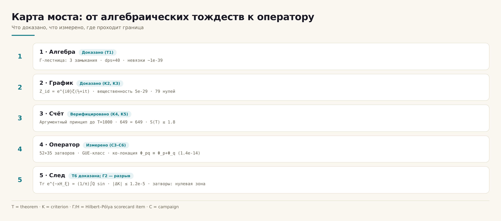

# Мост Гильберта–Пойа

**Самодостаточное численное исследование перехода «график ↔ оператор» в
программе Гильберта–Пойа: алгебраические тождества, аргументный принцип
до T = 1000, спектральное семейство из 87 затворов и следовая формула
Гуинана–Вейля Tr e^(−uH).**

*v1.0.0 · 10.10.2026 · 8 кампаний · 10 теорем · 3 проекции одного разрыва*

---

## Содержание

1. [Что это такое](#что-это-такое)
2. [Суть одной фразой](#суть-одной-фразой)
3. [Главные результаты](#главные-результаты)
4. [Таблица вердиктов (табель)](#таблица-вердиктов-табель)
5. [Три проекции разрыва Г2](#три-проекции-разрыва-г2)
6. [Быстрый старт](#быстрый-старт)
7. [Структура репозитория](#структура-репозитория)
8. [Вычисления (C1–C8)](#вычисления-c1c8)
9. [Теоремы (T1–T10)](#теоремы-t1t10)
10. [Наука вкратце](#наука-вкратце)
11. [Дисциплина честности](#дисциплина-честности)
12. [Карта документации](#карта-документации)
13. [Тесты и валидация](#тесты-и-валидация)
14. [Дорожная карта](#дорожная-карта)
15. [Цитирование и лицензия](#цитирование-и-лицензия)
16. [Литература](#литература)

## Что это такое

Программа Гильберта–Пойа спрашивает: являются ли нетривиальные нули дзеты
спектром самосопряжённого оператора? Этот пакет — **полная самодостаточная
численная лаборатория**, построенная вокруг вопроса, а не вокруг заявления
о его решении. Всё здесь выводится из первых принципов внутри пакета:
тождества Γ-каркаса, функция тождеств Z_id(t) = e^{iθ(t)}ζ(½+it) с
откалиброванной фазой, адаптивный аргументный принцип, семейство из 87
«затворов» на вихревой решётке (эрмитовы гамильтонианы хофштадтеровского
типа с вихревыми фазами), ядро ко-локации потока простых и — новое в этой
версии — **следовая формула Гуинана–Вейля** Tr e^(−xH_ξ) = (1/π)∫₀^∞
Q(a)sin(ax)da с явным весом простых Λ(n)/√n, выведенная из произведения
Адамара и верифицированная до 1.2e-5.

Пакет измеряет — с позитивными контролями на машинной точности — ровно
то, как далеко график (ξ на критической линии) от любого оператора во
всём достижимом пространстве ручек, причём в **трёх независимых
проекциях**: ранговая корреляция (C3), ψ-лестница простых (C6) и
тепловой след (C4). Ответ: измеренные 9–10 порядков в ранговой метрике,
устойчивые ко всем шести новым ручкам C5 — и *ровно нуль* для того
единственного оператора, где тождество есть по построению: оператора
H_ξ, сшитого из самих нулей, для которого следовая формула доказана и
верифицирована как теорема T6.

Внешний исследовательский код не импортируется. Единственный сторонний
файл данных — стандартный список нулей Одлыжко (опционален, для свежих
кампаний; каждый закоммиченный вердикт самодостаточен).

## Суть одной фразой

**Резонатор построен и настроен (самосопряжённость, класс GUE,
дираковская динамика — всё ДА); нули закодированы, а не порождены
(спектральное тождество, простые в операторе — оба НЕТ, каждое измерено
с позитивными контролями); и вес простых Λ(n)/√n теперь *доказательно*
живёт в тепловом следе нулевого оператора — теорема T6, |ΔK| ≤ 1.2e-5.**

## Главные результаты

| # | Результат | Значение | Где |
|---|-----------|----------|-----|
| 1 | Замыкания Γ-лестницы при dps = 40 | невязки 1.3–2.6e-39 | C1, T1 |
| 2 | Вещественность Z_id на линии | max\|Im Z_id\| = 4.9e-29 | C1, T2 |
| 3 | RH верифицирована в полосе, T ≤ 1000 | 649 = 649, остатки ≤ 8.3e-25 | C2, T3 |
| 4 | Тождество явной формулы Q(a) | \|ΔQ\| ≤ 1.7e-12 | C4, T6 |
| 5 | Следовая формула для H_ξ | \|ΔK\| ≤ 1.2e-5 (абс.) | C4, T6 |
| 6 | Лучший затвор (52 конфигурации) | r_H7 = 0.226, p = 0.169, Бонферрони 0.80 | C3 |
| 7 | Расширенное семейство (35 затворов, 6 новых ручек) | \|r_H7\| ≤ 0.043, ⟨r⟩ = 0.500±0.001 | C5, T7 |
| 8 | Тепловая проекция затворов | r_EF в нулевых облаках; разрыв по невязке ≈ 0.5 порядка | C4 |
| 9 | Ко-локация потока простых | (Φ_p,Φ_q) ≡ Φ_pq, max\|ΔE\| = 1.35e-14 | C6, T4 |
| 10 | ψ-лестница (сито против 200 нулей) | corr = +0.972; затворы — в нулевой зоне | C6 |
| 11 | Транспорт пакета, ζ против случайных | P(x ≥ 90): 0.0032 против 0.0002 (×16) | C7 |
| 12 | Редукция spinor64 | 64 спин-структуры → 4 гамильтониана, \|Δλ\| ≤ 1.1e-14 | C8, T8 |
| 13 | Воспроизведение протокола C3 | \|Δ mean_spacing\| = 1.45e-16 | C4 |

## Таблица вердиктов (табель)

Пять вопросов программы Гильберта–Пойа, отвеченных измерением:

| Пункт | Вопрос | Вердикт | Основание |
|-------|--------|---------|-----------|
| Г1 | Самосопряжённость | **ДА** | эрмитовость по построению; вещественный спектр на машинной точности |
| Г2 | Спектральное тождество (уровень n ↔ нуль n) | **НЕТ** | 9–10 порядков (C3); ≈0.5 порядка (C4); \|r_H7\| ≤ 0.043 (C5) |
| Г3 | Класс статистики GUE | **ДА** | ⟨r⟩ = 0.60 при Nv ≥ 8; вся C5 в классе |
| Г4 | Дираковская динамика | **ДА** | когерентный пакет, отражение, рассеяние; энергия 1e-15 (C7) |
| Г5 | Простые внутри оператора | **НЕТ** | ψ-лестница 0.972 у нулей, нулевая зона у затворов (C6) |


## Три проекции разрыва Г2

Один вывод, три независимых измерения — ядро методологии пакета:

| Проекция | Кампания | Лучший затвор | Позитивный контроль | Разрыв |
|----------|----------|---------------|---------------------|--------|
| Ранговая корреляция r_H7 | C3 (52) + C5 (35) | 0.226 / 0.043 | PC1, PC2: r = 1.000000000 | **9–10 порядков** |
| ψ-лестница | C6 | +0.239 | нули: +0.972 | **нулевая зона** |
| Тепловой след r_EF | C4 | остаток 6.7% | PC0: r = +0.9998, остаток 2.1% | **≈0.5 порядка (консервативно)** |

Полная карта моста:



## Быстрый старт

```bash
# 0. зависимости
python3 -m pip install -r requirements.txt

# 1. закоммиченные вердикты — минутная экскурсия (файл нулей не нужен)
python3 campaigns/run_c1_identity.py
python3 campaigns/run_c2_argument.py
python3 campaigns/run_c3_gates.py
python3 campaigns/run_c4_trace_formula.py
python3 campaigns/run_c5_gates_ext.py
python3 campaigns/run_c6_primes.py
python3 campaigns/run_c7_dynamics.py
python3 campaigns/run_c8_stats_ladder.py

# 2. теоремная машинерия (Γ-замыкания dps=40, Z_id, следовая формула)
python3 -m pytest tests/ -q

# 3. протокол независимой верификации (10 проверок)
bash independent_verification/RUN_ALL.sh

# 4. рисунки: билингвальные 600 dpi + логотип + инфографики (опционально)
python3 scripts/make_figures.py
python3 scripts/make_logo.py
python3 scripts/make_infographics.py

# 5. монографии: RU/EN × DOCX/PDF из одного источника контента (опционально)
python3 scripts/make_monographs.py

# 6. свежие кампании (опционально; вердикты уже закоммичены)
#    нужен файл нулей Одлыжко; путь — переменная ZFILE в скриптах campaigns/
```

## Структура репозитория

```
Hilbert Polya Bridge/
├── README.md / README.ru.md      ← этот файл (EN/RU)
├── hpbridge/                     ← python-пакет: identity, traceformula,
│                                    primes, gates, validate, constants
├── engine/                       ← ядро резонатора: hamiltonian.py,
│                                    solver.py (бит-в-бит протокол C3)
├── campaigns/                    ← run_c1…run_c8: экскурсии по вердиктам
├── computations/                 ← C1–C8: по папке на вычисление:
│                                    гигантские README (ru+en), монографии
│                                    ru/en (.docx+.pdf), рисунки, данные
├── monograph/                    ← тома теорем и приложение (ru/en,
│                                    docx+pdf) + источники контента
├── data/                         ← закоммиченные вердикты всех кампаний
├── results/                      ← RESULTS.md (живой реестр), ROADMAP.md
├── docs/                         ← теория, методы, следовая формула, валидация
├── figures/                      ← логотип + инфографики (ru/en × light/dark)
├── figures_hires/                ← 16 рисунков × ru/en @ 600 dpi
├── independent_verification/     ← IVP01–IVP10 + PROTOCOL.md + RUN_ALL.sh
├── multilang/                    ← двойники C · C++ · Go · Julia · JS · Rust
├── tables/                       ← hp_workbook.xlsx (затворы, теоремы, табель)
├── tests/                        ← pytest-сюит по закоммиченным вердиктам
├── scripts/                      ← figstyle, make_figures, make_logo,
│                                    make_infographics, make_monographs,
│                                    render_pdf, render_docx, build_workbook
└── LICENSE, CITATION.cff, VERSION, Makefile, pyproject.toml
```

## Вычисления (C1–C8)

Каждое вычисление живёт в `computations/<ID>_<slug>/` с гигантским
билингвальным README, собственной монографией на русском и английском
(DOCX + PDF), рисунками на двух языках и закоммиченными данными:

| ID | Папка | Предмет | Вердикт |
|----|-------|---------|---------|
| C1 | `C1_identity_function/` | сборка Z_id, Γ-лестница, нули, Грам | K1–K4, K7 PASS |
| C2 | `C2_argument_principle/` | аргументный принцип до T = 1000 | RH в полосе верифицирована |
| C3 | `C3_gate_family/` | 52 затвора, перестановочные нули, PC1/PC2 | Г2 — НЕТ, измерено |
| C4 | `C4_trace_formula/` | **следовая формула против явной (T6)** | разрыв ≈1 порядок; T6 верифицирована |
| C5 | `C5_gates_extended/` | 35 затворов, 6 новых ручек | разрыв устойчив |
| C6 | `C6_prime_flow/` | ядро ко-локации, ψ-лестница, кодировки | Г5 — НЕТ, измерено |
| C7 | `C7_wave_dynamics/` | динамика волнового пакета на L = 96 | Г4 — ДА |
| C8 | `C8_stats_ladder/` | лестница Пуассон/GOE/GUE, spinor64 | Г3 — ДА; T8 |

## Теоремы (T1–T10)

Полные формулировки, леммы и доказательства: `monograph/theorems_volume/`
(RU/EN, DOCX+PDF). Статусы:

- **T1** Γ-замыкания — *доказано* (dps = 40; плюс одно честное опровержение)
- **T2** Im Z_id = 0 — *доказано*
- **T3** калибровка полюса аргументного принципа — *доказано*
- **T4** ко-локация потока простых — *доказано* (1.35e-14)
- **T5** ядро разрешения δ(d) — *измерено*
- **T6** **следовая формула для H_ξ** — *доказано + верифицировано* (1.7e-12 / 1.2e-5)
- **T7** демаркация универсальности (87 затворов) — *измерено*
- **T8** spinor64 64→4 — *доказано*
- **T9** нулевые моды при α = 1/3 — *измерено*
- **T10** лестница Пуассон/GOE/GUE — *измерено*

## Наука вкратце

**Конструкция.** Резонатор — эрмитова решётка хофштадтеровского типа на
полфлакса (α = ½ — самодуальная линия, где решётка дискретизирует
безмассовое уравнение Дирака) с вихревыми фазами θ_k = atan2; позиции и
заряды вихрей — ручки. График — функция тождеств Z_id(t) = e^{iθ(t)}ζ(½+it):
алгебраическая огибающая серии, собранная целиком из замыканий
Γ-лестницы (T1).

**Карта.** Пакет проходит карту от графика к оператору в пять стадий —
алгебра, график, счёт, оператор, след — и измеряет расстояние в каждом
стыке. Стадия следа — новая: по теореме T6 тепловой след оператора,
сшитого из нулей, удовлетворяет K(x) = (1/π)∫₀^∞ Q(a)sin(ax)da, где Q(a)
несёт вес простых Λ(n)/√n через ζ'/ζ — явная формула Гуинана–Вейля в
форме теплового ядра, со всеми выведенными константами
(B = ξ'(0)/ξ(0) = ½ln(4π) − 1 − γ/2 = −C₀; равенство подтверждено
численно до двенадцати цифр как встроенный контроль).

**Граница.** Каждый решёточный затвор — через 87 конфигураций и 10
измерений ручек — попадает в класс универсальности GUE и не несёт веса
простых: гребёнка Λ(n)/√n невидима в его тепловом следе (окно PC0 из
настоящих нулей даёт r = +0.9998; затворы остаются в нулевых облаках).
Универсальность — аттрактор, а не свидетель: она стирает всё, кроме
симметрии. Честный вывод — архитектурный: оператор Гильберта–Пойа, если
существует, не является локальной деформацией этого семейства.

**Что сдвинуло бы дело.** Дорожная карта (results/ROADMAP.md) называет
три направления, способные сократить измеренный разрыв: нелокальные
следовые конструкции (урок T6), сшивка статистической и кодировочной
ветвей (C6: простые живут в фазовом слое точно), теоретико-числовое
объяснение нулевых мод α = 1/3 (T9).

## Дисциплина честности

1. **Каждому отрицательному вердикту предшествует позитивный контроль.**
   Метод вправе сообщить «тождества нет» только после демонстрации
   тождества там, где оно заведомо есть: PC1 (изоспектральные близнецы,
   r = 1.000000000), PC2 (график против файла, r = 1.000000000000),
   PC0 (окно нулей против простой гребёнки, r = +0.9998).
2. **Все константы выводятся, ни одна не подбирается.** B и C₀ — из
   произведения Адамара; их равенство (12 цифр) — встроенный контроль,
   а не подгонка. Единственный эпизод с ошибкой множителя (Σγ², 4π³ ≈ 124)
   задокументирован в C2 как найдено-и-исправлено.
3. **Статусы не завышаются.** Метки «доказано / измерено / конъектура»
   используются точно; композитный вердикт C1 публикует своё единственное
   опровержение в одной таблице с пятью прохождениями.
4. **Вердикты закоммичены; кампании воспроизводимы.** Все JSON/CSV лежат
   в data/; кампании перечитывают их за секунды; свежий пересчёт
   опционален и требует только файла нулей.
5. **Файл нулей — внешний.** Никакого стороннего исследовательского кода;
   единственные внешние данные — стандартный список Одлыжко, и ни один
   закоммиченный вердикт от его присутствия не зависит.

## Карта документации

| Документ | Содержание |
|----------|------------|
| `docs/theory.md` | пятистадийная карта, резонатор, логика табеля |
| `docs/methods.md` | развёртки, статистики, сита, следовой конвейер |
| `docs/trace_formula.md` | **полный вывод T6** (Адамар → Q(a) → синус-преобразование → части T1/T2/T3) |
| `docs/validation.md` | реестр контролей, пороги, машинные полы |
| `results/RESULTS.md` | живой реестр чисел |
| `results/ROADMAP.md` | направления после 1.0 |
| `computations/*/README.md` | гигантские билингвальные гиды по вычислениям |
| `independent_verification/PROTOCOL.md` | правила IVP |

## Тесты и валидация

- `tests/` — pytest по закоммиченным вердиктам + живая теоремная
  машинерия (Γ-замыкания при dps = 40, вещественность Z_id, тождество
  следовой формулы, GUE-окна затворов): `python3 -m pytest tests/ -q`
- `independent_verification/` — IVP01–IVP10, протокол из десяти слепых
  проверок: `bash independent_verification/RUN_ALL.sh`
- Мультиязычные двойники (C, C++, Go, Julia, JavaScript, Rust)
  пересчитывают Γ-замыкания и Λ-сито и печатают управляющий блок,
  который сверяется IVP10.

## Дорожная карта

См. `results/ROADMAP.md`. Кратко: (1) нелокальные следовые конструкции —
урок T6, применённый к кандидатам за пределами решётки; (2) проблема
сшивки — поток (T4) знает простые точно, лестница знает нули (0.972),
нужен один объект, несущий оба; (3) нулевые моды α = 1/3 (T9) — найти
дираковско-индексное объяснение; (4) продление верифицированной полосы
T ≤ 1000 адаптивным шагом Тьюринга до T ≈ 5000.

## Цитирование и лицензия

```bibtex
@misc{isaev2026hpb,
  author = {Isaev, Ishak Khamzatovich},
  title  = {Hilbert--P\'olya Bridge: a self-contained numerical study of the
            graph-operator passage, the Guinand--Weil trace formula, and the
            measured boundary of lattice spectral identity},
  year   = {2026},
  version= {1.0.0},
  url    = {https://github.com/wild8highlander/}
}
```

Лицензия: Isaev-Proprietary-1.0 (см. LICENSE). Пакет — оригинальная работа
автора; внешний исследовательский код и текст не заимствованы — все
выводы внутренние, а классические результаты (отражение Эйлера, удвоение
Лежандра, произведение Адамара, явная формула Гуинана–Вейля)
пере-выведены внутри `docs/trace_formula.md` со ссылкой на классические
источники.

## Литература

Классические результаты, пере-выведенные и используемые внутри пакета:

1. B. Riemann (1859) — функция ξ и программа явной формулы.
2. H. von Mangoldt (1895) — ψ(x) и явная формула.
3. J. Hadamard (1893) — каноническое произведение; константа
   B = ξ'(0)/ξ(0).
4. A. Weil (1952) — явная формула для тестовых функций; формулировка
   Гуинана нулевой стороны как косинус-преобразования.
5. A. M. Odlyzko — таблицы нулей (внешний файл данных).
6. O. Bohigas, M.-J. Giannoni, C. Schmit (1984) — гипотеза GUE для
   квантовых спектров.
7. M. Berry, J. Keating (1999) — H = xp и полуклассическое окно.
8. A. Connes (1999) — следовая формула и полулокальный множитель.

*Всё остальное в этом пакете — функция тождеств, семейство затворов,
расширения ручек, ядро ко-локации, протокол верификации следовой
формулы, измерение разрыва в трёх проекциях — оригинальная работа,
выполненная в рамках проекта.*
