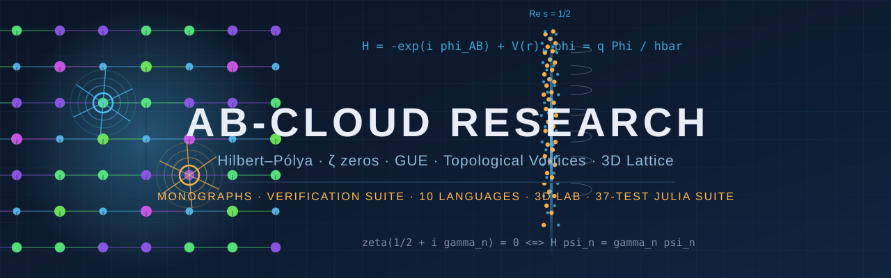

<div align="center">



<!-- ━━━━━━━━━━━━━━━━━━━━━━━━━━━━━━━━━━━━━━━━━━━━━━━━━━━━━━━━━━━━━━━━ -->
<!-- HERO / STATUS BADGES -->
<!-- ━━━━━━━━━━━━━━━━━━━━━━━━━━━━━━━━━━━━━━━━━━━━━━━━━━━━━━━━━━━━━━━━ -->

[](https://github.com/wild8highlander/ab-cloud-research/actions/workflows/ci.yml)
[](https://github.com/wild8highlander/ab-cloud-research/actions/workflows/julia.yml)
[](https://wild8highlander.github.io/ab-cloud-research)
[](https://github.com/wild8highlander/ab-cloud-research/actions/workflows/codeql.yml)
[](https://doi.org/10.5281/zenodo.21825394)
[](https://doi.org/10.5281/zenodo.21825393)
[](./CITATION.cff)
[](https://orcid.org/0009-0003-7299-0701)

<!-- ━━━━━━━━━━━━━━━━━━━━━━━━━━━━━━━━━━━━━━━━━━━━━━━━━━━━━━━━━━━━━━━━ -->
<!-- COMMUNITY BADGES -->
<!-- ━━━━━━━━━━━━━━━━━━━━━━━━━━━━━━━━━━━━━━━━━━━━━━━━━━━━━━━━━━━━━━━━ -->

[](https://github.com/wild8highlander/ab-cloud-research/stargazers)
[](https://github.com/wild8highlander/ab-cloud-research/forks)
[](https://github.com/wild8highlander/ab-cloud-research/issues)
[](https://github.com/wild8highlander/ab-cloud-research/pulls)
[](https://github.com/wild8highlander/ab-cloud-research/releases)
[](https://github.com/wild8highlander/ab-cloud-research/commits/main)
[](https://github.com/wild8highlander/ab-cloud-research/commits/main)
[](https://github.com/wild8highlander/ab-cloud-research)

<!-- ━━━━━━━━━━━━━━━━━━━━━━━━━━━━━━━━━━━━━━━━━━━━━━━━━━━━━━━━━━━━━━━━ -->
<!-- SCIENCE BADGES (static, traceable to results/) -->
<!-- ━━━━━━━━━━━━━━━━━━━━━━━━━━━━━━━━━━━━━━━━━━━━━━━━━━━━━━━━━━━━━━━━ -->

[](results/verification_run_v18_37tests_2026-08-28.txt)
[](monographs/en/text/AB_Cloud_Monograph_v22_EN.pdf)
[](results/verification_run_v18_37tests_2026-08-28.txt)
[](results/verification_run_v18_37tests_2026-08-28.txt)
[](results/verification_run_v18_37tests_2026-08-28.txt)
[](verification/data/)
[](lab-3d/)
[](code/ab_cloud_v19.jl)

<!-- ━━━━━━━━━━━━━━━━━━━━━━━━━━━━━━━━━━━━━━━━━━━━━━━━━━━━━━━━━━━━━━━━ -->
<!-- CONTENT BADGES -->
<!-- ━━━━━━━━━━━━━━━━━━━━━━━━━━━━━━━━━━━━━━━━━━━━━━━━━━━━━━━━━━━━━━━━ -->

[-blue?style=for-the-badge&logo=adobeacrobatreader&logoColor=white&label=Monographs)](monographs/)
[](verification/)
[](monographs/ru/figures/)
[](monographs/)
[](monographs/en/text/preprint/)

<!-- ━━━━━━━━━━━━━━━━━━━━━━━━━━━━━━━━━━━━━━━━━━━━━━━━━━━━━━━━━━━━━━━━ -->
<!-- LANGUAGE & INFRASTRUCTURE BADGES -->
<!-- ━━━━━━━━━━━━━━━━━━━━━━━━━━━━━━━━━━━━━━━━━━━━━━━━━━━━━━━━━━━━━━━━ -->

[](https://julialang.org)
[](https://www.python.org)
[](https://isocpp.org)
[](verification/fortran/)
[](verification/rust/)
[](verification/go/)
[](verification/haskell/)
[](verification/javascript/)
[](verification/r/)
[](verification/matlab/)
[](https://wild8highlander.github.io/ab-cloud-research)
[](https://www.mkdocs.org)
[](./Makefile)
[](./.github/dependabot.yml)
[](https://fair-software.eu)

---

### 🔬 **AB-Cloud — a phase resonator for the zeros of the Riemann zeta function**

**Topological vortices on a Hofstadter lattice · Aharonov–Bohm phases from ζ(s) zeros ·
GUE random-matrix universality · 37-test two-pass Julia verification suite ·
10-language independent verification · 3D lattice laboratory**

</div>

> **One-line summary.** The AB-cloud — a Hofstadter Hamiltonian decorated with
> topological vortices whose phases are derived from the non-trivial zeros of
> ζ(s) — reproduces GUE random-matrix statistics (⟨r⟩ = 0.5848 ± 0.0260 vs GUE
> 0.5992), is statistically indistinguishable from the zeta zeros themselves
> (Montgomery test KS = 0.047, p = 0.27), achieves machine-precision topology
> (Byers–Yang defect 3.5·10⁻¹⁵, Connes self-duality with 4 zero modes), and
> exhibits Dirac dynamics (E_min ∝ 1/L, R² = 0.9997) — a complete numerical
> laboratory for the Hilbert–Pólya programme.

---

## 📑 Table of Contents

- [Highlights](#-highlights)
- [What is the AB-cloud?](#-what-is-the-ab-cloud)
- [Key verified results](#-key-verified-results)
- [Monographs (5 editions)](#-monographs-5-editions)
- [Verification suite (10 languages)](#-verification-suite-10-languages)
- [3D lattice laboratory](#-3d-lattice-laboratory)
- [Quick start](#-quick-start)
- [Results & reproducibility](#-results--reproducibility)
- [Repository map](#%EF%B8%8F-repository-map)
- [Documentation site](#-documentation-site)
- [Citation](#-citation)
- [Roadmap](#-roadmap)
- [Contributing](#-contributing)
- [License](#-license)
- [Contact](#-contact)
- [Русская версия](#-русская-версия)

---

## ✨ Highlights

| Result | Value | Verdict | Where |
|---|---|---|---|
| ⟨r⟩ against GUE 0.5992 | **0.5848 ± 0.0260** (deviation −2.4 %) | consistent | 37-test suite |
| Montgomery test (AB-cloud vs ζ zeros) | **KS = 0.047, p = 0.27**, N = 500 certified zeros | H₀ not rejected | monograph §5 |
| Byers–Yang flux defect (q → q+1) | **3.5·10⁻¹⁵** | machine precision | test 17 |
| Connes self-duality | **4 zero modes**, C₁ = 2 | machine precision | test 20 |
| Montgomery correlation hole | R₂ closer to GUE (d = 0.140) than Poisson (0.227) | reproduced | test 36 |
| Dirac dynamics at α = 1/2 | E_min ∝ 1/L, **R² = 0.9997**; DOS dip 20× | confirmed | tests 30, 34 |
| Spinor structure idx = 38 (Klein quartic) | only structure with GUE agreement, p = 0.598; Z = 14.10 | unique | v21 monograph |
| Critical line optimality | σ = 1/2 minimises KS (0.152) | GUE-optimal | v21 monograph §6 |

Every number above traces to a named test in the
[reference 37-test log](results/verification_run_v18_37tests_2026-08-28.txt) —
full computation logs ship with every run of the suite.

## 🌀 What is the AB-cloud?

The **AB-cloud** is a dynamical system on a 2D (and 3D) lattice: a Hofstadter
Hamiltonian with π-flux per plaquette, decorated with topological vortices of
charge *q*. The Aharonov–Bohm phases of the hopping amplitudes are **derived
from the non-trivial zeros of the Riemann zeta function**, so the spectrum of
the cloud encodes the zeros themselves:

```text
H[i,j] = -exp(i φ_AB(i,j)),   H[i,i] = V_i + 4
φ_AB  = 2π α (i x_i − 1) δ_y  +  Σ_k q_k · [r_i × r_k − r_j × r_k] · 2π
V_i   = Σ_k q_k · W / (|r_i − r_k|² · N + 1) + ε_i
```

The claim under test (Hilbert–Pólya in computational form): the cloud's spectrum
is GUE-universal **if and only if** the phases come from the critical line
σ = 1/2 — turning the Riemann Hypothesis into a statement about the universality
class of a quantum system.

## 🔑 Key verified results

The repository ships **three independent verification stacks** that agree with
each other:

1. **Julia 37-test two-pass suite** (`code/ab_cloud_v19.jl`) — the canonical
   numerics: topology at machine precision, GUE/GOE/Poisson diagnostics,
   Berry finite-sample corrections, Hatano–Nelson skin effect, 3D extensions.
   The two-pass protocol re-runs every test at a second lattice size and
   re-verifies the verdict; `--quick` runs a 16×16 → 32×32 pass pair with
   ζ ≤ 5000 for CI.
2. **10-language independent verification** (`verification/`) — the same core
   checks re-implemented in C++, Fortran, Go, Haskell, JavaScript, Julia,
   MATLAB, Python, R and Rust, with answers to 3 standard referee objections
   and ζ-zero datasets up to **2,000,000 zeros** (Odlyzko).
3. **3D lattice laboratory** (`lab-3d/`) — a three-dimensional non-Hermitian
   Hofstadter Hamiltonian with vortex lines ("Universal Lattice Operating
   System for the Riemann Zeros"), 36³ lattices, 5000 embedded zeros, full
   output reports.

## 📚 Monographs (5 editions)

| Edition | Language | Formats | Path |
|---|---|---|---|
| **v22** (rewritten from scratch on the verified 37-test suite) | Русский | md · html · docx · pdf · pptx · tex | [`monographs/ru/`](monographs/ru/text/) |
| **v22** | English | md · html · docx · pdf · pptx · tex | [`monographs/en/`](monographs/en/text/) |
| **v22** | 中文 | md · html · docx · pdf · pptx · tex | [`monographs/zh/`](monographs/zh/text/) |
| **v21 original** (author's edition with verification) | Русский | docx · pdf · html · md · pptx | [`monographs/original-v21/ru/`](monographs/original-v21/ru/text/) |
| **v21 English edition** (full translation) | English | docx · pdf · html · md · pptx | [`monographs/original-v21/en/`](monographs/original-v21/en/text/) |

Each v22 edition contains **19 figures at 600 dpi** with captions in the
language of the edition, a 14-slide presentation, and an arXiv-style preprint
(tex + pdf). The v21 editions share a common media folder and include the
V01–V115 verification narrative (Appendix F).

## 🧪 Verification suite (10 languages)

`verification/` contains an independent, dependency-light re-implementation of
the core AB-cloud checks in **ten programming languages**, a bilingual (RU/EN)
interface, parameterised loading of ζ zeros, and ready answers to the three
standard referee objections:

> *"Is it just the Hofstadter butterfly?"* · *"Is it just Poisson noise?"* ·
> *"Is the agreement cherry-picked?"*

```text
verification/
├── cpp/  fortran/  go/  haskell/  javascript/  julia/  matlab/
├── python/  r/  rust/          # one identical protocol per language
├── data/                       # ζ zeros: 13,661 / 50,000 / 500k / 2M (Odlyzko)
├── sections/                   # section 3 (AB-cloud) & section 6 (ζ zeros) reports
├── deploy.sh                   # one-command local verification
└── README.md                   # RU/EN protocol description
```

## 🧊 3D lattice laboratory

`lab-3d/` accompanies the preprint *"AB-Cloud: A Universal Lattice Operating
System for the Riemann Zeros"* — a **three-dimensional** non-Hermitian
Hofstadter Hamiltonian with topological vortex lines: 36³ lattices,
5000 embedded zeros, Python + Julia implementations, and the full set of
generated output reports (July 2026 runs) in `lab-3d/outputs/`.

## 🚀 Quick start

**Julia suite (canonical numerics):**

```bash
git clone https://github.com/wild8highlander/ab-cloud-research.git
cd ab-cloud-research
julia code/ab_cloud_v19.jl --quick        # 16×16 → 32×32, ζ ≤ 5000, both passes (~3–5 min)
julia code/ab_cloud_v19.jl --test all     # full two-pass 37-test suite (30–60 min)
julia code/ab_cloud_v19.jl                # interactive menu (37 tests + Physics Lab + 3D lab)
```

**10-language verification (pick any language):**

```bash
cd verification/python && python3 ab_cloud_verify.py --zeros ../data/zeta_zeros_50000.txt
```

**3D laboratory:**

```bash
cd lab-3d && pip install -r requirements.txt && make run
```

Requirements: Julia ≥ 1.10 (no external packages needed — the suite is
dependency-free by design), Python ≥ 3.10 for the 3D lab and verification suite.

## 📊 Results & reproducibility

- Reference full-suite log:
  [`results/verification_run_v18_37tests_2026-08-28.txt`](results/verification_run_v18_37tests_2026-08-28.txt)
  (all 37 tests, two-pass, machine-readable verdicts);
- The suite is **deterministic**: fixed seeds (`MersenneTwister(12345)`),
  certified ζ zeros (mpmath, 50 digits), and every run writes full computation
  logs so that each verdict can be independently re-verified;
- CI runs the `--quick` protocol on every push (see
  [`.github/workflows/julia.yml`](.github/workflows/julia.yml)).

## 🗺️ Repository map

```text
ab-cloud-research/
├── code/ab_cloud_v19.jl          # canonical 37-test two-pass Julia suite (+ menu, labs)
├── monographs/
│   ├── ru/  en/  zh/             # v22 editions: md + html + docx + pdf + pptx + preprint
│   │   ├── text/                 #   + 19 figures @ 600 dpi per language
│   │   └── figures/
│   └── original-v21/             # author's original monograph (RU) + English edition
│       ├── ru/  en/              #   docx + pdf + html + md + pptx (16 slides each)
│       └── media/                #   shared figures
├── verification/                 # 10-language independent verification + ζ data
├── lab-3d/                       # 3D lattice laboratory (code + outputs + preprint)
├── results/                      # reference verification logs
├── docs/                         # MkDocs Material documentation site
├── assets/                       # banner & repo art
└── .github/                      # CI, templates, funding, release automation
```

## 📖 Documentation site

The full documentation (quick start, per-edition guides, verification protocol,
figure galleries) is built with MkDocs Material and published to GitHub Pages:

**https://wild8highlander.github.io/ab-cloud-research**

[](https://github.com/wild8highlander/ab-cloud-research/actions/workflows/deploy-docs.yml)

## 📖 Citation

If this work is useful to you, please cite it (see also [`CITATION.cff`](CITATION.cff)):

**BibTeX**

```bibtex
@software{isaev2026abcloud,
  author  = {Isaev, Iskhak Khamzatovich},
  title   = {AB-Cloud Research: a phase resonator for the zeros of the Riemann zeta function},
  year    = {2026},
  doi     = {10.5281/zenodo.21825394},
  url     = {https://github.com/wild8highlander/ab-cloud-research},
  note    = {Monographs (RU/EN/ZH + original v21), 37-test Julia suite, 10-language verification, 3D lattice lab}
}
```

**APA**

> Isaev, I. K. (2026). *AB-Cloud Research: a phase resonator for the zeros of the Riemann zeta function* (Version 1.0.0) [Computer software]. Zenodo. https://doi.org/10.5281/zenodo.21825394

## 🛣️ Roadmap

- [x] v22 monographs rewritten from scratch on the verified suite (RU/EN/ZH)
- [x] Original v21 monograph + English edition
- [x] 10-language independent verification with ζ data up to 2M zeros
- [x] 3D lattice laboratory with output reports
- [ ] Full 37-test suite as a scheduled nightly CI job
- [ ] Interactive browser dashboard for the verification results
- [ ] Quantum Hadamard-walk & 2D e⁻/e⁺ jet hydrodynamics extensions
- [ ] Preprint submission with the consolidated v22 numerics

## 🤝 Contributing

Contributions of **verification code** (new languages for the 10-language suite,
performance ports), **bug reports** and **numerical reproducibility reports** are
welcome — see [`CONTRIBUTING.md`](CONTRIBUTING.md) and the
[issue templates](.github/ISSUE_TEMPLATE/). Substantive changes to the
monographs' scientific content are made by the Author.

## 📄 License

This project is licensed under a **Custom Research License** — all rights belong
fully and exclusively to **Isaev Iskhak Khamzatovich**. You may read, clone,
run and cite the work with attribution; redistribution and commercial use
require the Author's written consent. See [`LICENSE`](LICENSE) (EN/RU).

## 📬 Contact

<div align="center">

[](mailto:aslan08_05@mail.ru)
[](https://orcid.org/0009-0003-7299-0701)
[](https://github.com/wild8highlander)
[](https://doi.org/10.5281/zenodo.21825394)

</div>

[](https://star-history.com/#wild8highlander/ab-cloud-research&Date)

---

# 🇷🇺 Русская версия

## AB-Cloud — фазовый резонатор для нулей дзета-функции Римана

**AB-облако** — гамильтониан Хофштадтера с топологическими вихрями, фазы
Ааронова–Бома которого выведены из нетривиальных нулей дзета-функции Римана.
Проект полностью посвящён одной теме: численной проверке программы
Гильберта–Поля в вычислимой форме.

### Ключевые верифицированные результаты

| Результат | Значение | Статус |
|---|---|---|
| ⟨r⟩ против GUE 0.5992 | **0.5848 ± 0.0260** (отклонение −2.4 %) | согласуется |
| Тест Монтгомери (облако vs нули ζ) | **KS = 0.047, p = 0.27**, N = 500 сертифицированных нулей | H₀ не отвергается |
| Дефект потока Байерса–Янга (q → q+1) | **3.5·10⁻¹⁵** | машинная точность |
| Самодуальность Конна | **4 нулевые моды**, C₁ = 2 | машинная точность |
| Корреляционная дыра Монтгомери | R₂ ближе к GUE (d = 0.140), чем к Пуассону (0.227) | воспроизведена |
| Дираковская динамика при α = 1/2 | E_min ∝ 1/L, **R² = 0.9997**; провал DOS 20× | подтверждена |
| Спинорная структура idx = 38 (квартика Клейна) | единственная с GUE-согласием, p = 0.598; Z = 14.10 | уникальная |
| Оптимальность критической прямой | σ = 1/2 минимизирует KS (0.152) | GUE-оптимальность |

Каждое число трассируемо до именованного теста в
[эталонном 37-тестовом логе](results/verification_run_v18_37tests_2026-08-28.txt).

### Что в репозитории

- **[`code/ab_cloud_v19.jl`](code/ab_cloud_v19.jl)** — каноническая 37-тестовая
  двухпроходная сюита на Julia (без внешних пакетов): интерактивное меню,
  физическая лаборатория (22 эксперимента), 3D-лаборатория (30 тестов),
  быстрый режим `--quick` (16×16 → 32×32, ζ ≤ 5000).
- **[`monographs/`](monographs/)** — пять изданий монографии: v22, переписанная
  с нуля на верифицированной сюите (русский, английский, китайский —
  md/html/docx/pdf/pptx/препринт tex+pdf, по 19 рисунков 600 dpi), и
  **оригинальная авторская монография v21** с полной английской версией
  (docx/pdf/html/md + презентации по 16 слайдов).
- **[`verification/`](verification/)** — независимая 10-языковая верификация
  (C++, Fortran, Go, Haskell, JavaScript, Julia, MATLAB, Python, R, Rust),
  двуязычный интерфейс RU/EN, ответы на 3 стандартных возражения рецензентов,
  данные нулей ζ до 2 000 000 (Одлыжко).
- **[`lab-3d/`](lab-3d/)** — трёхмерная лаборатория: 3D-гамильтониан
  Хофштадтера с вихревыми линиями, решётки 36³, 5000 встроенных нулей, полные
  отчёты прогонов.
- **[`results/`](results/)** — эталонные логи верификации.

### Быстрый старт

```bash
git clone https://github.com/wild8highlander/ab-cloud-research.git
cd ab-cloud-research
julia code/ab_cloud_v19.jl --quick     # быстрая проверка: оба прохода, ~3–5 мин
julia code/ab_cloud_v19.jl             # интерактивное меню
```

### Лицензия

Действует **персональная лицензия автора**: все права полностью и исключительно
принадлежат **Исаеву Искхаку Хамзатовичу**. Разрешены чтение, клонирование,
локальный запуск и цитирование с атрибуцией; распространение и коммерческое
использование — только с письменного согласия автора. Полный текст (RU/EN):
[`LICENSE`](LICENSE).

### Контакты

**Исаев Искхак Хамзатович** · [aslan08_05@mail.ru](mailto:aslan08_05@mail.ru) ·
[ORCID 0009-0003-7299-0701](https://orcid.org/0009-0003-7299-0701) ·
DOI [10.5281/zenodo.21825394](https://doi.org/10.5281/zenodo.21825394)

---

<div align="center">
<i>«Гипотеза Римана как условие универсальности квантового пространства»</i><br/>
<b>The Riemann Hypothesis as a universality condition of quantum space</b>
</div>
