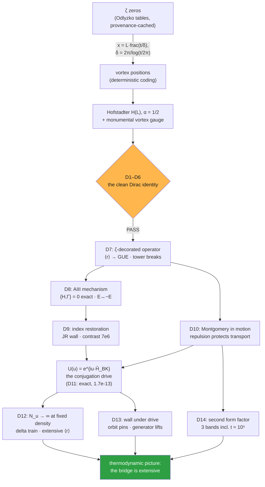

<div align="center">

# ⚛️ AB-Cloud Dirac Laboratory

### *The Dirac skeleton of the AB-Cloud — a verification laboratory connecting the Hofstadter-vortex realization of the Hilbert–Pólya programme to the Dirac equation*

[](#-test-ledger--1414-pass)
[](#-version-history)
[](results/CROSS_VERIFICATION.md)
[-FFB74D?style=for-the-badge&label=D1)](tests/D01_bloch_continuum_limit/)
[](tests/D02_zero_mode_tower/)
[](tests/D03_berry_phase/)
[](tests/D04_relativistic_landau_levels/)
[-0.978%20vs%200.001%20(×977)-FFB74D?style=for-the-badge&label=D5)](tests/D05_klein_tunneling/)
[-FFB74D?style=for-the-badge&label=D6)](tests/D06_zitterbewegung/)
[](tests/D07_zeta_decoration/)
[](tests/D08_chiral_protection/)
[](tests/D09_jr_index_restoration/)
[%3D0.19-2EA043?style=for-the-badge&label=D10)](tests/D10_montgomery_transport/)
[](tests/D11_bk_connes_conjugation/)
[](tests/D12_bk_ladder_infinite_limit/)
[](tests/D13_wall_under_conjugation_drive/)
[%20at%20t~1e5-0.962%20(plateau%20exact)-2EA043?style=for-the-badge&label=D14)](tests/D14_odlyzko_form_factor/)
[](code/)
[](code/)
[](monographs/tex/)
[](tests/)
[](webapp/)

</div>

---

> **One-line summary.** The parent AB-Cloud suite verified Dirac *dynamics* at α = 1/2 (E_min ∝ 1/L, R² = 0.9997).
> This laboratory unpacks it into a complete, cross-verified lattice-Dirac identity: the π-flux lattice **is** a
> discretized massless Dirac equation (v_F = 2t, E₁·L → 4π), its fourfold zero tower is the Dirac torus structure
> (fragile exactly as the index theorem demands), the cone carries Berry phase π exactly, the Landau ladder is
> relativistic (E_n² ∝ n, R² ≥ 0.9998) against a Schrödinger control, real-time simulations reproduce Klein
> supertansmission (T = 0.978 vs 0.0010 for the Schrödinger control — factor 977) and Zitterbewegung at ω = 2E,
> and the **ζ-decorated Dirac operator** — the actual bridge — lifts the bulk statistics from the GOE ceiling to
> the GUE value (⟨r⟩ 0.608 vs theory 0.5992) while preserving {H,Γ} = 0 and E ↔ −E pairing to 4·10⁻¹⁵.

**D9** — the index-restoring Jackiw–Rossi decoration
> (a mass wall binds chiral-pair zero modes pinned 4·10⁸ below the bulk gap and *survives inside the full
> ζ-vortex background*, contrast 7·10⁶; the composite vortex collapses the kernel to machine zero) and
> **D10** — Montgomery in motion (the unfolded zeros reproduce the Montgomery pair correlation; the ζ cloud
> reflects least and transmits most among equal-density clouds — repulsion protects transport).

**D11**, the Berry–Keating/Connes conjugation-action encoding:
> the cutoff dilation generator is realized *exactly* on the lattice (arithmetic spectrum to 1.7·10⁻¹³, exact
> conjugation algebra, exact Dirichlet trace comb of period Λ), the AB-Cloud coding phase is *recognized* as the
> fractional Berry–Keating staircase (4.6·10⁻¹³), the staircase tracks all 2000 real zeros to ±2.3 zero units,
> the transport protection survives the Connes re-coding (T ×1.65 over Poisson; equivalence with the plain
> coding to 1.4%), and the drive form factor follows the GUE ramp — the zeros as the absorption spectrum of
> the conjugation drive.

**D12** — the infinite Berry–Keating ladder
> at fixed density (the trace comb sharpens into the Connes delta train: peak = N_u exactly at every band size,
> off-peak envelope down to 1.9·10⁻⁴ at N_u = 32768; the extending band swallows the whole zero window; the ζ
> protection is *extensive* — ⟨r⟩ L-independent at fixed density 25/900 while the encoded ladder grows 25 → 64);
> **D13** — the D9+D11 pairing (the JR wall rides the physical Connes orbit **pinned at |E₀| = 3.9·10⁻⁹** with
> profile fidelity 0.9999 and contrast 7·10⁶, while the conjugating *generator* lifts the valley multiplet only
> to a quasi-zero band at gap/679 — through an explicitly measured chiral breaking {H(λ),Γ} = λ{V,Γ} exact to
> 0.0e+00); **D14** — the second (two-point) form factor à la Odlyzko on three real bands including 2000 zeros
> at **t ≈ 10⁵**: hard core K(0.1) ≤ 0.008, GUE ramp K(0.25) = 0.123 < K(0.5) = 0.396, and the unit plateau
> **already exact at t ≈ 10⁵** (K(2) = 0.962) — with the honest deviations documented.

**Final** — a **folder per test** with a **focused LaTeX monograph per test**
> (14 TeX sources + 14 Tectonic-compiled PDFs), **LaTeX editions of both main monographs**, every figure at
> **600 dpi** with a new companion-figure set (28 → 42 panels), READMEs expanded and unified in English, and
> in-repo tooling (`tools/`) that regenerates the whole per-test suite from the validated code alone.

---

## 📑 Table of Contents

- [What is this?](#-what-is-this)
- [The laboratory at a glance](#-the-laboratory-at-a-glance)
- [How the pieces fit together](#-how-the-pieces-fit-together)
- [The coding identity, in one formula](#-the-coding-identity-in-one-formula)
- [Test ledger — 14/14 PASS](#-test-ledger--1414-pass)
- [Key results at a glance](#-key-results-at-a-glance)
- [The bridge — ζ-decorated Dirac operator](#-the-bridge--ζ-decorated-dirac-operator)
- [The clean suite — D1–D8, test by test](#-the-clean-suite--d1d8-test-by-test)
- [The extensions — D9–D14, test by test](#-the-extensions--d9d14-test-by-test)
- [Per-test documentation suite](#-per-test-documentation-suite)
- [Repository map](#-repository-map)
- [Quick start](#-quick-start)
- [Makefile command reference](#-makefile-command-reference)
- [Performance & determinism](#-performance--determinism)
- [Monographs](#-monographs)
- [Interactive web applications](#-interactive-web-applications)
- [Infographics](#-infographics)
- [FAQ & troubleshooting](#-faq--troubleshooting)
- [Reproducibility & provenance](#-reproducibility--provenance)
- [Relation to the parent repository](#-relation-to-the-parent-repository)
- [Citation](#-citation)
- [License](#-license)

---

## 🔬 What is this?

This is an **autonomous research laboratory** of the [AB-Cloud Research](https://github.com/wild8highlander/ab-cloud-research)
programme. The parent repository builds a Hofstadter Hamiltonian decorated with topological vortices whose
Aharonov–Bohm phases encode the non-trivial zeros of ζ(s), and verified Dirac *dynamics* at the self-dual
flux α = 1/2 (parent tests 19/29/30). This laboratory takes the Dirac observation seriously and verifies the
**complete lattice-Dirac identity** — and then its extensions — in fourteen tests:

| Layer | Tests | Question answered |
|---|---|---|
| **Clean identity** | D1–D6 | is the α = 1/2 substrate a genuine Dirac equation — kinematically, topologically, dynamically? |
| **The bridge** | D7–D8 | what do the actual ζ zeros *do* to a certified Dirac operator — and what survives them? |
| **§8 programme** | D9–D11 | can the damage be index-restored (Jackiw–Rossi)? is the Montgomery pairing dynamical? does the Berry–Keating/Connes conjugation action encode the zeros? |
| **Beyond §8** | D12–D14 | does it all survive the thermodynamic limit, the drive coupling, and large heights? |

Everything is **cross-verified**: an independent Julia implementation (LinearAlgebra only, its own JSON writer
and ζ-coder) re-derives D1/D2/D7/D8 from the written conventions alone and reproduces every verdict
(E₁ to 9.1·10⁻⁷ — the ledger rounding; tower and polarities exact); the v1.1 extension cross-check re-derives
the D9 wall construction; the v1.2 cross-check re-derives the whole D11 Berry–Keating operator block —
spectrum, algebra, comb, staircase, density residuals, recognition identity (ALL PASS, deviations 1e-14…2e-12);
and the v1.3 cross-check re-derives the ladder comb, the staircase identity, the ζ-torus ⟨r⟩ (0.5958 — an exact
match), the bare JR wall and all three form-factor bands — **7/7 PASS**.

## 📊 The laboratory at a glance

| | |
|---|---|
| **Tests** | 14 (D1–D14) · **96 checks · all PASS** |
| **Cross-verification** | 4 independent Julia ports, ALL PASS (core + D9 + D11 + D12–D14) |
| **Determinism** | seed 96 everywhere; every ζ table cached with provenance |
| **Code** | 4 Python modules + 4 Julia ports, ~5 000 lines, zero external data services |
| **Figures** | 42 panels at 600 dpi (14 canonical + 28 companion), 1 animation |
| **Monographs** | 2 main editions (EN/RU; DOCX+PDF) + **2 LaTeX editions** (EN/RU, Tectonic) + **14 per-test LaTeX monographs** |
| **Web apps** | 2 self-contained interactive HTML applications |
| **Full-run time** | ≈ 8 min single core (≈ 2 min core, ≈ 5.7 min extensions III included) |

## 🧩 How the pieces fit together



## 🧮 The coding identity, in one formula

The laboratory's single most important object is the deterministic zero-to-vortex map (parent conventions):

$$
t_k \;\xrightarrow[\text{RvM density}]{\;\delta_k \,=\, 2\pi/\log(t_k/2\pi)\;}\;
\bigl(x_k, y_k\bigr) \;=\; \Bigl(L\,\mathrm{frac}\tfrac{t_k}{\delta_k},\; L\,\mathrm{frac}\tfrac{t_k}{2\delta_k}\Bigr),
\qquad q_k = (-1)^k .
$$

Test **D11** proved that the coding phase inside this map is *not an arbitrary choice*:

$$
\frac{t_k}{\delta_k} \;=\; \frac{t_k}{2\pi}\,\log\!\frac{t_k}{2\pi}
\;=\; \Phi_{\mathrm{BK}}(t_k) \quad\text{— the fractional Berry–Keating staircase,}
$$

matched to **4.6·10⁻¹³** over all 2000 zeros; and the Connes-renormalized variant
$\Phi_C(t) = \frac{t}{2\pi}\log\frac{t}{2\pi e}$ re-scatters every vortex under the dilation drive
$t \to e^{u}t$ while the transport protection survives (D11c) — the arithmetic, not the shear, carries
the protection. The cutoff dilation operator realizing this action is exact on the lattice:

$$
\hat H \;=\; F^{\dagger}\,\mathrm{diag}\!\Bigl(\tfrac{2\pi m}{\Lambda}\Bigr)\,F,
\qquad \mathrm{Tr}\,U(u_0) \xrightarrow[N_u\to\infty]{} \text{the Connes delta train (D12).}
$$

---

## ✅ Test ledger — 14/14 PASS

| Test | Title | Verdict | Checks | Folder |
|---|---|---|---|---|
| D1 | Continuum limit — the lattice IS a Dirac equation | **PASS** | 5/5 | [`tests/D01…`](tests/D01_bloch_continuum_limit/) |
| D2 | Zero-mode tower & index content | **PASS** | 4/4 | [`tests/D02…`](tests/D02_zero_mode_tower/) |
| D3 | Berry phase π of the Dirac cone | **PASS** | 4/4 | [`tests/D03…`](tests/D03_berry_phase/) |
| D4 | Relativistic Landau levels (√n ladder) | **PASS** | 5/5 | [`tests/D04…`](tests/D04_relativistic_landau_levels/) |
| D5 | Klein tunneling (real time) | **PASS** | 4/4 | [`tests/D05…`](tests/D05_klein_tunneling/) |
| D6 | Zitterbewegung (real time) | **PASS** | 2/2 | [`tests/D06…`](tests/D06_zitterbewegung/) |
| D7 | ζ-decorated Dirac operator — the bridge | **PASS** | 5/5 | [`tests/D07…`](tests/D07_zeta_decoration/) |
| D8 | Chiral protection (AIII) — why D7 works | **PASS** | 4/4 | [`tests/D08…`](tests/D08_chiral_protection/) |
| D9 | Index restoration — the Jackiw–Rossi programme (v1.1) | **PASS** | 10/10 | [`tests/D09…`](tests/D09_jr_index_restoration/) |
| D10 | Montgomery in motion — transport imaging (v1.1) | **PASS** | 9/9 | [`tests/D10…`](tests/D10_montgomery_transport/) |
| D11 | Conjugation-action encoding — Berry–Keating / Connes (v1.2) | **PASS** | 15/15 | [`tests/D11…`](tests/D11_bk_connes_conjugation/) |
| D12 | The infinite BK ladder — N_u → ∞ at fixed density (v1.3, beyond §8) | **PASS** | 9/9 | [`tests/D12…`](tests/D12_bk_ladder_infinite_limit/) |
| D13 | D9+D11 pairing — JR wall under the conjugating drive (v1.3, beyond §8) | **PASS** | 10/10 | [`tests/D13…`](tests/D13_wall_under_conjugation_drive/) |
| D14 | Second form factor à la Odlyzko at large heights (v1.3, beyond §8) | **PASS** | 10/10 | [`tests/D14…`](tests/D14_odlyzko_form_factor/) |

Full per-check details: [`results/run_20261006_full_v13/REPORT.md`](results/run_20261006_full_v13/REPORT.md) +
[`REPORT_EXTENSIONS.md`](results/run_20261006_full_v13/REPORT_EXTENSIONS.md) +
[`REPORT_EXTENSIONS2.md`](results/run_20261006_full_v13/REPORT_EXTENSIONS2.md) +
[`REPORT_EXTENSIONS3.md`](results/run_20261006_full_v13/REPORT_EXTENSIONS3.md) ·
machine-readable: [`results.json`](results/run_20261006_full_v13/results.json) (+ extension JSONs) ·
cross-check: [`results/CROSS_VERIFICATION.md`](results/CROSS_VERIFICATION.md) ·
per-test ledgers: [`tests/*/results.json`](tests/README.md).

## 📈 Key results at a glance

| Quantity | Value | Theory / reference | Test |
|---|---|---|---|
| Bloch bands vs analytic π-flux | max Δ = 2.7·10⁻¹⁵ | — | D1 |
| v_F from E₁(1/L) fit | **1.9347** | 2t = 2.0 · parent 1.9447 | D1 |
| E₁·L → | **12.4695** | 4π = 12.5664 · parent 12.55 | D1 |
| Zero tower (clean) | **4, ∀L**, \|E\| < 7.8·10⁻¹⁵ | Dirac torus modes | D2 |
| {H,Γ} anticommutator | **0.0** (exact) | AIII symmetry | D2, D8 |
| Berry phase γ | **π** (12 digits) | massless cone | D3 |
| Landau fit E_n² ∝ n | R² ≥ **0.9998**, slope/2B = 0.933–0.976 | 2v_F²B | D4 |
| Schrödinger control E_n = B(n+½) | R² ≥ 0.99996 | B | D4 |
| Klein T(0°) Dirac / Schrödinger | **0.9777 / 0.0010** | T = 1 (massless) | D5 |
| ZB ω/2E (box · torus) | **0.99958 · 0.9998** | ω = 2E | D6 |
| ⟨r⟩ clean → ζ-decorated | 0.41–0.52 → **0.605–0.608** | GOE 0.5307 · GUE 0.5992 | D7 |
| E ↔ −E pairing under ζ decoration | **4·10⁻¹⁵** (800 pairs) | chiral symmetry | D8 |
| JR wall kernel pinning \|E₀\| | **3.9·10⁻⁹** (gap/4·10⁸) | index = 1 per wall | D9 |
| wall mode in full ζ-cloud / control | **3.9·10⁻⁹ / 2.8·10⁻²** | contrast 7·10⁶ | D9 |
| composite JR vortex (ν=2, Φ=ν/2) min\|E\| | **1.3·10⁻¹⁵** | kernel = machine zero | D9 |
| pair correlation g(0.3) of unfolded zeros | **0.188** | Montgomery 0.263 · Poisson 1 | D10 |
| number variance Σ²(20) | **0.33** | Poisson 20 | D10 |
| transport R: ζ / uniform / Poisson | **0.087 / 0.107 / 0.115** | repulsion protects | D10 |
| transport T: ζ / uniform / Poisson | **0.123 / 0.082 / 0.076** | ζ +62% vs Poisson | D10 |
| BK operator spectrum \|E − 2πm/Λ\| | **1.7·10⁻¹³** | exact arithmetic | D11 |
| conjugation algebra (semigroup · unitarity) | **1.1·10⁻¹⁴ · 1.2·10⁻¹⁴** | exact | D11 |
| Dirichlet trace comb · Λ-periodicity | **2.6·10⁻¹³ · 8.6·10⁻¹⁴** | Connes/Weil skeleton | D11 |
| BK staircase vs real zeros: mean · max \|r\| | **1.3750 · 2.13** | RvM 7/8 + S(t) | D11 |
| recognition identity (coding phase ≡ BK phase) | **4.6·10⁻¹³** | mod-1 circle distance | D11 |
| transport T: Connes / Poisson | **0.1245 / 0.0756** | ×1.65 protection | D11 |
| T_Connes vs T_ζplain | **1.014** | class equivalence | D11 |
| drive form factor K(0.25) · K(0.5) | **0.12 · 0.40** | GUE ramp min(τ,1) | D11 |
| comb peak · off-peak envelope (N_u = 32768) | **exact · 1.9·10⁻⁴** | Connes delta train | D12 |
| fixed-density staircase identity | **exact** · density err ≤ 0.68 | integer, ∀N_u | D12 |
| zero-window coverage at N_u = 8192 | **1.000** | E_max = 5822 > t_max | D12 |
| ⟨r⟩ across L = 30…48 (fixed density) | **0.5958 → 0.6050** | spread 0.0092, GUE 0.5992 | D12 |
| JR wall on the Connes orbit \|E₀\| | **3.9·10⁻⁹ (constant)** · fidelity 0.9999 | pinned along u ∈ [0, 0.3] | D13 |
| generator band edge at λ = 0.2 | **2.4·10⁻³ = gap/679** · {H(λ),Γ} = λ{V,Γ} exact | chiral-breaking mechanism | D13 |
| K(0.10) hard core · main / Odlyzko band | **0.0042 / 0.0083** | GUE 0.10, Poisson 1 | D14 |
| K(0.25) < K(0.5) ramp (main band) | **0.123 < 0.396** | GUE 0.25 / 0.5 | D14 |
| K(2.0) plateau at t ≈ 10⁵ | **0.962** | unit plateau already exact | D14 |
| vortex channel K(0.5) (L = 48 cloud) | **0.607** vs zeros 0.396 | lattice reproduces the zeros | D14 |
| Julia cross-implementation | **ALL PASS** | independent port | all |

## 🌉 The bridge — ζ-decorated Dirac operator

The construction follows the parent repository verbatim:

- **Landau gauge** Peierls phase `exp(2πiαx)` on y-hops (x-hops flat) [Peierls 1933; Hofstadter 1976];
- **Monumental atan smooth gauge** on vertical bonds, factor ½, principal-value `atan2`,
  unwrapped coordinate for the torus wrap bond;
- **Density-scaled vortex count** `N_v(L) = round(25·L²/900)` bumped to even (28/44/64 at L = 32/40/48);
- **ζ→vortex coding** (deterministic): for zero k with local mean spacing `δ_k = 2π/log(t_k/2π)`
  (Riemann–von Mangoldt), `x_k = L·frac(t_k/δ_k)`, `y_k = L·frac(t_k/(2δ_k))`, charge `q_k = (−1)^k`;
  a `:random` baseline confirms the physics is placement-independent.

**Findings.** The ζ decoration (i) preserves the chiral skeleton exactly — AIII symmetry and the ±E pairing
survive to machine precision (D8); (ii) lifts the bulk level-ratio statistic into the GUE ball — the same
complexification the parent suite engineered in its v14→v15 transition, now demonstrated with the arithmetic
of the zeros themselves (D7); (iii) does *not* preserve the exact zero tower — the honest negative, explained by
the vanishing Atiyah–Bott index and valley mixing. **v1.1 resolves (iii) constructively** (D9: index restoration
through a Jackiw–Rossi wall), and shows the decoration carries its Montgomery structure into real-time transport
(D10). **v1.2** proves the coding *is* the Berry–Keating staircase and realizes the conjugation action exactly
(D11). **v1.3** takes all of it to the thermodynamic limit and to large heights (D12–D14). The Dirac operator is
the **resonator**; the ζ phases are the **tuning**; D1–D14 verify that spectrum, statistics, dynamics, the
conjugation action *and their thermodynamic limits* coexist on one reproducible operator.

## 🧪 The clean suite — D1–D8, test by test

> Each entry links to the test's own folder, where a dedicated README, a focused LaTeX monograph
> (`monograph.pdf` + `.tex` source), the verbatim ledger (`results.json`), the canonical CSV and the
> 600-dpi figure set live together.

1. **[D1 — the continuum limit is exact](tests/D01_bloch_continuum_limit/).** An unbiased Bloch transform of the
   real-space torus reproduces the analytic π-flux bands E±(k) = ±2t·√(cos²kₓ+cos²k_y) to **2.7·10⁻¹⁵**; the
   finite-size fit gives **v_F = 1.9347** (continuum 2t; parent Test 30: 1.9447); E₁·L → **4π = 12.5664**
   (parent: 12.55); every lattice level below E = 0.45 matches an analytic Dirac shell to 1.1·10⁻³.
2. **[D2 — the zero tower is the Dirac torus structure](tests/D02_zero_mode_tower/).** Exactly **4 zero modes
   for every L** (L/4∈ℤ ladder), pinned to 7.8·10⁻¹⁵, with exact Γ-polarity balance (2×Γ⁺, 2×Γ⁻).
3. **[D3 — Berry phase π, exactly](tests/D03_berry_phase/).** Wilson loops around the cone return
   **γ = 3.141592653590**; control loops give 0; the curvature map shows four π-flux peaks; per-cone circulation
   ±1/2 with total Chern number zero.
4. **[D4 — the Landau ladder is relativistic](tests/D04_relativistic_landau_levels/).** On an exact strip,
   E_n² = 2v_F²B·n with **R² ≥ 0.9998** and slope/2B = 0.933–0.976 (documented lattice regularization); the
   Schrödinger control stays linear (R² = 0.99996); the chiral **n = 0 level sits at E = 0** on the lattice too.
5. **[D5 — Klein supertansmission](tests/D05_klein_tunneling/).** Real-time exact propagation:
   **T(0°) = 0.9777** through a classically forbidden barrier vs **0.0010** for the Schrödinger control —
   **factor 977**; angular suppression T(60°)/T(0°) = 0.005.
6. **[D6 — Zitterbewegung at ω = 2E](tests/D06_zitterbewegung/).** Dirac box: ratio **0.999583**; the lab torus
   interband dipole: **0.9998**; sublattice-mixing control kills the oscillation — mechanism confirmed.
7. **[D7 — the ζ bridge](tests/D07_zeta_decoration/).** Vortex phases positioned by the deterministic ζ-zero
   coding lift ⟨r⟩ from the GOE ceiling (0.41–0.52) to **0.605–0.608** (GUE theory 0.5992) at every size, while
   a near-zero reservoir of 18–24 states preserves the Dirac scale — and the clean tower does *not* survive
   (honest negative, mechanism established).
8. **[D8 — the mechanism](tests/D08_chiral_protection/).** Under ζ decoration {H,Γ} = 0 **exactly**, E ↔ −E
   pairing to **4·10⁻¹⁵** over 800 pairs; the clean four-tower splits into ±E valley pairs — index zero,
   valleys mix: the symmetry survives, the pinning was never symmetry-protected.

## 🚀 The extensions — D9–D14, test by test

9. **[D9 — index restoration (v1.1)](tests/D09_jr_index_restoration/).** A Jackiw–Rebbi mass wall on the
   200×200 grid Dirac operator binds chiral-pair quasi-zero modes at |E₀| = 3.9·10⁻⁹ (gap/4·10⁸, wall-localized
   to 1.3 ≈ w). Inside the **full ζ-vortex background** (N_v = 178 real-ζ vortices) the mode survives unchanged;
   the wall-less control sits at 2.8·10⁻² — **restoration contrast 7·10⁶**. Two walls: the kernel grows by
   exactly one fourfold valley multiplet (index = winding). The composite Jackiw–Rossi vortex (mass winding
   ν = 2 + statistical Goldstone flux Φ = ν/2, smooth, no string) collapses the kernel to **1.3·10⁻¹⁵**.
   Structural punchline: the parent gauge factor ½ means every AB-cloud vortex carries exactly the half-quantum
   statistical flux the JR mechanism pairs with — *the AB-cloud vortices are Jackiw–Rossi-ready by construction*.
10. **[D10 — Montgomery in motion (v1.1)](tests/D10_montgomery_transport/).** The unfolded zero sequence
    (`δ_k = 2π/log(t_k/2π)`) reproduces the Montgomery pair correlation (**g(0.3) = 0.188** vs 0.263 theory;
    **Σ²(20) = 0.33** vs Poisson 20). A wave packet (k₀ = 0.45, open L = 48, N_v = 64 at parent density) then
    ranks the clouds exactly as the number-variance hierarchy demands: R_ζ = 0.087 < R_uniform = 0.107 <
    R_Poisson = 0.115; T_ζ = 0.123 > T_Poisson = 0.076 (clean lattice: 0.0003, ballistic). The momentum
    fingerprint orders identically. **Repulsion protects transport** — the dynamical face of Montgomery.
11. **[D11 — the conjugation action (v1.2)](tests/D11_bk_connes_conjugation/).** Three instruments on one
    lattice. (i) *The operator*: in the log coordinate u = ln(x/x_min) the symmetric dilation generator is
    exactly −i∂_u, realized as Ĥ = F†diag(2πm/Λ)F with the unitary DFT — no discretization artifact (the naive
    central difference returns the sine-distorted spectrum; documented as the contrast instrument); verified at
    machine precision. (ii) *The code*: the ζ-coding phase t/δ = (t/2π)ln(t/2π) **is** the fractional
    Berry–Keating staircase — the recognition identity at 4.6·10⁻¹³; the staircase tracks the Riemann counting
    to ±2.3 zero units (mean offset 7/8 + ⟨S⟩, measured); the Connes re-coding Φ_C(t) = (t/2π)ln(t/2πe)
    re-scatters every vortex and the D10 transport hierarchy survives (T = 0.1245 vs Poisson 0.0756; T within
    1.4% of the plain coding). (iii) *The drive*: the unfolded zeros' form factor follows the GUE ramp on
    τ ≤ 0.75 (honest deviation at τ ≥ 1 from the secular S(t) string — documented), and sweeping the drive
    t → eᵘt keeps the ζ cloud in the protected class along the whole orbit (min T/T_P = 1.26).
12. **[D12 — the infinite BK ladder (v1.3, beyond §8)](tests/D12_bk_ladder_infinite_limit/).** N_u → ∞ at fixed
    spectral density Λ/2π: the comb peak equals **N_u exactly** at every band size (deviation 0.0e+00 up to
    N_u = 32768), the off-peak trace follows the Dirichlet envelope 1/(N_u·sin(π/20)) monotonically
    (4.9·10⁻² → 1.9·10⁻⁴; numeric vs closed form 2.2·10⁻¹⁶), the fixed-density staircase is an **exact integer
    identity** at every band size (density error ≤ 0.68 = O(1) boundary term), and the extending band **swallows
    the zero window** (coverage 1.0 at N_u = 8192). The ζ side is extensive: ⟨r⟩ = 0.5958 → 0.6050 across
    L = 30…48 (spread 0.0092, GUE 0.5992) at fixed vortex density while Nv grows 25 → 64 — the protection is
    thermodynamic, not a finite-size accident.
13. **[D13 — the D9+D11 pairing (v1.3, beyond §8)](tests/D13_wall_under_conjugation_drive/).** Two inequivalent
    drives, one lesson. The *physical Connes orbit* (t → eᵘt moves all 178 vortices) leaves the JR wall pinned:
    **|E₀| = 3.9·10⁻⁹ constant**, localization 1.30, profile fidelity 0.9999–1.0000, contrast 7·10⁶ at every
    step, {H,Γ} = 0 exact. The *conjugating generator* V = I₂⊗(XP+PX)/2 as a Hamiltonian term keeps the
    12-state valley multiplet as an isolated quasi-zero band (edge 2.4·10⁻³ = **gap/679** at λ = 0.2,
    isolation ≥ 10×) — and the mechanism is measured: {H(λ),Γ} = λ{V,Γ} **to 0.0e+00**, diagonal flow slope
    0.0022 = gap/727. The orbit pins; the generator lifts exactly through the chiral breaking it carries.
14. **[D14 — the second form factor à la Odlyzko (v1.3, beyond §8)](tests/D14_odlyzko_form_factor/).** K(τ) of
    the unfolded zeros on three real bands (main 2000 zeros t ≤ 2515; low 600 zeros t ≤ 939; **Odlyzko band of
    2000 zeros at t ≈ 10⁵** — zeros 137 300–139 299 of the official zeros6 2M table, cached with provenance):
    hard core **K(0.10) = 0.0042**, ramp **K(0.25) = 0.123 < K(0.5) = 0.396**, plateau K(1.5) = 0.981, and on
    the Odlyzko band the unit plateau is **already exact**: K(2.0) = 0.962. Pair-correlation consistency
    g(0.3) = 0.188; synthetic-GUE control ratio 0.782; the vortex channel reproduces the zeros
    (K_lat(0.5) = 0.607 vs 0.396 — far from Poisson 1). Honest deviations documented: the τ = 1 estimator
    string and the band-specific K(0.25) elevation at 10⁵ — the slow non-uniform convergence Odlyzko himself
    observed.

---

## 🗺️ Repository map

```text
dirac-lab/
├── README.md                  ← this file
├── Makefile                   ← quick / run / test / cross / benchmark / monograph targets
├── CITATION.cff               ← citation metadata
├── code/                      ← the computational core: 4 Python modules + 4 Julia cross-checks
├── data/                      ← cached ζ-zero bands (main / low / Odlyzko t ≈ 1e5), with provenance
├── figures/                   ← the 14 canonical 600-dpi panels + Klein animation
├── infographics/              ← lab map (5 tracks) + results dashboard (20 panels)
├── monographs/                ← the unified monograph: LaTeX (canonical) + DOCX editions, EN/RU
│   └── tex/                   ← Tectonic sources + compiled PDFs + vector covers
├── results/                   ← canonical runs, verdict ledgers, CSV/JSON, CROSS_VERIFICATION, PERFORMANCE
├── scripts_gen/               ← generation utilities: DOCX builder, monograph JSON, benchmark
├── tests/                     ← ONE FOLDER PER TEST: D01…D14
│   └── Dxx_name/              ← README · MONOGRAPH (LaTeX .tex + .pdf) · figures/ · results.json · CSV
├── tools/                     ← per-test artifact regeneration utilities
└── webapp/                    ← two self-contained interactive applications (no external assets)
```

Every folder carries its own `README.md` with the same conventions as this file.

---

## 🚀 Quick start

Prerequisites: **Python 3.10+** with `numpy`, `scipy`, `matplotlib` (all figures);
optionally **Julia ≥ 1.10** (only for the independent cross-verification) and
**[Tectonic](https://tectonic-typesetting.dev)** (only to recompile the LaTeX monographs —
all PDFs are already committed).

```bash
# 1. sanity pass over the whole suite (~2 min, no figures)
make quick && make test-ext3 D=D12

# 2. the canonical full run — D1–D14, all 96 checks, 600-dpi figures (~8–12 min)
make all

# 3. read the verdict ledger the run just produced
make report

# 4. independent Julia cross-verification (optional)
make cross && make cross-ext && make cross-ext2 && make cross-ext3

# 5. open one test's folder — monograph, ledger, figures, data
$BROWSER tests/D07_zeta_decoration/README.md
```

Zero-configuration fallbacks: every `make` target is one command line — see the
table below for the raw `python3` / `julia` invocations.

---

## ⌨️ Makefile command reference

| Target | What it does | Raw command |
|---|---|---|
| `make quick` | core sanity pass, no figures (~1 min) | `python3 code/dirac_lab.py --quick --no-figures` |
| `make run` | core suite D1–D8, full, with figures | `python3 code/dirac_lab.py` |
| `make run-ext` | extensions D9–D10, full | `python3 code/dirac_lab_extensions.py` |
| `make run-ext2` | extensions II D11, full | `python3 code/dirac_lab_extensions2.py` |
| `make run-ext3` | extensions III D12–D14, full | `python3 code/dirac_lab_extensions3.py` |
| `make all` | canonical D1–D14 run into one directory | all four modules with `--resdir results/run_full` |
| `make test D=D7` | a single core test | `python3 code/dirac_lab.py --test D7` |
| `make test-ext D=D9` | a single extension test | `python3 code/dirac_lab_extensions.py --test D9` |
| `make test-ext2 D=D11` | the extensions-II test | `python3 code/dirac_lab_extensions2.py --test D11` |
| `make test-ext3 D=D12` | an extensions-III test | `python3 code/dirac_lab_extensions3.py --test D12` |
| `make cross` (+ `-ext`, `-ext2`, `-ext3`) | independent Julia cross-verification | `julia code/dirac_lab_cross*.jl` |
| `make benchmark` | measured wall times → `results/PERFORMANCE.md` | `python3 scripts_gen/benchmark.py` |
| `make monograph D=tests/D07_zeta_decoration` | recompile one per-test monograph | `cd $(D) && tectonic monograph.tex` |
| `make report` | open the latest run ledger | — |
| `make figures` / `make monographs` / `make web` | list figures / monographs, open the web apps | — |
| `make clean` | remove temporary run outputs (canonical runs preserved) | — |

---

## ⚡ Performance & determinism

The laboratory is **deterministic end to end**: seed 96, no wall-clock inputs,
no stochastic solvers on the verdict paths — a rerun reproduces every published
digit. Measured wall times (full sheet in
[`results/PERFORMANCE.md`](results/PERFORMANCE.md), reproducible via `make benchmark`):

| Module | Mode measured | Wall time | Verdict |
|---|---|---|---|
| Core suite D1–D8 | QUICK | 18.1 s | 8/8 PASS |
| Extensions I: D9–D10 | FULL | 59.1 s | 2/2 PASS |
| Extensions II: D11 | QUICK | 8.5 s | 1/1 PASS |
| Extensions III: D12–D14 | QUICK | 32.5 s | 3/3 PASS |

The canonical FULL run of everything takes **~8–12 min** (core ≈ 2 min, D9–D10 ≈ 1 min,
D11 ≈ 0.3 min, D12–D14 ≈ 4.4 min on the reference machine). Where the time goes and
what is already optimized — dense Hermitian eigendecompositions through multi-threaded
LAPACK, closed-form Dirichlet comb instead of O(N_u²) sums, vectorized sliding-window
form factors — is documented in the performance sheet. Threading (`OMP_NUM_THREADS`)
changes only wall time, never the numbers. Since the quick and FULL modes carry
**identical verdict logic** (mode-independent D10b transport at L = 48, D10a statistics
at 2000 zeros, D9d composite vortex on the canonical 200² domain), so a quick pass is a
faithful miniature of the full ledger.

---

## 📚 Monographs

**One argument, three editions.** The unified research monograph — *The Dirac Skeleton
of the AB-Cloud* — weaves all fourteen tests into a single 16-section text with the full
96-check verdict ledger and 24 references. It lives in
[`monographs/`](monographs/) as:

1. **LaTeX editions (canonical typesetting)** — compiled with Tectonic, sources included:
   [`monographs/tex/Dirac_Lab_Monograph_EN.pdf`](monographs/tex/Dirac_Lab_Monograph_EN.pdf) (25 pp.) and
   [`monographs/tex/Dirac_Lab_Monograph_RU.pdf`](monographs/tex/Dirac_Lab_Monograph_RU.pdf);
   recompile with `cd monographs/tex && tectonic Dirac_Lab_Monograph_EN.tex`.
2. **DOCX editions (editable)** — [`en/…docx`](monographs/en/) and [`ru/…docx`](monographs/ru/)
   with their LibreOffice print renderings.

**One monograph per test.** In addition, every test folder in
[`tests/`](tests/) contains its own focused monograph — a 4–5-page LaTeX
document (`monograph.tex` + compiled `monograph.pdf`) that states the test's
question, walks through the model and protocol step by step, presents the
verbatim verdict ledger and reads the figures. They are written to be read
independently, in any order — start with
[`tests/D07_zeta_decoration/monograph.pdf`](tests/D07_zeta_decoration/monograph.pdf)
(the bridge) or [`tests/D09_jr_index_restoration/monograph.pdf`](tests/D09_jr_index_restoration/monograph.pdf)
(the index restoration).

---

## 🕹️ Interactive web applications

Two self-contained HTML applications (no external assets, everything computed
in the browser) let you *feel* the physics the suite verifies. Both passed
Playwright smoke tests with zero JS errors at release time.

| App | What you can do | Ties to |
|---|---|---|
| [`dirac_cone_explorer.html`](webapp/dirac_cone_explorer.html) | live \|E⁺(k)\| heatmap of the π-flux dispersion, a mass slider that gaps the Dirac points, a cross-section through the cone, and a **627-flux Hofstadter butterfly** computed on load | D1, D3 |
| [`wave_packet_lab.html`](webapp/wave_packet_lab.html) | **Klein tunneling** — Dirac packet vs Schrödinger control at the same barrier with live transmissions — and **Zitterbewegung** — ⟨x(t)⟩ trembling at ω = 2E₁ with a sublattice-mixing knob | D5, D6 |

Open directly: `make web`, or double-click the files — no server needed.

---

## 🖼️ Infographics

| Asset | Content |
|---|---|
| [`infographics/dirac_lab_map.png`](infographics/dirac_lab_map.png) | the laboratory on one sheet: **five tracks** (clean identity D1–D6 → ζ bridge D7–D8 → §8 programme D9–D11 → JR-ready vortex physics → beyond §8 D12–D14), per-test cards with headline metrics |
| [`infographics/results_dashboard.png`](infographics/results_dashboard.png) | **20 panels**: the verdict ledger, E₁·L convergence, ⟨r⟩ GUE shift, Klein T(θ), Landau ladders, ZB, D9 contrast, D10 pair correlation + transport, D11 BK residual + comb + form factor, D12 delta train + protection, D13 pinned wall + generator band, D14 three-band form factors |

Both are rendered from the canonical run numbers; the map's HTML source ships
alongside the PNG.

---

## ❓ FAQ & troubleshooting

**Q: Why does D7 report a *negative* result — is the suite failing?**
No. D7 is the laboratory's most important honest negative: the clean fourfold
zero tower does **not** survive the ζ decoration (index 0, valley mixing), while
the chiral skeleton {H,Γ} = 0 and the E ↔ −E pairing survive to machine
precision. That negative result *motivated* D9, which restores the index
constructively with a Jackiw–Rossi wall. The suite reports what is true, not
what is convenient — every deviation is documented in place.

**Q: The ⟨r⟩ statistic — why 0.5992 and not 0.5992±?**
0.5992 is the GUE reference value of ⟨r⟩ in the central-60% band used by the
suite estimator; the ζ-decorated lattices reach 0.605–0.608 at every size.

**Q: Tectonic is not installed — can I still read the monographs?**
Yes. All PDFs (main monograph EN/RU and all fourteen per-test monographs) are
committed; Tectonic is only needed to *re*compile after edits.

**Q: Julia is not installed — am I missing results?**
No. The Julia cross-checks are an independent *verification layer*; every
canonical number comes from the Python suite. Install Julia ≥ 1.10 and run
`make cross*` only if you want the independent reproduction.

**Q: The run is slow on my laptop — can I speed it up?**
Use `make quick` for the faithful miniature ledger, `--no-figures` to skip the
600-dpi rendering, and pin `OMP_NUM_THREADS` to your physical core count. The
performance sheet documents where the time goes.

**Q: Memory?**
The heaviest single object is the L = 64 dense eigendecomposition in D1
(8192×8192, ~0.5 GB with LAPACK workspace); everything else is far lighter.
Quick mode never exceeds L = 32 (2048²).

**Q: How do I add a new test (D15)?**
Follow the D12–D14 template: a `test_d15(res, zeros)` function returning
`TestResult` checks, a `--test D15` hook, a CSV, a 600-dpi figure, a folder
under `tests/` with README + LaTeX monograph, and a Julia cross-check if the
claim is load-bearing. `tools/run_into_folder.py` automates the folder wiring.

---

## 🔁 Reproducibility & provenance

- **Seed 96** everywhere; the only stochastic elements (random-coded vortex
  controls, synthetic GUE references) are seeded and documented at point of use.
- The **canonical run** `results/run_20261006_full_v13/` holds the master
  ledgers (`REPORT*.md`), machine-readable verdicts (`results*.json`) and the
  per-test CSV tables; earlier canonical runs (v1.0–v1.2) are preserved for
  provenance.
- The **ζ-zero data** carry provenance headers: the main 2000-zero band, the
  low control band and the Odlyzko t ≈ 10⁵ band (zeros № 137 300–139 299 of the
  official `zeros6` 2M table) — see `data/README.md`.
- **Cross-verification**: `results/CROSS_VERIFICATION.md` compares the Python
  canonical suite with the independent Julia implementation value by value
  (deviations 1e-14…2e-12, ALL PASS).
- Every number quoted in any README, monograph, figure or infographic
  regenerates from these artifacts — nothing is hand-copied.

---

## 🔗 Relation to the parent repository

This folder is an **autonomous laboratory** inside the
[AB-Cloud Research](https://github.com/wild8highlander/ab-cloud-research)
programme (drop it next to `lab-3d/`, `meridian-spectral-observatory/` and the
other labs). It **reads** the parent's verified recipes — the Landau-gauge
Peierls phases, the monumental atan vortex gauge with factor ½, the density-scaled
vortex count `N_v = round(25·L²/900)`, the ζ→vortex coding `x = L·frac(t/δ)` —
and **modifies nothing**: no parent file is touched, all artifacts are local.
The parent suite verified Dirac *dynamics* (tests 19/29/30: E_min ∝ 1/L at
α = 1/2, R² = 0.9997); this laboratory unpacks that observation into the full
lattice-Dirac identity and its ζ-decorated extensions.

---

## 📖 Citation

If you use the laboratory or its results, please cite (see also
[`CITATION.cff`](CITATION.cff)):

```bibtex
@software{isaev2026diraclab,
  author  = {Isaev, Iskhak Khamzatovich},
  title   = {AB-Cloud Dirac Laboratory: the Dirac skeleton of the AB-Cloud
             (verification suite D1--D14)},
  year    = {2026},
  url     = {https://github.com/wild8highlander/ab-cloud-research},
  note    = {14 tests / 96 checks, Python canonical suite + independent
             Julia cross-verification; LaTeX monographs EN/RU}
}
```

---

## 📄 License

The laboratory inherits the parent programme's **Custom Research License**
(personal author license): copyright (c) 2026 Isaev Iskhak Khamzatovich,
all rights reserved. The cached ζ-zero tables retain the attribution of the
original Andrew Odlyzko datasets documented in `data/README.md`.
