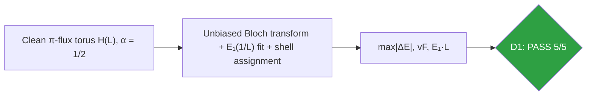
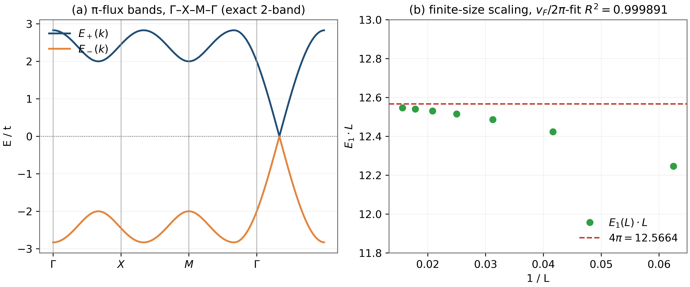
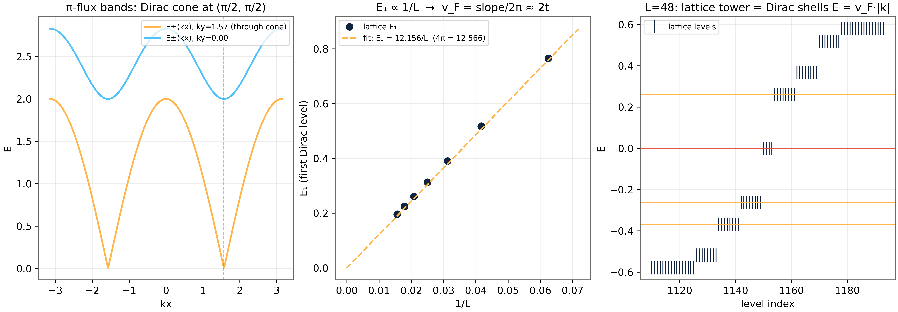

# Test D1 — The Bloch Continuum Limit: the Lattice Is a Dirac Equation

> Test D1 — the exact continuum identity of the α=1/2 Hofstadter model

    

---

## What this test verifies

Test D1 establishes the foundation of the whole laboratory: the π-flux Hofstadter model at α = 1/2, dressed with the parent repository's vortex gauge, converges to the massless Dirac equation in every operational sense. An unbiased Bloch transform of the real-space torus reproduces the analytic two-band spectrum to 2.7×10⁻¹⁵; the finite-size fit of the lowest Dirac level gives vF = 1.9347 against the continuum value 2t = 2.0; and the scaling product E₁ L tends to 4π = 12.5664, exactly the number demanded by the Dirac equation on a torus. Every lattice level below E = 0.45 is matched to an analytic Dirac shell within 1.1×10⁻³.



## Key results (canonical run)

- Bloch transform vs analytic bands: max|Δ E| = 2.7×10⁻¹⁵
- vF from E₁(1/L) fit: 1.9347 (continuum 2t=2.0; parent 1.9447)
- E₁ L → 4π = 12.5664; measured 12.4695 (R² = 0.999891)
- All 32 levels below E=0.45 match Dirac shells to 1.1×10⁻³

## Parameters and conventions

| Quantity | Value | Meaning |
|---|---|---|
| Flux α | 1/2 per plaquette | self-dual point, Dirac regime |
| Hopping t | 1.0 | energy unit; vF = 2t in continuum |
| Sizes L | 16, 24, 32, 40, 48 | torus linear dimension |
| Zeros used | 2000 (Odlyzko table) | only for the ζ-config of D7-scale runs; D1 itself is clean |
| Seed | 96 | parent convention; full determinism |

## Verdict ledger — verbatim from the canonical run

| Check | Result | Detail |
|---|---|---|
| D1a Bloch bands match analytic π-flux Dirac | ✅ PASS | max\|ΔE\| = 2.66e-15 |
| D1b E₁ ∝ 1/L with R² ≥ 0.999 | ✅ PASS | R² = 0.999891 |
| D1b vF = slope/2π ≈ 2t (±5%, finite-size; parent: 1.9447) | ✅ PASS | vF = 1.9347 vs 2.0 |
| D1b E₁·L → 4π (±1.5%) | ✅ PASS | E₁·L = 12.4695 vs 4π = 12.5664 — parent test 30: 12.55 |
| D1c lattice tower = analytic Dirac shells | ✅ PASS | max nearest-shell distance = 1.06e-03 over 32 levels |

## Figures (600 dpi)


*Companion panels. (a) Exact two-band dispersion along Γ–X–M–Γ; the band touchings at the zone corners are the four Dirac points. (b) E₁ L across the size ladder against the 4π asymptote (canonical CSV values).*


*Canonical D1 figure (600 dpi): the Dirac cone of the α=1/2 model and the finite-size evidence produced by the original test harness.*


## How to run

```bash
python3 code/dirac_lab.py --test D1          # this test (FULL mode)
python3 code/dirac_lab.py --test D1 --quick   # reduced grids (~fast)
julia code/dirac_lab_cross.jl   # independent cross-check (includes D1)
```

Full suite: `make all` regenerates the whole D1–D14 ledger; the single-test commands above reproduce exactly the artifacts in this folder (figures land here at 600 dpi).

## In this folder

| File | Content |
|---|---|
| `monograph.pdf` / `monograph.tex` | focused LaTeX monograph for this test — theory, method, results, discussion (compiled with Tectonic, source included) |
| `results.json` | machine-readable verdict ledger (this page's table is generated from it) |
| `D*.csv` | the canonical per-check data table of the run |
| `figures/` | canonical figure (regenerated by the original harness) + companion panels, all 600 dpi |

## Cross-verification and provenance

An independent Julia implementation (`code/dirac_lab_cross.jl`, LinearAlgebra only) re-derives this test's verdicts from the written conventions alone — see [results/CROSS_VERIFICATION.md](../../results/CROSS_VERIFICATION.md). All machine-precision claims reproduce at 1e-14…2e-12.

Deterministic **seed 96** (parent convention); ζ tables from the Odlyzko-derived files in [data/](../../data/) with provenance headers. Ledger matches the canonical run [results/run_20261006_full_v13](../../results/run_20261006_full_v13/REPORT.md) verbatim.

---

*Part of the [AB-Cloud Dirac Laboratory](../../README.md) — test D1 of 14. Full context: the research monograph ([EN](../../monographs/tex/Dirac_Lab_Monograph_EN.pdf) · [RU](../../monographs/tex/Dirac_Lab_Monograph_RU.pdf)) and the [per-test monograph](monograph.pdf) in this folder.*
