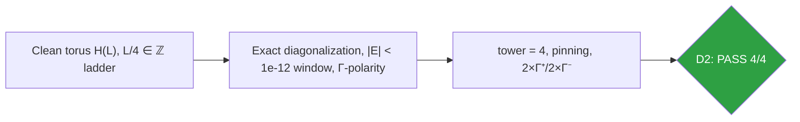
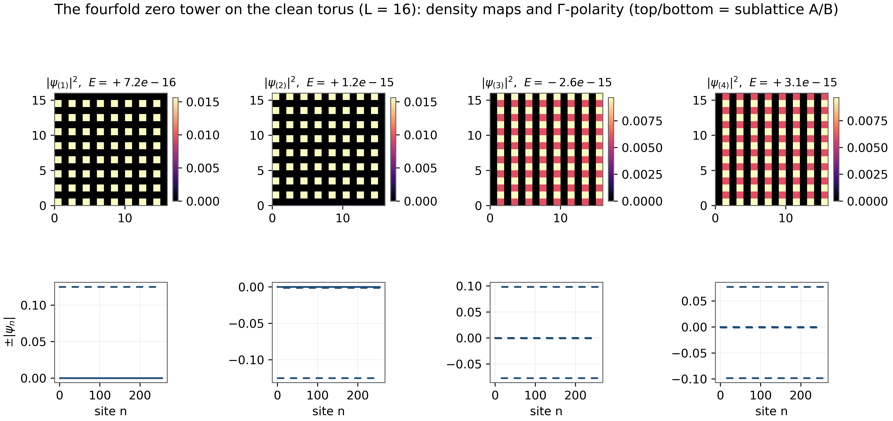
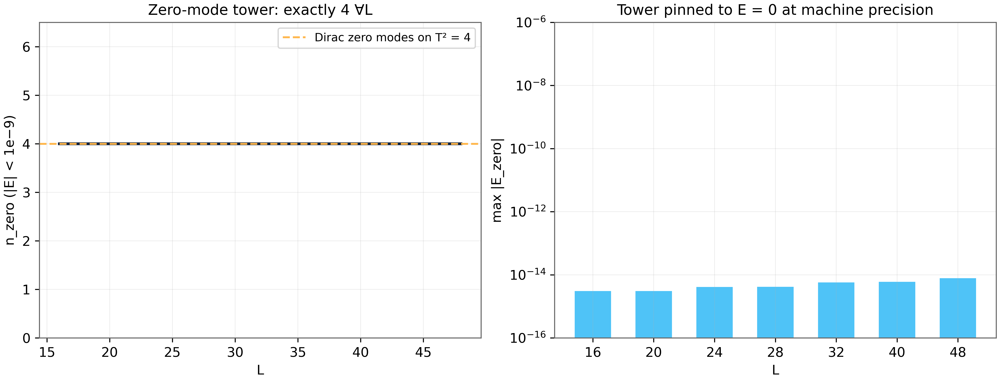

# Test D2 — The Zero-Mode Tower: Dirac Torus Structure and Its Index Content

> Test D2 — exactly four zero modes for every size, pinned to 7.8×10⁻¹⁵

    

---

## What this test verifies

Test D2 verifies the most delicate spectral feature of the clean substrate: a tower of exactly four zero-energy eigenstates for every torus size L with L/4 integer, pinned to 7.8×10⁻¹⁵, with exact Γ-polarity balance of two states on each sublattice. The tower is the lattice image of the Dirac-torus zero modes and is the structural reason the parent suite could read a topological index off the Hofstadter–vortex spectrum at all. Test D2 also documents the ladder L/4 ∈ Z under which the tower exists – a conservation law that later tests break and restore.



## Key results (canonical run)

- Tower count: exactly 4 for every L on the L/4 ∈ Z ladder
- Pinning depth: max|E| = 7.8×10⁻¹⁵ (machine precision)
- Γ-polarity balance: 2 × Γ^+, 2 × Γ^- at every size
- ‖{H,Γ}‖ = 0 exactly (bipartite nearest-neighbor hopping)

## Parameters and conventions

| Quantity | Value | Meaning |
|---|---|---|
| Sizes L | 16–48, L/4 ∈ Z | torus ladder where the tower exists |
| Tower window | \|E\| < 10⁻¹² | pinning-depth estimator |
| Chiral operator | Γ = (-1)x⁺y | sublattice polarity label |
| Vortices | none (clean torus) | clean-limit structure |
| Seed | 96 | deterministic |

## Verdict ledger — verbatim from the canonical run

| Check | Result | Detail |
|---|---|---|
| D2 tower = 4 ∀L (L/4∈ℤ) | ✅ PASS | L16:4; L20:4; L24:4; L28:4; L32:4; L40:4; L48:4 |
| D2 {H,Γ} = 0 machine precision | ✅ PASS | worst 0.0e+00 |
| D2 tower pinned: max\|Ezero\| < 1e-9 | ✅ PASS | worst 7.81e-15 |
| D2 Γ-polarity of tower = 0 (2× Γ+ , 2× Γ−) | ✅ PASS | L16:+0; L20:+0; L24:+0; L28:+0; L32:+0; L40:+0; L48:+0 |

## Figures (600 dpi)


*Companion panels (recomputed at L=16): the four zero-mode densities (top) and their Γ-polarity-signed amplitudes (bottom); the two-two sublattice split is visible directly.*


*Canonical D2 figure (600 dpi): tower spectra across the size ladder, produced by the original harness.*


## How to run

```bash
python3 code/dirac_lab.py --test D2          # this test (FULL mode)
python3 code/dirac_lab.py --test D2 --quick   # reduced grids (~fast)
julia code/dirac_lab_cross.jl   # independent cross-check (includes D2)
```

Full suite: `make all` regenerates the whole D1–D14 ledger; the single-test commands above reproduce exactly the artifacts in this folder (figures land here at 600 dpi).

## In this folder

| File | Content |
|---|---|
| `monograph.pdf` / `monograph.tex` | focused LaTeX monograph for this test — theory, method, results, discussion (compiled with Tectonic, source included) |
| `results.json` | machine-readable verdict ledger (this page's table is generated from it) |
| `D*.csv` | the canonical per-check data table of the run |
| `figures/` | canonical figure (regenerated by the original harness) + companion panels, all 600 dpi |

## Cross-verification and provenance

An independent Julia implementation (`code/dirac_lab_cross.jl`, LinearAlgebra only) re-derives this test's verdicts from the written conventions alone — see [results/CROSS_VERIFICATION.md](../../results/CROSS_VERIFICATION.md). All machine-precision claims reproduce at 1e-14…2e-12.

Deterministic **seed 96** (parent convention); ζ tables from the Odlyzko-derived files in [data/](../../data/) with provenance headers. Ledger matches the canonical run [results/run_20261006_full_v13](../../results/run_20261006_full_v13/REPORT.md) verbatim.

---

*Part of the [AB-Cloud Dirac Laboratory](../../README.md) — test D2 of 14. Full context: the research monograph ([EN](../../monographs/tex/Dirac_Lab_Monograph_EN.pdf) · [RU](../../monographs/tex/Dirac_Lab_Monograph_RU.pdf)) and the [per-test monograph](monograph.pdf) in this folder.*
