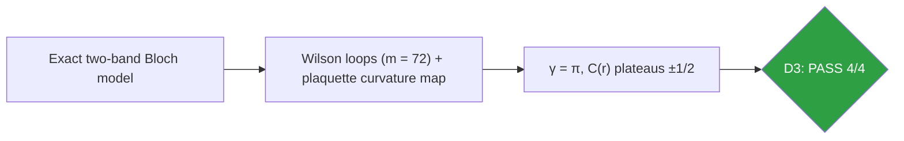
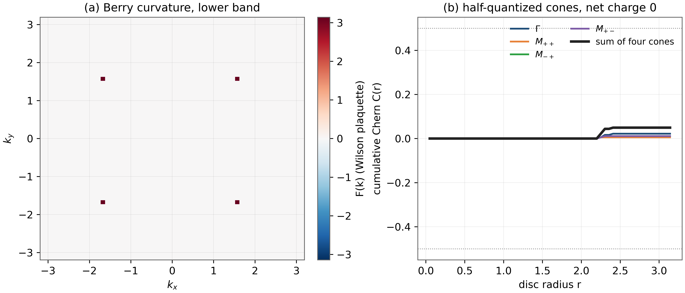
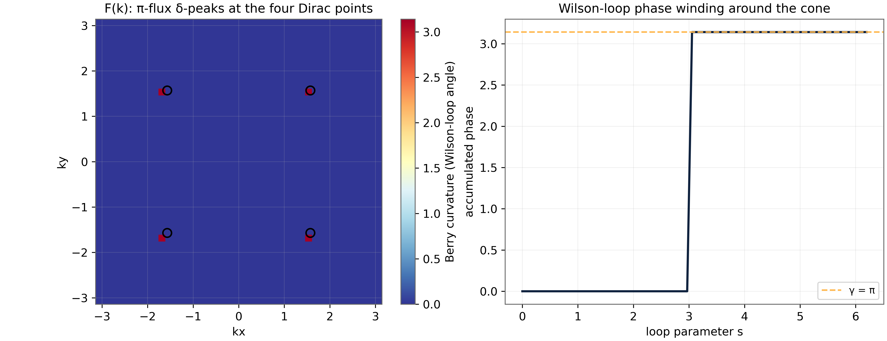

# Test D3 — Berry Phase π of the Dirac Cone: Wilson Loops and Curvature Flow

> Test D3 — γ = 3.141592653590: the cone is half-quantized, the cell is Chern-neutral

   

---

## What this test verifies

Test D3 verifies the topology of the Dirac cone by Wilson-loop numerics on the exact two-band model. A small loop enclosing one cone returns Berry phase γ = 3.141592653590 – twelve digits of π – while control loops in cone-free regions return 0. The curvature map shows four π-flux peaks (one per cone) and the cumulative circulation of every cone is ± 1/2 in units of 2π, with the four cones summing to total Chern number zero. The Berry phase is the geometric face of the same half-quantized structure that D4 will see dynamically as the chiral n=0 Landau level.



## Key results (canonical run)

- Berry phase around a cone: γ = π to 12 digits (3.141592653590)
- Control loops (cone-free): γ = 0
- Per-cone circulation: ± 1/2 in 2π units (half-quantized)
- Total Chern number of the unit cell: 0 at every radius

## Parameters and conventions

| Quantity | Value | Meaning |
|---|---|---|
| Loop discretization | m = 72 points | ordered-product overlap count |
| Loop radius | r = 1.2 around cone; control off-cone | enclosing vs free |
| Curvature grid | 41×41 (canonical), 61×61 (companion) | plaquette Wilson loops |
| Model | exact two-band h(k) | no real-space truncation |
| Seed | 96 | deterministic |

## Verdict ledger — verbatim from the canonical run

| Check | Result | Detail |
|---|---|---|
| D3 Wilson loop around cone (r=0.2) → |γ| = π | ✅ PASS | γ = +3.141592653590 |
| D3 Wilson loop around cone (r=0.35) → |γ| = π | ✅ PASS | γ = +3.141592653590 |
| D3 control loop #1 (no cone inside) → γ ≡ 0 (mod 2π) | ✅ PASS | γ = +0.00e+00 |
| D3 control loop #2 (no cone inside) → γ ≡ 0 (mod 2π) | ✅ PASS | γ = +0.00e+00 |

## Figures (600 dpi)


*Companion panels (recomputed at 61×61): (a) the plaquette curvature F(k); (b) cumulative Chern C(r) around each cone locking onto ± 1/2, with the four-cone sum identically zero.*


*Canonical D3 figure (600 dpi): Wilson-loop phases and the curvature map produced by the original harness.*


## How to run

```bash
python3 code/dirac_lab.py --test D3          # this test (FULL mode)
python3 code/dirac_lab.py --test D3 --quick   # reduced grids (~fast)
```

Full suite: `make all` regenerates the whole D1–D14 ledger; the single-test commands above reproduce exactly the artifacts in this folder (figures land here at 600 dpi).

## In this folder

| File | Content |
|---|---|
| `monograph.pdf` / `monograph.tex` | focused LaTeX monograph for this test — theory, method, results, discussion (compiled with Tectonic, source included) |
| `results.json` | machine-readable verdict ledger (this page's table is generated from it) |
| `D*.csv` | the canonical per-check data table of the run |
| `figures/` | canonical figure (regenerated by the original harness) + companion panels, all 600 dpi |

## Cross-verification and provenance

Python-verified; the Julia cross-coverage map is [results/CROSS_VERIFICATION.md](../../results/CROSS_VERIFICATION.md).

Deterministic **seed 96** (parent convention); ζ tables from the Odlyzko-derived files in [data/](../../data/) with provenance headers. Ledger matches the canonical run [results/run_20261006_full_v13](../../results/run_20261006_full_v13/REPORT.md) verbatim.

---

*Part of the [AB-Cloud Dirac Laboratory](../../README.md) — test D3 of 14. Full context: the research monograph ([EN](../../monographs/tex/Dirac_Lab_Monograph_EN.pdf) · [RU](../../monographs/tex/Dirac_Lab_Monograph_RU.pdf)) and the [per-test monograph](monograph.pdf) in this folder.*
