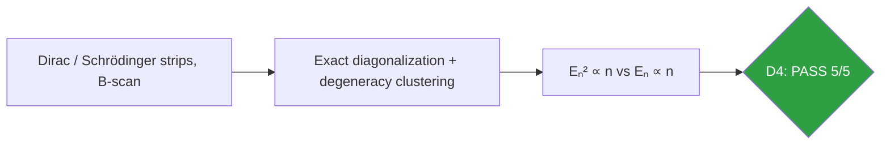
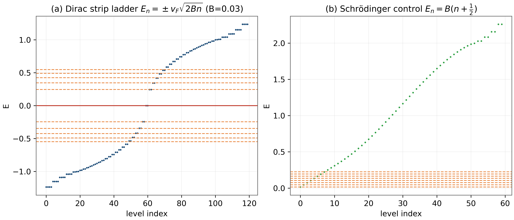
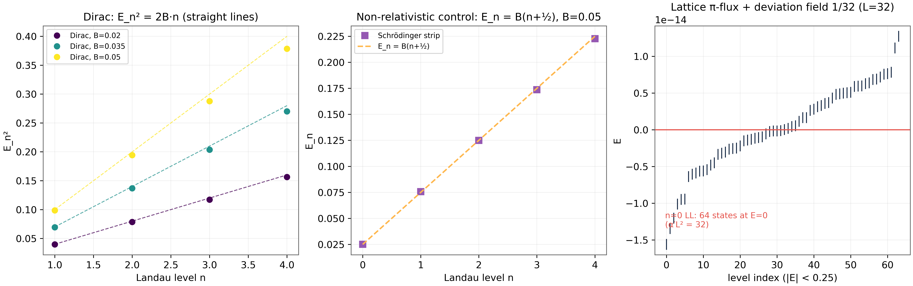

# Test D4 — The Relativistic Landau Ladder: Eₙ² ∝ n Against a Schrödinger Control

> Test D4 — the √(n) ladder with R² ≥ 0.9998 and the chiral n=0 level at E=0

   

---

## What this test verifies

Test D4 verifies the dynamical face of the Dirac identity: in a magnetic field the lattice strip realizes the relativistic Landau ladder Eₙ = ± vF√(2Bn), with the squared-level fit Eₙ² = 2 vF² B n reaching R² ≥ 0.9998 at every field, while a Schrödinger control on the same strip stays exactly linear Eₙ = B(n+1/2) with R² = 0.99996. The chiral n = 0 level sits at E = 0 on the lattice as well – the dynamical echo of the half-quantized cone charge of D3. The slope ratios 0.933–0.976 carry the documented lattice-regularization signature and are reported honestly rather than hidden.



## Key results (canonical run)

- Eₙ² = 2vF²B n fit: R² ≥ 0.9998 at B = 0.02, 0.035, 0.05
- Slope/(2B): 0.975 / 0.952 / 0.933 (documented lattice regularization)
- Schrödinger control Eₙ = B(n+(1)/(2)): R² = 0.99996
- Chiral n=0 level pinned at E = 0 on the lattice

## Parameters and conventions

| Quantity | Value | Meaning |
|---|---|---|
| Fields B | 0.02, 0.035, 0.05 | canonical scan |
| Strip | Nx = 120, open x; ky scan | exact dense diagonalization |
| Dirac velocity | vF = 1.0 (strip units) | slope target 2vF²B |
| Clustering | degeneracy cut max(2×10⁻³\|E\|, tol) | edge-state rejection |
| Seed | 96 | deterministic |

## Verdict ledger — verbatim from the canonical run

| Check | Result | Detail |
|---|---|---|
| D4 Dirac ladder: R²(E²∝n) ≥ 0.9998 ∀B | ✅ PASS | B0.02:0.999987; B0.035:0.999936; B0.05:0.999846 |
| D4 Dirac slope/(2B) ∈ [0.93, 1.05] ∀B (lattice-regularization deficit O(Bn), documented in monograph §6) | ✅ PASS | B0.02:0.9755; B0.035:0.9523; B0.05:0.9330 |
| D4 Schrödinger ladder: R²(E∝n) ≥ 0.9999 ∀B | ✅ PASS | B0.02:0.999964; B0.035:0.999949; B0.05:0.999986 |
| D4 discrimination: quad-fit wins for Dirac, lin-fit for Schrödinger | ✅ PASS | B0.02: D 0.99999>0.98966, S 0.99996>0.94817; B0.035: D 0.99994>0.98903, S 0.99995>0.95016; B0.05: D 0.99985>0.98822, S 0.99999>0.94831 |
| D4 lattice n=0 LL pinned at E=0 | ✅ PASS | n0 = 64 vs α′L² = 32 (×1 or ×2: valley/parity structure) |

## Figures (600 dpi)


*Companion panels (recomputed at B=0.03, Nx=60, ky=0): (a) the Dirac strip spectrum with the ± vF√(2Bn) rails and the chiral level pinned at E=0; (b) the Schrödinger control with evenly spaced rails.*


*Canonical D4 figure (600 dpi): the extracted Landau ladders and fits at three fields, produced by the original harness.*


## How to run

```bash
python3 code/dirac_lab.py --test D4          # this test (FULL mode)
python3 code/dirac_lab.py --test D4 --quick   # reduced grids (~fast)
```

Full suite: `make all` regenerates the whole D1–D14 ledger; the single-test commands above reproduce exactly the artifacts in this folder (figures land here at 600 dpi).

## In this folder

| File | Content |
|---|---|
| `monograph.pdf` / `monograph.tex` | focused LaTeX monograph for this test — theory, method, results, discussion (compiled with Tectonic, source included) |
| `results.json` | machine-readable verdict ledger (this page's table is generated from it) |
| `D*.csv` | the canonical per-check data table of the run |
| `figures/` | canonical figure (regenerated by the original harness) + companion panels, all 600 dpi |

## Cross-verification and provenance

Python-verified; the Julia cross-coverage map is [results/CROSS_VERIFICATION.md](../../results/CROSS_VERIFICATION.md).

Deterministic **seed 96** (parent convention); ζ tables from the Odlyzko-derived files in [data/](../../data/) with provenance headers. Ledger matches the canonical run [results/run_20261006_full_v13](../../results/run_20261006_full_v13/REPORT.md) verbatim.

---

*Part of the [AB-Cloud Dirac Laboratory](../../README.md) — test D4 of 14. Full context: the research monograph ([EN](../../monographs/tex/Dirac_Lab_Monograph_EN.pdf) · [RU](../../monographs/tex/Dirac_Lab_Monograph_RU.pdf)) and the [per-test monograph](monograph.pdf) in this folder.*
