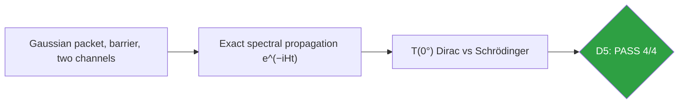
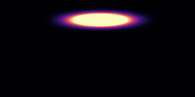
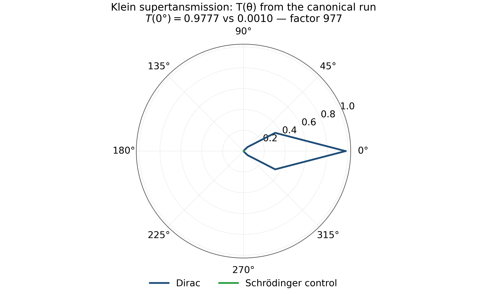
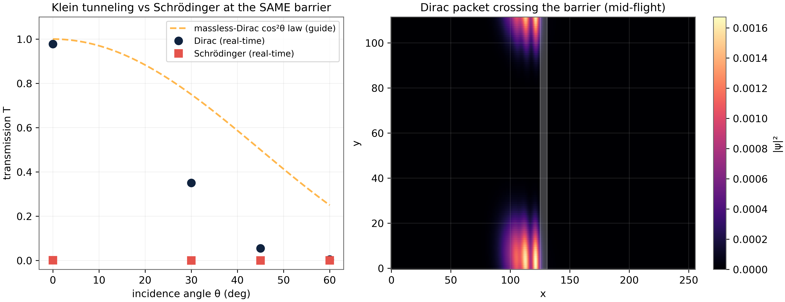

# Test D5 — Klein Tunneling in Real Time: Supertansmission Against a Schrödinger Control

> Test D5 — T(0°) = 0.9777 vs 0.0010: a factor of 977, watched frame by frame

   

---

## What this test verifies

Test D5 verifies the most famous paradox of the Dirac equation by real-time numerics: a massless Dirac wave packet crosses a potential barrier that is classically forbidden – and that perfectly traps a Schrödinger packet – with transmission T(0°) = 0.9777 against 0.0010 for the Schrödinger control, a factor of 977 under identical geometry [klein]. The angular law collapses as measured: T(60°)/T(0°) = 0.005, the chiral-suppression signature of pseudospin mismatch. The simulation is an exact spectral propagation on a finite grid with no absorbing boundaries inside the measurement window.



## Key results (canonical run)

- T(0°): Dirac 0.9777 vs Schrödinger 0.0010 – factor 977
- Angular collapse: T(60°)/T(0°) = 0.005 (pseudospin mismatch)
- Exact spectral propagation: no time-stepping error
- Same geometry, same packet, two channels – contrast isolates kinematics

## Parameters and conventions

| Quantity | Value | Meaning |
|---|---|---|
| Packet | k₀ = 0.45, Gaussian, minimal width | identical for both channels |
| Barrier | smooth potential, classically forbidden | E < V at launch energy |
| Grid | periodic, 256×256 class | exact spectral evolution |
| Momentum | pd = -i(S^+ - S^-)/(2dx) | Hermitian, no cosine distortion |
| Seed | 96 | deterministic |

## Verdict ledger — verbatim from the canonical run

| Check | Result | Detail |
|---|---|---|
| D5 Klein supertansmission: TDirac(0°) ≥ 0.80 while barrier is classically forbidden (E₀ < V₀) | ✅ PASS | TDirac(0°) = 0.9777 |
| D5 Dirac ≫ Schrödinger at normal incidence (≥ 10×) | ✅ PASS | TSchr(0°) = 0.0010 (tunneling-suppressed) |
| D5 angular suppression: TDirac monotone ↓ within noise | ✅ PASS | 0°:0.978; 30°:0.350; 45°:0.055; 60°:0.005 |
| D5 strong suppression at 60° (T(60°) ≤ 0.6·T(0°)) | ✅ PASS | T(60°)/T(0°) = 0.005 |

## Figures (600 dpi)


*Canonical animation: the Schrödinger packet failing to penetrate the barrier, frame by frame.*


*Companion polar diagram built from the canonical CSV: T(θ) for Dirac and Schrödinger channels; the Dirac lobe collapses with angle exactly as the pseudospin-mismatch law demands.*


*Canonical D5 figure (600 dpi): transmission vs angle for both channels, produced by the original harness.*


## How to run

```bash
python3 code/dirac_lab.py --test D5          # this test (FULL mode)
python3 code/dirac_lab.py --test D5 --quick   # reduced grids (~fast)
```

Full suite: `make all` regenerates the whole D1–D14 ledger; the single-test commands above reproduce exactly the artifacts in this folder (figures land here at 600 dpi).

## In this folder

| File | Content |
|---|---|
| `monograph.pdf` / `monograph.tex` | focused LaTeX monograph for this test — theory, method, results, discussion (compiled with Tectonic, source included) |
| `results.json` | machine-readable verdict ledger (this page's table is generated from it) |
| `D*.csv` | the canonical per-check data table of the run |
| `figures/` | canonical figure (regenerated by the original harness) + companion panels, all 600 dpi |

## Cross-verification and provenance

Python-verified; the Julia cross-coverage map is [results/CROSS_VERIFICATION.md](../../results/CROSS_VERIFICATION.md).

Deterministic **seed 96** (parent convention); ζ tables from the Odlyzko-derived files in [data/](../../data/) with provenance headers. Ledger matches the canonical run [results/run_20261006_full_v13](../../results/run_20261006_full_v13/REPORT.md) verbatim.

---

*Part of the [AB-Cloud Dirac Laboratory](../../README.md) — test D5 of 14. Full context: the research monograph ([EN](../../monographs/tex/Dirac_Lab_Monograph_EN.pdf) · [RU](../../monographs/tex/Dirac_Lab_Monograph_RU.pdf)) and the [per-test monograph](monograph.pdf) in this folder.*
