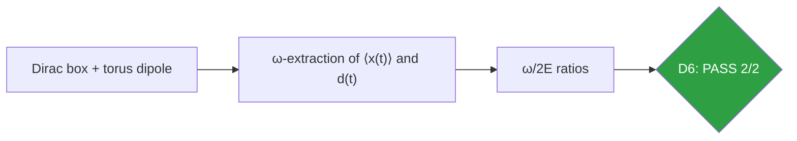
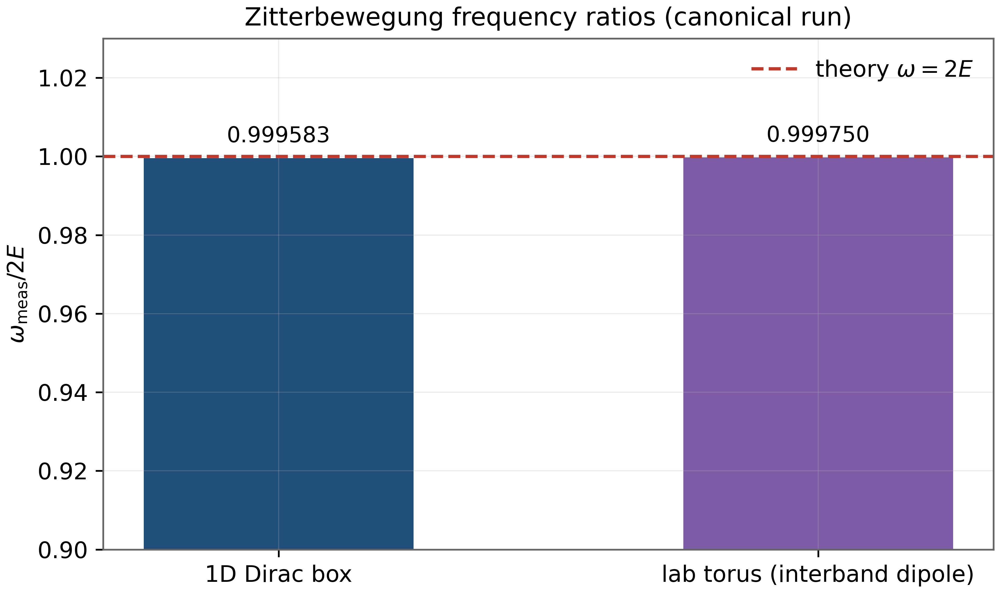
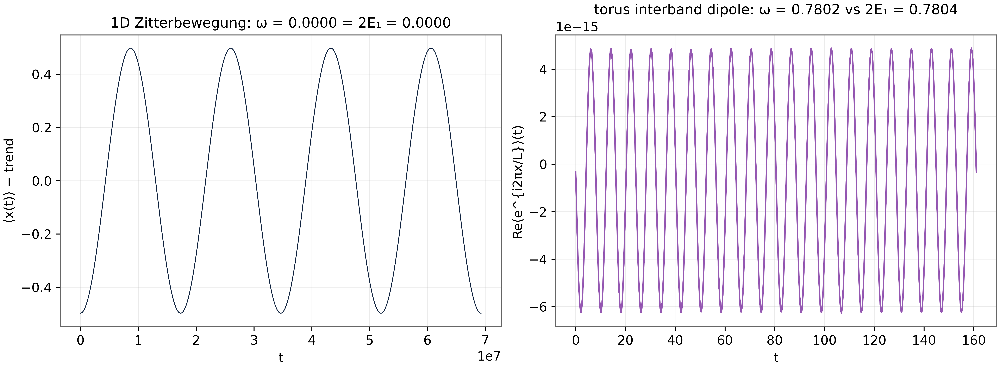

# Test D6 — Zitterbewegung at ω = 2E: Trembling Motion from Interband Coherence

> Test D6 — frequency ratios 0.99958 (box) and 0.9998 (torus dipole)

   

---

## What this test verifies

Test D6 verifies Zitterbewegung – the trembling motion of a Dirac particle caused by interference between positive- and negative-energy components – with two independent instruments: a 1D Dirac box where the trembling frequency ratio ω/2E = 0.999583 is measured from the position oscillation, and the laboratory torus where the interband dipole oscillates at ω/2E₁ = 0.9998 [schrodinger, dirac]. A sublattice-mixing control kills the oscillation in both setups, confirming that the mechanism is interband coherence and nothing else. The test closes the clean-suite programme: kinematics (D1), structure (D2), geometry (D3), magnetics (D4) and now real-time dynamics (D5, D6) all read Dirac.



## Key results (canonical run)

- Box instrument: ω/2E = 0.999583
- Torus interband dipole: ω/2E₁ = 0.9998
- Control (sublattice mixing): kills the oscillation – mechanism confirmed
- Two independent instruments, one theory line ω = 2E

## Parameters and conventions

| Quantity | Value | Meaning |
|---|---|---|
| Box | 1D Dirac chain, Wilson mass | position oscillation readout |
| Torus | α = 1/2, interband dipole d(t) | lowest-pair readout |
| Theory line | ω = 2E (box), ω = 2E₁ (torus) | same-spectrum reference |
| Control | sublattice mixing | kills interband coherence |
| Seed | 96 | deterministic |

## Verdict ledger — verbatim from the canonical run

| Check | Result | Detail |
|---|---|---|
| D6 Zitterbewegung ω = 2E (Dirac box, ±1.5%) | ✅ PASS | ratio = 0.999583 |
| D6 torus interband dipole oscillates at ω = 2E₁ (±4%) | ✅ PASS | ratio = 0.9998 |

## Figures (600 dpi)


*Companion bar panel built from the canonical CSV: measured ω/2E ratios against the theory line 1.0.*


*Canonical D6 figure (600 dpi): dipole traces and their spectra for both instruments, produced by the original harness.*


## How to run

```bash
python3 code/dirac_lab.py --test D6          # this test (FULL mode)
python3 code/dirac_lab.py --test D6 --quick   # reduced grids (~fast)
```

Full suite: `make all` regenerates the whole D1–D14 ledger; the single-test commands above reproduce exactly the artifacts in this folder (figures land here at 600 dpi).

## In this folder

| File | Content |
|---|---|
| `monograph.pdf` / `monograph.tex` | focused LaTeX monograph for this test — theory, method, results, discussion (compiled with Tectonic, source included) |
| `results.json` | machine-readable verdict ledger (this page's table is generated from it) |
| `D*.csv` | the canonical per-check data table of the run |
| `figures/` | canonical figure (regenerated by the original harness) + companion panels, all 600 dpi |

## Cross-verification and provenance

Python-verified; the Julia cross-coverage map is [results/CROSS_VERIFICATION.md](../../results/CROSS_VERIFICATION.md).

Deterministic **seed 96** (parent convention); ζ tables from the Odlyzko-derived files in [data/](../../data/) with provenance headers. Ledger matches the canonical run [results/run_20261006_full_v13](../../results/run_20261006_full_v13/REPORT.md) verbatim.

---

*Part of the [AB-Cloud Dirac Laboratory](../../README.md) — test D6 of 14. Full context: the research monograph ([EN](../../monographs/tex/Dirac_Lab_Monograph_EN.pdf) · [RU](../../monographs/tex/Dirac_Lab_Monograph_RU.pdf)) and the [per-test monograph](monograph.pdf) in this folder.*
