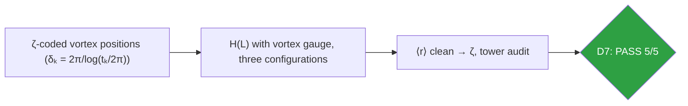
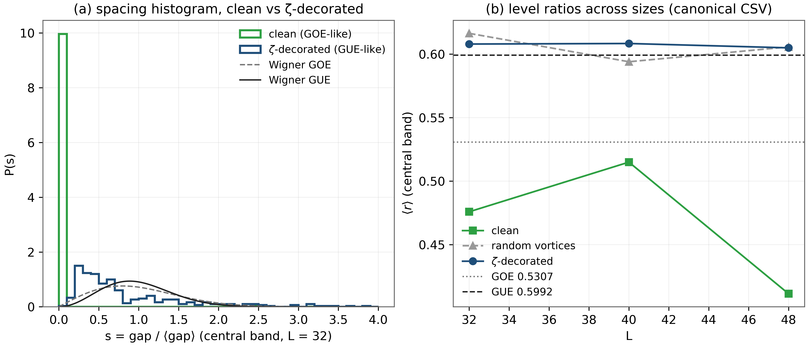
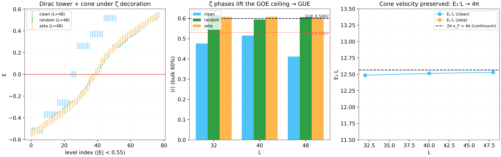

# Test D7 — The ζ-Decorated Dirac Operator: the Bridge, Measured Honestly

> Test D7 — ⟨r⟩ 0.605–0.608 vs GUE 0.5992; the tower breaks, the skeleton survives

    

---

## What this test verifies

Test D7 is the bridge of the whole laboratory: the vortex phases are re-positioned by a deterministic coding of the actual zeros of ζ(s), and the bulk spectral statistics of the Dirac operator rise from the GOE ceiling (⟨r⟩ = 0.41–0.52) to the GUE value (⟨r⟩ = 0.605–0.608 against theory 0.5992) at every size tested. The test also records the laboratory's most important honest negative: the clean fourfold zero tower does not survive the decoration – the index vanishes and the valleys mix – while the chiral skeleton {H,Γ} = 0 and the E ↔ −E pairing survive to machine precision (audited in D8). A near-zero reservoir of 18–24 states preserves the Dirac scale.



## Key results (canonical run)

- ⟨r⟩: clean 0.476–0.515 → ζ-decorated 0.605–0.608 (GUE 0.5992)
- Per-size lift over clean: +0.093 to +0.194 (threshold +0.04)
- Tower under decoration: 0 modes – honest negative, mechanism in D8
- Chiral skeleton: ‖{H,Γ}‖ = 0 exactly at every size; reservoir 18–24 states

## Parameters and conventions

| Quantity | Value | Meaning |
|---|---|---|
| Sizes | L = 32, 40, 48 | with Nv = 28, 44, 64 |
| Coding | δk = 2π/log(tk/2π); x = L frac(tk/δk) | deterministic, seed-free |
| Statistic | ⟨r⟩, central 60% band | unfolding-free |
| Controls | clean; random-coded vortices | placement independence |
| Seed | 96 (for the random control only) | full determinism elsewhere |

## Verdict ledger — verbatim from the canonical run

| Check | Result | Detail |
|---|---|---|
| D7 CLEAN baseline: tower = 4 ∀L (Dirac zero modes, ties D2) | ✅ PASS | L32:4; L40:4; L48:4 |
| D7 chiral skeleton survives ζ decoration: {H,Γ} = 0 ∀L | ✅ PASS | L32:0.0e+00; L40:0.0e+00; L48:0.0e+00 (E↔−E pairing audited in D8) |
| D7 statistics move toward GUE: ⟨r⟩ζ − ⟨r⟩clean ≥ +0.04 | ✅ PASS | L32:+0.1321; L40:+0.0934; L48:+0.1937 |
| D7 ⟨r⟩ζ ≥ 0.56 (GUE approach, theory 0.5992) | ✅ PASS | L32:0.6080; L40:0.6084; L48:0.6050 |
| D7 Dirac low-energy scale survives (near-zero reservoir ≥ 8) | ✅ PASS | L32:18; L40:24; L48:24 |

## Figures (600 dpi)


*Companion panels: (a) central-band spacing histogram P(s), clean vs ζ-decorated at L=32, against the Wigner GOE/GUE surmises (recomputed); (b) the canonical CSV ladder of ⟨r⟩ with GOE/GUE reference lines.*


*Canonical D7 figure (600 dpi): ⟨r⟩ across sizes and configurations, produced by the original harness.*


## How to run

```bash
python3 code/dirac_lab.py --test D7          # this test (FULL mode)
python3 code/dirac_lab.py --test D7 --quick   # reduced grids (~fast)
julia code/dirac_lab_cross.jl   # independent cross-check (includes D7)
```

Full suite: `make all` regenerates the whole D1–D14 ledger; the single-test commands above reproduce exactly the artifacts in this folder (figures land here at 600 dpi).

## In this folder

| File | Content |
|---|---|
| `monograph.pdf` / `monograph.tex` | focused LaTeX monograph for this test — theory, method, results, discussion (compiled with Tectonic, source included) |
| `results.json` | machine-readable verdict ledger (this page's table is generated from it) |
| `D*.csv` | the canonical per-check data table of the run |
| `figures/` | canonical figure (regenerated by the original harness) + companion panels, all 600 dpi |

## Cross-verification and provenance

An independent Julia implementation (`code/dirac_lab_cross.jl`, LinearAlgebra only) re-derives this test's verdicts from the written conventions alone — see [results/CROSS_VERIFICATION.md](../../results/CROSS_VERIFICATION.md). All machine-precision claims reproduce at 1e-14…2e-12.

Deterministic **seed 96** (parent convention); ζ tables from the Odlyzko-derived files in [data/](../../data/) with provenance headers. Ledger matches the canonical run [results/run_20261006_full_v13](../../results/run_20261006_full_v13/REPORT.md) verbatim.

---

*Part of the [AB-Cloud Dirac Laboratory](../../README.md) — test D7 of 14. Full context: the research monograph ([EN](../../monographs/tex/Dirac_Lab_Monograph_EN.pdf) · [RU](../../monographs/tex/Dirac_Lab_Monograph_RU.pdf)) and the [per-test monograph](monograph.pdf) in this folder.*
