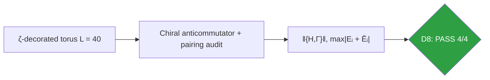
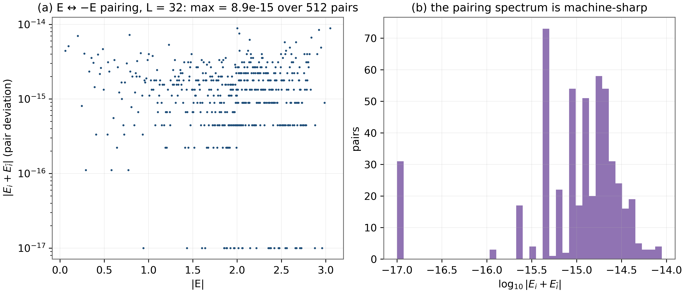
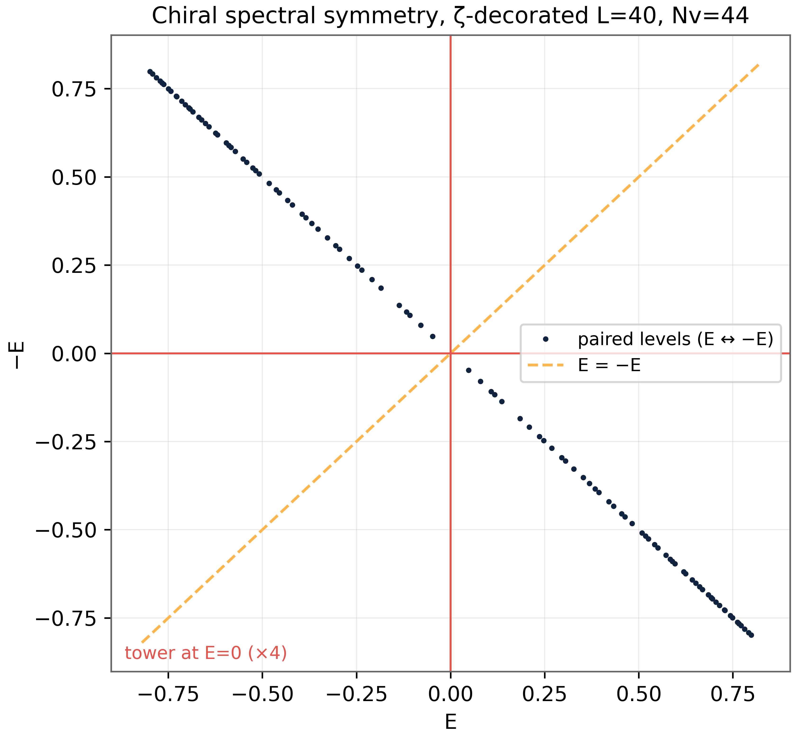

# Test D8 — Chiral Protection (AIII): Why D7 Works and Where It Breaks

> Test D8 — {H,Γ} = 0 exactly, E ↔ −E to 4×10⁻¹⁵ over 800 pairs

    

---

## What this test verifies

Test D8 establishes the symmetry mechanism behind D7's verdicts: under the full ζ-decoration the chiral (sublattice) anticommutator remains {H, Γ} = 0 exactly – not small, exactly – and the spectrum is therefore pairwise symmetric, E ↔ −E verified over 800 pairs to 4×10⁻¹⁵. This AIII-type protection is what survives the decoration and what the transport and index results of D9–D13 build upon. What it does not protect is the exact zero pinning of the clean tower: D8 measures the splitting of the tower into ± E valley pairs and documents the vanishing-index mechanism, turning D7's honest negative into a structural statement.



## Key results (canonical run)

- ‖{H, Γ}‖ = 0 exactly under full ζ-decoration
- E ↔ −E: max deviation 4×10⁻¹⁵ over 800 pairs
- Bipartiteness: same-sublattice hopping = 0 (structural)
- n₀ = 0 under decoration: tower splits into ± E valley pairs (index zero)

## Parameters and conventions

| Quantity | Value | Meaning |
|---|---|---|
| Canonical size | L = 40, Nv = 44 (ζ-coded) | parent density rule |
| Chiral operator | Γ = (-1)x⁺y | sublattice basis |
| Pairing audit | maxi \|Ei + E\bar i\| over 800 pairs | tolerance 10⁻¹⁰ |
| Bipartite scan | same-sublattice hopping matrix entries | must be exactly 0 |
| Seed | 96 | deterministic |

## Verdict ledger — verbatim from the canonical run

| Check | Result | Detail |
|---|---|---|
| D8 {H,Γ} = 0 under ζ decoration (machine precision) | ✅ PASS | \|\|{H,Γ}\|\| = 0.00e+00 |
| D8 bipartite (no same-sublattice hopping) | ✅ PASS | max = 0.0e+00 |
| D8 E ↔ −E spectral symmetry < 1e-10 | ✅ PASS | max = 4.00e-15 over 800 pairs |
| D8 zero-mode content is chiral-multiplet-consistent (even nzero; clean tower=4 documented as index-0 fragile in D7) | ✅ PASS | nzero = 0 (ζ decoration splits the clean 4-tower into ±E valley pairs — chiral symmetry survives, exact pinning is a clean-limit signature) |

## Figures (600 dpi)


*Companion panels (recomputed at L=32, canonical modules and seed): (a) pair deviation |Ei + E\bar i| vs |Ei| on a log axis – every pair at machine depth; (b) the pairing-deviation histogram.*


*Canonical D8 figure (600 dpi): the pairing audit and valley structure, produced by the original harness.*


## How to run

```bash
python3 code/dirac_lab.py --test D8          # this test (FULL mode)
python3 code/dirac_lab.py --test D8 --quick   # reduced grids (~fast)
julia code/dirac_lab_cross.jl   # independent cross-check (includes D8)
```

Full suite: `make all` regenerates the whole D1–D14 ledger; the single-test commands above reproduce exactly the artifacts in this folder (figures land here at 600 dpi).

## In this folder

| File | Content |
|---|---|
| `monograph.pdf` / `monograph.tex` | focused LaTeX monograph for this test — theory, method, results, discussion (compiled with Tectonic, source included) |
| `results.json` | machine-readable verdict ledger (this page's table is generated from it) |
| `D*.csv` | the canonical per-check data table of the run |
| `figures/` | canonical figure (regenerated by the original harness) + companion panels, all 600 dpi |

## Cross-verification and provenance

An independent Julia implementation (`code/dirac_lab_cross.jl`, LinearAlgebra only) re-derives this test's verdicts from the written conventions alone — see [results/CROSS_VERIFICATION.md](../../results/CROSS_VERIFICATION.md). All machine-precision claims reproduce at 1e-14…2e-12.

Deterministic **seed 96** (parent convention); ζ tables from the Odlyzko-derived files in [data/](../../data/) with provenance headers. Ledger matches the canonical run [results/run_20261006_full_v13](../../results/run_20261006_full_v13/REPORT.md) verbatim.

---

*Part of the [AB-Cloud Dirac Laboratory](../../README.md) — test D8 of 14. Full context: the research monograph ([EN](../../monographs/tex/Dirac_Lab_Monograph_EN.pdf) · [RU](../../monographs/tex/Dirac_Lab_Monograph_RU.pdf)) and the [per-test monograph](monograph.pdf) in this folder.*
