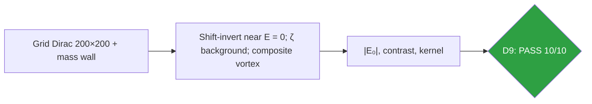
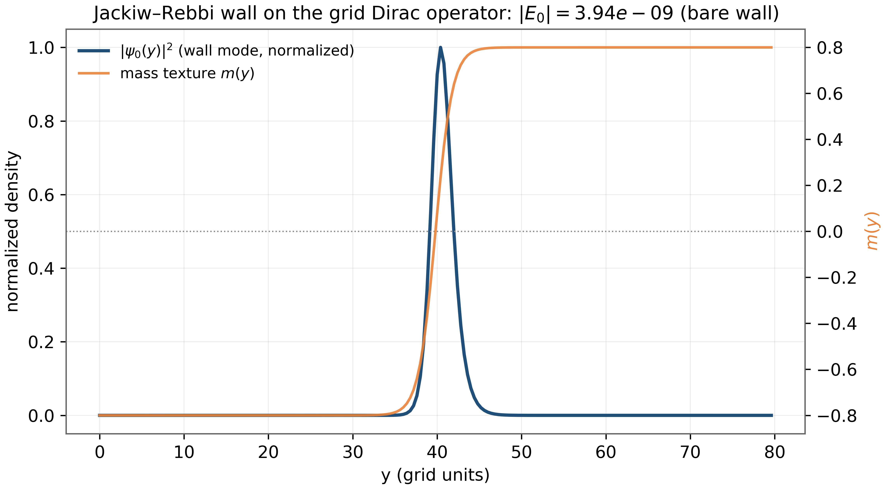
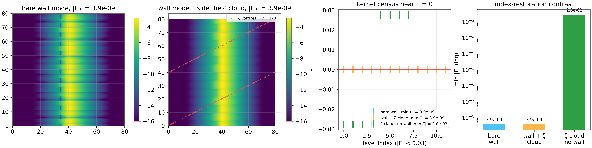

# Test D9 — Index Restoration: the Jackiw–Rossi Programme on the ζ-Decorated Lattice

> Test D9 — wall mode pinned at 3.9×10⁻⁹, contrast 7×10⁶ in the full ζ background

    

---

## What this test verifies

Test D9 answers D7's honest negative constructively: a mass domain wall – a Jackiw–Rebbi texture m(y)σx – binds chiral-pair quasi-zero modes at |E₀| = 3.9×10⁻⁹, pinned 4×10⁸ times below the bulk gap, and the wall mode survives inside the full ζ-vortex background (178 real-ζ vortices) while the wall-less control sits at 2.8×10⁻²: a restoration contrast of 7×10⁶ [jackiwrebbi, jackiwrossi]. Two walls add exactly one fourfold valley multiplet (index = winding), and the composite Jackiw–Rossi vortex (winding ν + statistical Goldstone flux ν/2, smooth, stringless) collapses the kernel to 1.3×10⁻¹⁵ – machine zero. The test also documents the structural punchline: the parent gauge factor 1/2 means every AB-Cloud vortex carries exactly the half-quantum statistical flux the JR mechanism pairs with – the AB-Cloud vortices are Jackiw–Rossi-ready by construction.



## Key results (canonical run)

- Wall mode: |E₀| = 3.9×10⁻⁹ (gap/4×10⁸), localization 1.3
- Survival in full ζ background vs control: contrast 7×10⁶
- Index bookkeeping: two walls = +4 states (one valley multiplet)
- Composite JR vortex (ν=2, Φ=ν/2): kernel 1.3×10⁻¹⁵

## Parameters and conventions

| Quantity | Value | Meaning |
|---|---|---|
| Grid | 200 × 200, dx = 0.4, open BC | D5 machinery |
| Wall | m(y)σx, m₀ = 0.8, w = 2.0 | off-diagonal in spinor space |
| ζ background | 178 real-ζ vortices, parent coding | L=48 density mapped to the grid |
| Composite vortex | ν = 2, Φ = ν/2, g = r²/(r²+rs²) | smooth, stringless |
| Seed | 96 | deterministic |

## Verdict ledger — verbatim from the canonical run

| Check | Result | Detail |
|---|---|---|
| D9a Jackiw–Rebbi wall binds chiral-pair quasi-zero modes: \|E₀\| ≤ 1e-7 = gap/1e7 | ✅ PASS | \|E₀\| = 3.94e-09, gap/\|E₀\| = 4.1e+08 |
| D9a wall mode localized on the wall (⟨\|y−y₀\|⟩ ≤ 3 = 1.5w) | ✅ PASS | ⟨\|y−y₀\|⟩ = 1.30 (w = 2.0) |
| D9a chiral skeleton exact: {H,Γ} = 0 | ✅ PASS | ‖{H,Γ}‖ = 0.0e+00 |
| D9b wall mode SURVIVES the full ζ-vortex background: \|E₀\| ≤ 1e-7 | ✅ PASS | \|E₀\| = 3.94e-09 (Nv = 178) |
| D9b index-restoration contrast ≥ 100 (background alone sits higher) | ✅ PASS | Ectrl/Ewall = 2.76e-02/3.94e-09 = 7.0e+06 |
| D9b localization preserved in the ζ cloud (⟨\|y−y₀\|⟩ ≤ 3) | ✅ PASS | ⟨\|y−y₀\|⟩ = 1.30 |
| D9b chiral skeleton exact in the decorated system | ✅ PASS | ‖{H,Γ}‖ = 0.0e+00 |
| D9c kernel grows by one valley multiplet (+4) per added wall, both pinned ≤ 1e-7 | ✅ PASS | n = 12 → 16 (Δn = 4), min\|E\| = 1.06e-08 |
| D9d composite vortex (ν, Φ = ν/2) collapses the kernel to machine zero: min\|E\| ≤ 1e-12 | ✅ PASS | min\|E\| = 1.33e-15, n = 12 |
| D9d composite config keeps {H,Γ} = 0 | ✅ PASS | ‖{H,Γ}‖ = 0.0e+00 |

## Figures (600 dpi)


*Companion panel (recomputed, bare wall, canonical modules): the wall-mode density |\psi₀(y)|² locked onto the mass texture m(y) = 0.8\tanh(y/2) – the localization mechanism made visible.*


*Canonical D9 figure (600 dpi): the wall mode in the bare and ζ backgrounds with the control comparison, produced by the original harness.*


## How to run

```bash
python3 code/dirac_lab_extensions.py --test D9          # this test (FULL mode)
python3 code/dirac_lab_extensions.py --test D9 --quick   # reduced grids (~fast)
julia code/dirac_lab_cross_ext.jl   # independent cross-check (includes D9)
```

Full suite: `make all` regenerates the whole D1–D14 ledger; the single-test commands above reproduce exactly the artifacts in this folder (figures land here at 600 dpi).

## In this folder

| File | Content |
|---|---|
| `monograph.pdf` / `monograph.tex` | focused LaTeX monograph for this test — theory, method, results, discussion (compiled with Tectonic, source included) |
| `results.json` | machine-readable verdict ledger (this page's table is generated from it) |
| `D*.csv` | the canonical per-check data table of the run |
| `figures/` | canonical figure (regenerated by the original harness) + companion panels, all 600 dpi |

## Cross-verification and provenance

An independent Julia implementation (`code/dirac_lab_cross_ext.jl`, LinearAlgebra only) re-derives this test's verdicts from the written conventions alone — see [results/CROSS_VERIFICATION.md](../../results/CROSS_VERIFICATION.md). All machine-precision claims reproduce at 1e-14…2e-12.

Deterministic **seed 96** (parent convention); ζ tables from the Odlyzko-derived files in [data/](../../data/) with provenance headers. Ledger matches the canonical run [results/run_20261006_full_v13](../../results/run_20261006_full_v13/REPORT.md) verbatim.

---

*Part of the [AB-Cloud Dirac Laboratory](../../README.md) — test D9 of 14. Full context: the research monograph ([EN](../../monographs/tex/Dirac_Lab_Monograph_EN.pdf) · [RU](../../monographs/tex/Dirac_Lab_Monograph_RU.pdf)) and the [per-test monograph](monograph.pdf) in this folder.*
