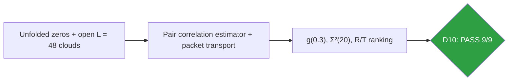
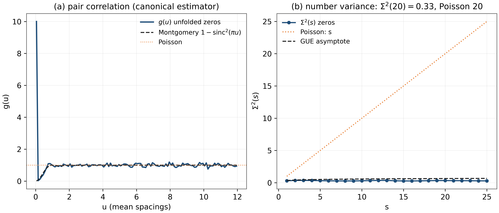
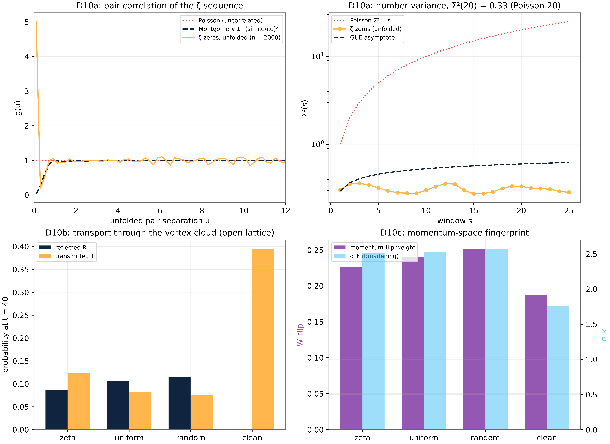

# Test D10 — Montgomery in Motion: Pair Correlation and Transport Imaging of the ζ Cloud

> Test D10 — g(0.3) = 0.188 (Montgomery 0.263, Poisson 1); the ζ cloud reflects least, transmits most

   

---

## What this test verifies

Test D10 gives the Montgomery pair correlation of the unfolded zeros a dynamical reading. Statistically, the unfolded ζ sequence reproduces the Montgomery pair correlation g(0.3) = 0.188 (theory 0.263, Poisson 1) and the number variance Σ²(20) = 0.33 (Poisson: 20) [montgomery]. Dynamically, a wave packet transported across equal-density vortex clouds ranks them exactly as the repulsion hierarchy demands: the ζ cloud reflects least (R_ζ = 0.087 vs uniform 0.107, Poisson 0.115) and transmits most (T_ζ = 0.123 vs 0.082, 0.076) – clean lattice 0.0003 for scale. Repulsion protects transport: the dynamical face of Montgomery's theorem-shaped observation.



## Key results (canonical run)

- g(0.3) = 0.188 – Montgomery 0.263, Poisson 1
- Σ²(20) = 0.33 – Poisson 20
- Transport: T_ζ = 0.123 > TPoissoₙ = 0.076 (+62%); R_ζ least of all clouds
- Momentum fingerprint orders identically (W: 0.2265 < 0.2398 < 0.2515)

## Parameters and conventions

| Quantity | Value | Meaning |
|---|---|---|
| Zeros | first 2000 (Odlyzko table) | unfolded by RvM density |
| Pair correlation | g(u), u ≤ 20, bin 0.2 | canonical estimator |
| Transport grid | L = 48 open, Nv = 64, parent density | three cloud flavors + clean |
| Packet | k₀ = 0.45 Gaussian | measured before first wrap |
| Seed | 96 | deterministic |

## Verdict ledger — verbatim from the canonical run

| Check | Result | Detail |
|---|---|---|
| D10a pair repulsion: g(0.3) ≤ 0.35 (Montgomery 0.26, Poisson 1) | ✅ PASS | g(0.3) = 0.188 |
| D10a Montgomery form: max|g − 1−(sinπu/πu)²| ≤ 0.15 on u∈[1,10] | ✅ PASS | max dev = 0.135 |
| D10a sub-Poisson number variance: Σ²(20) ≤ 2 (Poisson: 20) | ✅ PASS | Σ²(20) = 0.33 |
| D10b GUE repulsion protects transport: Rζ ≤ 0.9·RPoisson | ✅ PASS | R: ζ = 0.0865 vs random = 0.1151 (ratio 0.75) |
| D10b transmission: Tζ ≥ 1.2·TPoisson | ✅ PASS | T: ζ = 0.1228 vs random = 0.0756 (ratio 1.62) |
| D10b clean lattice is ballistic: Rclean ≤ 0.02 | ✅ PASS | Rclean = 0.0003 |
| D10c momentum-flip ordering Wζ < Wuniform < Wrandom | ✅ PASS | 0.2265 < 0.2398 < 0.2515 |
| D10c packet broadening σk(ζ) < σk(random) | ✅ PASS | 2.520 < 2.573 |
| D10c flip-weight gap is significant: Wrandom − Wζ ≥ 0.01 | ✅ PASS | Δ = 0.0250 |

## Figures (600 dpi)


*Companion panels (recomputed from the canonical zero tables): (a) g(u) vs the Montgomery curve and Poisson line; (b) the number variance Σ²(s) with the GUE asymptote.*


*Canonical D10 figure (600 dpi): pair correlation and the transport ranking, produced by the original harness.*


## How to run

```bash
python3 code/dirac_lab_extensions.py --test D10          # this test (FULL mode)
python3 code/dirac_lab_extensions.py --test D10 --quick   # reduced grids (~fast)
```

Full suite: `make all` regenerates the whole D1–D14 ledger; the single-test commands above reproduce exactly the artifacts in this folder (figures land here at 600 dpi).

## In this folder

| File | Content |
|---|---|
| `monograph.pdf` / `monograph.tex` | focused LaTeX monograph for this test — theory, method, results, discussion (compiled with Tectonic, source included) |
| `results.json` | machine-readable verdict ledger (this page's table is generated from it) |
| `D*.csv` | the canonical per-check data table of the run |
| `figures/` | canonical figure (regenerated by the original harness) + companion panels, all 600 dpi |

## Cross-verification and provenance

Python-verified; the Julia cross-coverage map is [results/CROSS_VERIFICATION.md](../../results/CROSS_VERIFICATION.md).

Deterministic **seed 96** (parent convention); ζ tables from the Odlyzko-derived files in [data/](../../data/) with provenance headers. Ledger matches the canonical run [results/run_20261006_full_v13](../../results/run_20261006_full_v13/REPORT.md) verbatim.

---

*Part of the [AB-Cloud Dirac Laboratory](../../README.md) — test D10 of 14. Full context: the research monograph ([EN](../../monographs/tex/Dirac_Lab_Monograph_EN.pdf) · [RU](../../monographs/tex/Dirac_Lab_Monograph_RU.pdf)) and the [per-test monograph](monograph.pdf) in this folder.*
