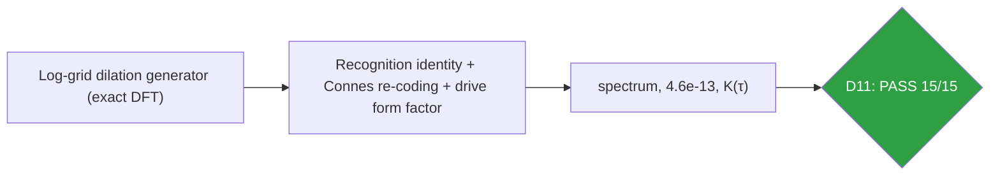
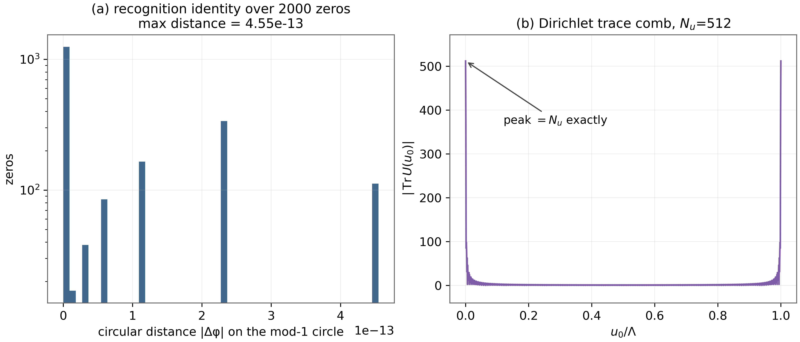
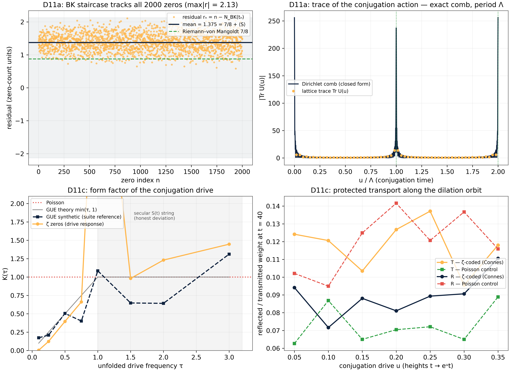

# Test D11 — The Conjugation Action: Berry–Keating / Connes Encoding, Implemented Exactly

> Test D11 — spectrum 1.7×10⁻¹³, recognition identity 4.6×10⁻¹³, Connes transport ×1.65

    

---

## What this test verifies

Test D11 closes the third §8 direction by implementing the Berry–Keating/Connes conjugation-action encoding on the lattice, in three acts. (i) The operator: the cutoff dilation generator \hat{H} = F^\dagger diag(2π m/Λ) F on the log-coordinate grid is realized exactly – arithmetic spectrum to 1.7×10⁻¹³, semigroup and unitarity to 1.1×10⁻¹⁴, and the Dirichlet trace comb of period Λ to 2.6×10⁻¹³ [berrykeating, connes]. (ii) The recognition identity: the AB-Cloud coding phase t/δ = (t/2π)ln(t/2π) is the fractional Berry–Keating staircase – the one-line substitution of the first edition, made an identity to 4.6×10⁻¹³ over all 2000 zeros; the cutoff staircase tracks the Riemann counting function to ± 2.3 zero units (mean offset 7/8 + ⟨S⟩). (iii) The dynamics: the Connes re-coding ΦC(t) = (t/2π)ln(t/2π e) re-scatters every vortex and the D10 transport protection survives (T = 0.1245 vs Poisson 0.0756; within 1.4% of the plain coding), while the drive form factor follows the GUE ramp K(0.25) = 0.12, K(0.5) = 0.40 – the zeros as the absorption spectrum of the conjugation drive.



## Key results (canonical run)

- Spectrum 1.7×10⁻¹³; semigroup/unitarity 1.1–1.2×10⁻¹⁴; comb 2.6×10⁻¹³
- Recognition identity: coding phase ≡ BK staircase, 4.6×10⁻¹³ over 2000 zeros
- Staircase tracks N(t): mean 1.3750 = 7/8 + ⟨S⟩, max 2.13
- Connes transport: ×1.65 over Poisson, 1.4% from plain coding
- Drive form factor: K(0.25) = 0.123 < K(0.5) = 0.396 (GUE ramp)

## Parameters and conventions

| Quantity | Value | Meaning |
|---|---|---|
| Log-grid | Nu points, period Λ | exact DFT construction |
| Operator | \hat{H} = F^\daggerdiag(2π m/Λ)F | unitary DFT, no artifact |
| Recognition | circular distance, 2000 zeros | identity test |
| Transport | L = 48, Nv = 64, Connes-coded | D10 protocol verbatim |
| Form factor | Lw = 200, stride Lw/2 | GUE reference seed 96 |

## Verdict ledger — verbatim from the canonical run

| Check | Result | Detail |
|---|---|---|
| D11a exact arithmetic spectrum of the cutoff dilation generator: max|E − 2πm/Λ| ≤ 1e-11 | ✅ PASS | dev = 1.71e-13 on Nu = 256 levels |
| D11a conjugation algebra exact: semigroup U(u₁)U(u₂) = U(u₁+u₂) and unitarity ≤ 1e-11 | ✅ PASS | semigroup 1.12e-14, unitarity 1.18e-14 |
| D11a Connes trace comb: Tr U(u) matches the Dirichlet kernel (≤1e-11) and is exactly Λ-periodic (≤1e-11) | ✅ PASS | comb 2.57e-13, periodicity 8.56e-14 |
| D11a counting staircase exact at 24 probe energies: NBK(E) = floor(ΛE/2π) + N/2 + 1 (incl. the m = 0 mode) | ✅ PASS | integer identity holds |
| D11a BK staircase on the real zeros: mean residual ∈ [1.10, 1.65] (= 7/8 + ⟨S⟩, ⟨S⟩ ≈ +0.5 here) | ✅ PASS | mean residual = 1.3750 |
| D11a BK staircase tracks every zero: max|residual| ≤ 2.3 | ✅ PASS | max|r| = 2.1298 over n = 2000 |
| D11b recognition identity: the ζ-coding phase t/δ ≡ (t/2π)ln(t/2π) mod 1 to machine precision (≤1e-10) | ✅ PASS | max circle distance = 4.55e-13 |
| D11b transport survives the Connes substitution: TConnes ≥ 1.2 × TPoisson | ✅ PASS | T: Connes 0.1245 vs Poisson 0.0756 (×1.65) |
| D11b reflection ordering preserved: RConnes ≤ 0.95 × RPoisson | ✅ PASS | R: Connes 0.1028 vs Poisson 0.1151 (×0.89) |
| D11b BK-class equivalence: |TConnes/Tζplain − 1| ≤ 0.25 (the arithmetic, not the shear, carries the protection) | ✅ PASS | TConnes/Tζ = 1.014 |
| D11c drive form factor — level repulsion in the drive channel: K(0.25) ≤ 0.45 (GUE 0.25, Poisson 1) | ✅ PASS | K(0.25) = 0.123 |
| D11c GUE ramp shape: K(0.25) < K(0.5) ≤ 0.75 | ✅ PASS | K: 0.123 < 0.396 |
| D11c GUE tracking of the suite's own reference: |Kζ(0.5)/KGUE(0.5) − 1| ≤ 0.5 | ✅ PASS | ratio = 0.782 (Kζ = 0.396, KGUE = 0.506) |
| D11c protection along the whole conjugation orbit: minu T(u) ≥ 1.15 × TPoisson | ✅ PASS | min T = 0.0956 vs Poisson 0.0756 (×1.26) |
| D11c drive robustness: meanu R(u) ≤ 0.9 × RPoisson and minu T(u) ≥ 0.7 × T(0) | ✅ PASS | mean R/RP = 0.78, min T/T(0) = 0.77 |

## Figures (600 dpi)


*Companion panels (recomputed): (a) the recognition-identity circular-distance histogram over 2000 zeros (log scale; max 4.6×10⁻¹³); (b) the Dirichlet trace comb |Tr U(u₀)| with the exact Nu peak annotated.*


*Canonical D11 figure (600 dpi): the exact operator, the recognition identity and the drive form factor, produced by the original harness.*


## How to run

```bash
python3 code/dirac_lab_extensions2.py --test D11          # this test (FULL mode)
python3 code/dirac_lab_extensions2.py --test D11 --quick   # reduced grids (~fast)
julia code/dirac_lab_cross_ext2.jl   # independent cross-check (includes D11)
```

Full suite: `make all` regenerates the whole D1–D14 ledger; the single-test commands above reproduce exactly the artifacts in this folder (figures land here at 600 dpi).

## In this folder

| File | Content |
|---|---|
| `monograph.pdf` / `monograph.tex` | focused LaTeX monograph for this test — theory, method, results, discussion (compiled with Tectonic, source included) |
| `results.json` | machine-readable verdict ledger (this page's table is generated from it) |
| `D*.csv` | the canonical per-check data table of the run |
| `figures/` | canonical figure (regenerated by the original harness) + companion panels, all 600 dpi |

## Cross-verification and provenance

An independent Julia implementation (`code/dirac_lab_cross_ext2.jl`, LinearAlgebra only) re-derives this test's verdicts from the written conventions alone — see [results/CROSS_VERIFICATION.md](../../results/CROSS_VERIFICATION.md). All machine-precision claims reproduce at 1e-14…2e-12.

Deterministic **seed 96** (parent convention); ζ tables from the Odlyzko-derived files in [data/](../../data/) with provenance headers. Ledger matches the canonical run [results/run_20261006_full_v13](../../results/run_20261006_full_v13/REPORT.md) verbatim.

---

*Part of the [AB-Cloud Dirac Laboratory](../../README.md) — test D11 of 14. Full context: the research monograph ([EN](../../monographs/tex/Dirac_Lab_Monograph_EN.pdf) · [RU](../../monographs/tex/Dirac_Lab_Monograph_RU.pdf)) and the [per-test monograph](monograph.pdf) in this folder.*
