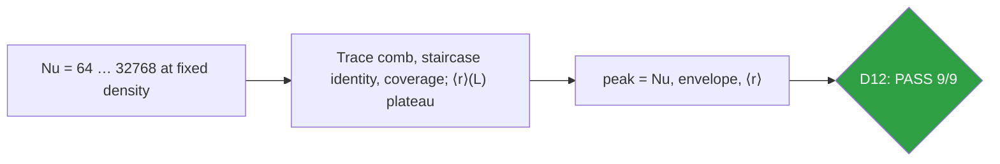
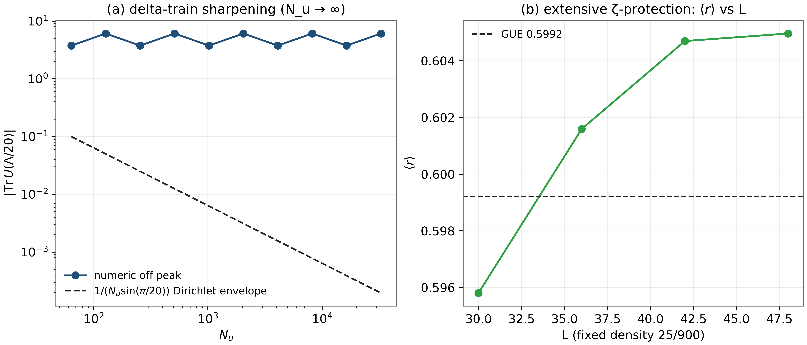
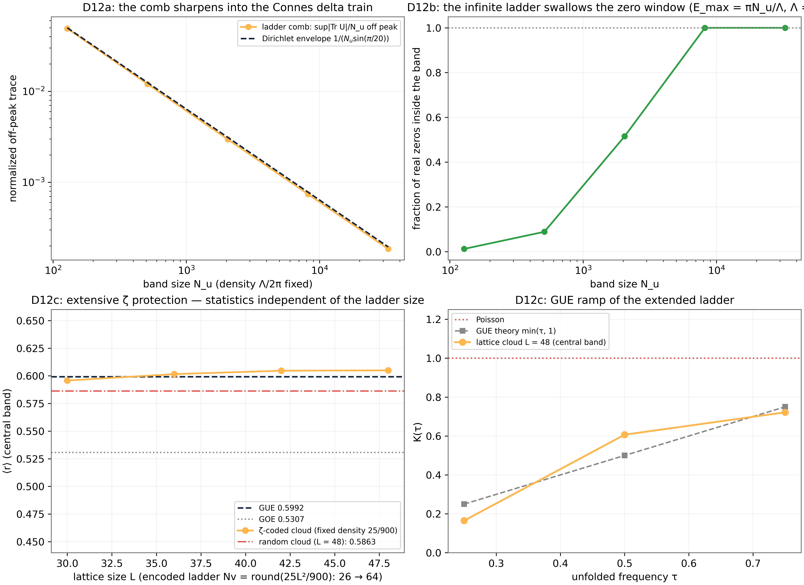

# Test D12 — The Infinite Berry–Keating Ladder: Nu → ∞ at Fixed Density

> Test D12 — delta-train peak exact to Nu = 32768; envelope 1.9×10⁻⁴; coverage 1.0; ⟨r⟩ extensive

    

---

## What this test verifies

Test D12 takes the Berry–Keating ladder of D11 to its thermodynamic limit: band size Nu → ∞ at fixed spectral density Λ/2π per unit u. The trace comb sharpens into the Connes delta train – the peak equals Nu exactly (0.0×10⁺⁰ deviation) at every band size up to Nu = 32768, while the off-peak envelope follows the closed Dirichlet form 1/(Nusin(π/20)) down to 1.9×10⁻⁴. The fixed-density staircase is an exact integer identity at every Nu (floor - ceil +1, density error ≤ 0.68 – an O(1) boundary term), and the extending band swallows the whole zero window (coverage 1.0 at Nu = 8192). On the ζ side the protection is extensive: ⟨r⟩ = 0.5958 → 0.6050 across L = 30…48 at fixed vortex density 25/900 while the encoded ladder grows 25 → 64 – the GUE value is not a finite-size accident.



## Key results (canonical run)

- Comb peak = Nu exactly (0.0×10⁺⁰) up to Nu = 32768
- Off-peak envelope: 1/(Nusin(π/20)) – numeric vs closed form 2.2×10⁻¹⁶; reaches 1.9×10⁻⁴
- Staircase integer identity exact ∀ Nu; density error ≤ 0.68 (O(1))
- Coverage 1.000 at Nu = 8192; ⟨r⟩ plateau 0.5958 → 0.6050, spread 0.0092

## Parameters and conventions

| Quantity | Value | Meaning |
|---|---|---|
| Band sizes | Nu = 64 … 32768 (powers of two) | at fixed density Λ/2π |
| Off-peak probe | u₀ = Λ/20 | first comb zero |
| Staircase | Connes ΦC(t) = (t/2π)ln(t/2π e) | integer identity audit |
| Coverage | zero window t ∈ [14.1, 2515.3] | band must swallow it |
| ζ sizes | L = 30, 36, 42, 48 at density 25/900 | Nv = 26 → 64 |

## Verdict ledger — verbatim from the canonical run

| Check | Result | Detail |
|---|---|---|
| D12a coherent peak: \|Tr U(Λ)\| = Nu exactly at every band size (≤1e-12 rel) | ✅ PASS | max dev = 0.00e+00 over Nu = [128, 512, 2048, 8192, 32768] |
| D12a comb → delta train: off-peak sup \|Tr U\|/Nu follows the Dirichlet envelope 1/(Nu·sin(π/20)) and decreases monotonically | ✅ PASS | sup/Nu: 4.9e-02 → 1.2e-02 → 3.0e-03 → 7.4e-04 → 1.9e-04 |
| D12a lattice operator agrees with the closed-form comb at the conjugation time Λ (≤1e-11) | ✅ PASS | dev = 2.23e-16 |
| D12b fixed-density staircase exact: count = floor(Λb/2π) − ceil(Λa/2π) + 1 at 3 windows × every band size | ✅ PASS | max dev = 0e+00 |
| D12b density is Nu-independent: \|count − ΛΔE/2π\| ≤ 1 (boundary term only) | ✅ PASS | max dev = 0.68 |
| D12b the extending ladder swallows the zero window: coverage monotone ↑ and = 1.0 at the largest band | ✅ PASS | coverage 1.000 at Nu = 32768 (Emax = 23288 ≥ tmax = 2515.3) |
| D12c extensive protection at fixed density: ⟨r⟩(L) within [0.585, 0.625] (GUE 0.5992) for every ladder size | ✅ PASS | L30:0.5958; L36:0.6016; L42:0.6047; L48:0.6050 |
| D12c statistics are L-independent while the encoded ladder grows (spread ≤ 0.012; Nv 25/900 law) and the GUE shift over the clean lattice is preserved (Δ ≥ +0.04) | ✅ PASS | spread = 0.0092; min Δ = +0.1175; Nv 26 → 64; random(L=48) = 0.5863 |
| D12c GUE ramp present in the extended-ladder cloud: K(0.25) < K(0.5) < K(0.75) and K(0.5) ≤ 0.85 | ✅ PASS | K: 0.165 < 0.607 < 0.722 |

## Figures (600 dpi)


*Companion panels (recomputed, canonical modules and seed): (a) the off-peak trace against the closed Dirichlet envelope across four decades; (b) the fixed-density ⟨r⟩ ladder at L = 30, 36, 42, 48 with the GUE line.*


*Canonical D12 figure (600 dpi): the delta-train sharpening and the extensive ⟨r⟩ plateau, produced by the original harness.*


## How to run

```bash
python3 code/dirac_lab_extensions3.py --test D12          # this test (FULL mode)
python3 code/dirac_lab_extensions3.py --test D12 --quick   # reduced grids (~fast)
julia code/dirac_lab_cross_ext3.jl   # independent cross-check (includes D12)
```

Full suite: `make all` regenerates the whole D1–D14 ledger; the single-test commands above reproduce exactly the artifacts in this folder (figures land here at 600 dpi).

## In this folder

| File | Content |
|---|---|
| `monograph.pdf` / `monograph.tex` | focused LaTeX monograph for this test — theory, method, results, discussion (compiled with Tectonic, source included) |
| `results.json` | machine-readable verdict ledger (this page's table is generated from it) |
| `D*.csv` | the canonical per-check data table of the run |
| `figures/` | canonical figure (regenerated by the original harness) + companion panels, all 600 dpi |

## Cross-verification and provenance

An independent Julia implementation (`code/dirac_lab_cross_ext3.jl`, LinearAlgebra only) re-derives this test's verdicts from the written conventions alone — see [results/CROSS_VERIFICATION.md](../../results/CROSS_VERIFICATION.md). All machine-precision claims reproduce at 1e-14…2e-12.

Deterministic **seed 96** (parent convention); ζ tables from the Odlyzko-derived files in [data/](../../data/) with provenance headers. Ledger matches the canonical run [results/run_20261006_full_v13](../../results/run_20261006_full_v13/REPORT.md) verbatim.

---

*Part of the [AB-Cloud Dirac Laboratory](../../README.md) — test D12 of 14. Full context: the research monograph ([EN](../../monographs/tex/Dirac_Lab_Monograph_EN.pdf) · [RU](../../monographs/tex/Dirac_Lab_Monograph_RU.pdf)) and the [per-test monograph](monograph.pdf) in this folder.*
