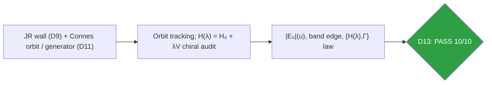
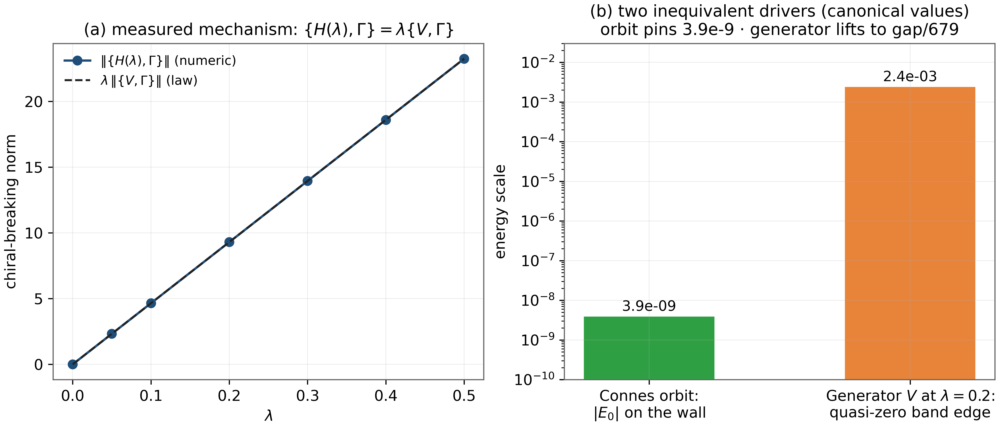
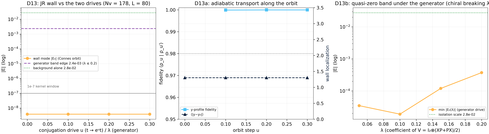

# Test D13 — The D9+D11 Pairing: the Jackiw–Rossi Wall Under the Conjugation Drive

> Test D13 — the orbit pins the wall at 3.9×10⁻⁹ constant; the generator lifts to gap/679 via measured chiral breaking

    

---

## What this test verifies

Test D13 couples the two v1.1–v1.2 constructions – the index-bearing Jackiw–Rossi wall (D9) and the Berry–Keating/Connes conjugation machinery (D11) – and discovers that two inequivalent drives hide inside the phrase ``conjugation drive''. The physical Connes orbit (t → eut moving all 178 vortices) leaves the wall mode pinned: |E₀| = 3.9×10⁻⁹ constant along u ∈ [0, 0.3], localization 1.30, profile fidelity 0.9999–1.0000, contrast 7×10⁶ at every step, {H,Γ} = 0 exact. The conjugating generator V = I₂ \otimes (XP + PX)/2 applied as a Hamiltonian term does something else entirely: it keeps the 12-state valley multiplet as an isolated quasi-zero band whose edge reaches 2.4×10⁻³ = gap/679 at λ = 0.2 – through an explicitly measured chiral-breaking law {H(λ), Γ} = λ{V, Γ} (identity exact to 0.0×10⁺⁰) with diagonal flow slope 0.0022 = gap/727. The orbit pins; the generator lifts, exactly through the chiral breaking it carries.



## Key results (canonical run)

- Orbit drive: |E₀| = 3.9×10⁻⁹ constant, fidelity 0.9999, contrast 7×10⁶
- {H, Γ} = 0 exact along the orbit
- Generator drive: band edge 2.4×10⁻³ = gap/679 at λ = 0.2, isolation ≥ 10×
- Chiral-breaking law: {H(λ),Γ} = λ{V,Γ} exact to 0.0×10⁺⁰; diagonal slope gap/727

## Parameters and conventions

| Quantity | Value | Meaning |
|---|---|---|
| Orbit | u ∈ [0, 0.3], 178 vortices re-coded | physical Connes family |
| Wall | D9 construction verbatim | m₀ = 0.8, w = 2.0 |
| Generator | V = I₂\otimes(XP+PX)/2, edge-completed | Hermitian to 0.0×10⁺⁰ |
| Coupling | λ ∈ [0, 0.2] | quasi-zero band tracking |
| Seed | 96 | deterministic |

## Verdict ledger — verbatim from the canonical run

| Check | Result | Detail |
|---|---|---|
| D13a wall mode pinned along the whole Connes orbit: |E₀| ≤ 1e-7 at every u | ✅ PASS | u=0.00:3.9e-09 u=0.10:3.9e-09 u=0.20:3.9e-09 u=0.30:3.9e-09 |
| D13a localization on the wall preserved: ⟨|y−y₀|⟩ ≤ 3.5 | ✅ PASS | 1.30 1.30 1.30 1.30 (w = 2.0) |
| D13a adiabatic transport: y-profile fidelity ≥ 0.98 between successive orbit steps | ✅ PASS | 0.9999 1.0000 1.0000 |
| D13a index contrast along the orbit: background-alone min|E| ≥ 100 × wall |E₀| at every u | ✅ PASS | 7e+06 7e+06 7e+06 7e+06 |
| D13a chiral skeleton exact on the whole orbit: {H,Γ} = 0 | ✅ PASS | 0.0e+00 0.0e+00 0.0e+00 0.0e+00 |
| D13a valley multiplet fully present at every u: nkernel(|E|<1e-7) ≥ 12 | ✅ PASS | 12 12 12 12 (k = 12 window) |
| D13b valley multiplet survives the generator drive as an isolated quasi-zero band: the 12 lowest states have band edge ≤ gap/300 at every λ ≤ 0.2 (edge scales ∝ λ) | ✅ PASS | max band edge = 2.36e-03 = gap/679 |
| D13b isolation from the background: control min|E| ≥ 8 × band edge at every λ | ✅ PASS | control 2.76e-02 vs band 2.36e-03 (min ratio 1e+01) |
| D13b the lifting mechanism is explicit chiral breaking: ‖{H(λ),Γ} − λ{V,Γ}‖ ≤ 1e-12 (identity), i.e. the orbit drive (chiral-preserving) pins at 1e-8 while the generator lifts only to λ-scale | ✅ PASS | max dev = 0.0e+00 |
| D13b vanishing diagonal flow: |d|E₀|/dλ| ≤ 0.05 = gap/32 (⟨V⟩ = 0 for the symmetric wall mode) | ✅ PASS | slope = 0.0022, R² = 0.774 |

## Figures (600 dpi)


*Companion panels (recomputed at 48×48): (a) the chiral-breaking law ‖{H(λ),Γ}‖ = λ‖{V,Γ}‖ point by point; (b) the two canonical driver scales on a log axis.*


*Canonical D13 figure (600 dpi): the pinned wall along the orbit and the generator-driven band edge, produced by the original harness.*


## How to run

```bash
python3 code/dirac_lab_extensions3.py --test D13          # this test (FULL mode)
python3 code/dirac_lab_extensions3.py --test D13 --quick   # reduced grids (~fast)
julia code/dirac_lab_cross_ext3.jl   # independent cross-check (includes D13)
```

Full suite: `make all` regenerates the whole D1–D14 ledger; the single-test commands above reproduce exactly the artifacts in this folder (figures land here at 600 dpi).

## In this folder

| File | Content |
|---|---|
| `monograph.pdf` / `monograph.tex` | focused LaTeX monograph for this test — theory, method, results, discussion (compiled with Tectonic, source included) |
| `results.json` | machine-readable verdict ledger (this page's table is generated from it) |
| `D*.csv` | the canonical per-check data table of the run |
| `figures/` | canonical figure (regenerated by the original harness) + companion panels, all 600 dpi |

## Cross-verification and provenance

An independent Julia implementation (`code/dirac_lab_cross_ext3.jl`, LinearAlgebra only) re-derives this test's verdicts from the written conventions alone — see [results/CROSS_VERIFICATION.md](../../results/CROSS_VERIFICATION.md). All machine-precision claims reproduce at 1e-14…2e-12.

Deterministic **seed 96** (parent convention); ζ tables from the Odlyzko-derived files in [data/](../../data/) with provenance headers. Ledger matches the canonical run [results/run_20261006_full_v13](../../results/run_20261006_full_v13/REPORT.md) verbatim.

---

*Part of the [AB-Cloud Dirac Laboratory](../../README.md) — test D13 of 14. Full context: the research monograph ([EN](../../monographs/tex/Dirac_Lab_Monograph_EN.pdf) · [RU](../../monographs/tex/Dirac_Lab_Monograph_RU.pdf)) and the [per-test monograph](monograph.pdf) in this folder.*
