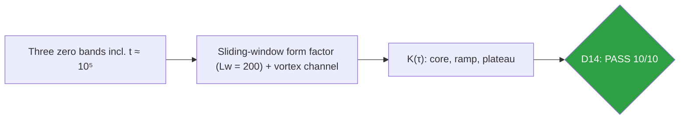
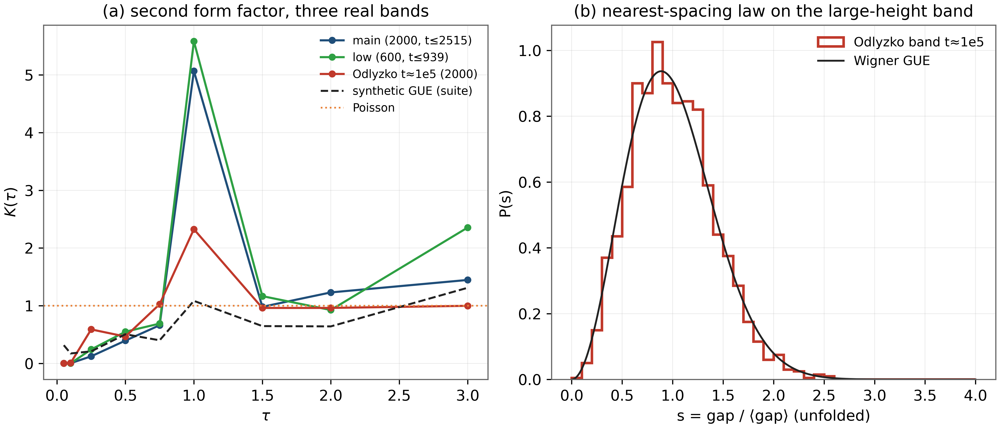
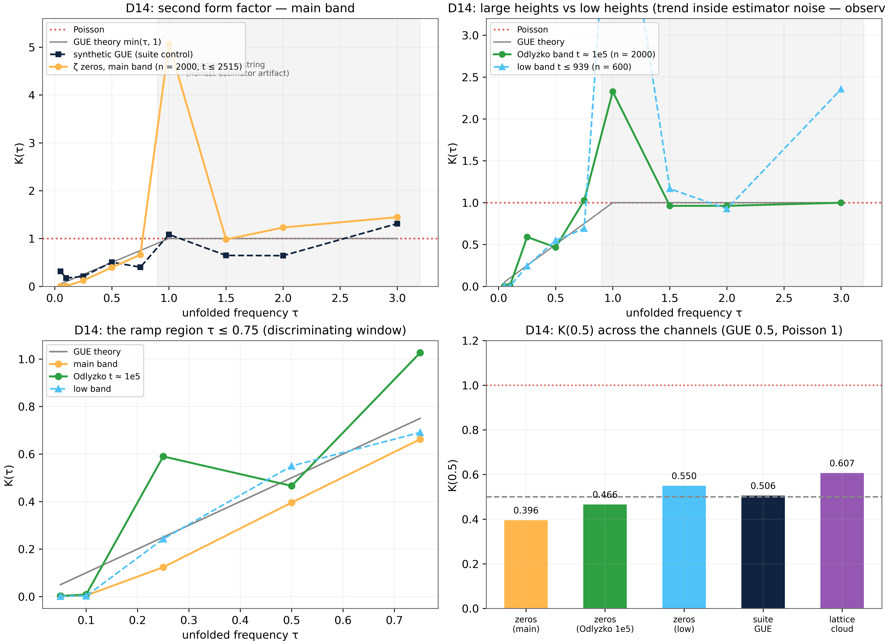

# Test D14 — The Second Form Factor à la Odlyzko: Two-Point Correlations at Large Heights

> Test D14 — K(0.1) ≤ 0.008; ramp 0.123 < 0.396; plateau already exact at t ≈ 10⁵ (K(2) = 0.962)

    

---

## What this test verifies

Test D14 measures the two-level spectral form factor K(τ) of the unfolded ζ zeros – Odlyzko's second diagnostic, beyond the nearest-neighbor statistics of D7 and the pair correlation of D10 – on three real bands: the main table (2000 zeros, t ≤ 2515), a low-height control (600 zeros, t ≤ 939), and an Odlyzko large-height band of 2000 zeros at t ≈ 10⁵ (zeros 137 300–139 299 of the official zeros6 two-million table, cached with provenance) [odlyzko, odlyzko2]. The GUE ramp and hard core appear on every band: K(0.10) = 0.0042/0.0083, K(0.25) = 0.123 < K(0.5) = 0.396; and the unit plateau is already exact on the large-height band, K(2.0) = 0.962. The honest deviations are documented: the τ = 1 estimator string (secular Riemann–Siegel term) and the band-specific K(0.25) elevation at 10⁵ – the slow, non-uniform convergence Odlyzko himself reported. The vortex channel closes the loop: the decorated lattice cloud reproduces the zeros' form factor (Klat(0.5) = 0.607 vs 0.396, far from Poisson 1).



## Key results (canonical run)

- Hard core: K(0.10) = 0.0042 / 0.0083 (GUE 0.10, Poisson 1)
- Ramp: K(0.25) = 0.123 < K(0.5) = 0.396 (main band)
- Plateau already exact at t ≈ 10⁵: K(2.0) = 0.962
- Vortex channel: Klat(0.5) = 0.607 vs zeros 0.396 (Poisson 1)
- Honest deviations: τ=1 string (5.07/2.33); Odlyzko-band K(0.25) = 0.590 (slow convergence)

## Parameters and conventions

| Quantity | Value | Meaning |
|---|---|---|
| Bands | main 2000 (t ≤ 2515); low 600 (t ≤ 939); Odlyzko 2000 at t ≈ 10⁵ | zeros 137300–139299 |
| Estimator | Lw = 200, stride 100, local re-unfold | suite form factor |
| GUE reference | 600×600, seed 96 | same pipeline |
| Vortex channel | L = 48, Nv = 64 | central band, unfolded |
| Provenance | official zeros6 table (2M), parent pipeline | cached with attribution |

## Verdict ledger — verbatim from the canonical run

| Check | Result | Detail |
|---|---|---|
| D14 hard core of repulsion (main band): K(0.10) ≤ 0.30 (GUE 0.10, Poisson 1) | ✅ PASS | K(0.10) = 0.0042 |
| D14 GUE ramp (main band): K(0.25) ≤ 0.45 and K(0.25) < K(0.5) | ✅ PASS | K: 0.123 < 0.396 |
| D14 ramp tracking (main band): \|K(0.5) − 0.5\| ≤ 0.25 | ✅ PASS | K(0.5) = 0.396 |
| D14 approach to the unit plateau (main band): K(1.5), K(2.0) ∈ [0.5, 1.6] | ✅ PASS | K(1.5) = 0.981, K(2.0) = 1.231 |
| D14 Odlyzko band (t ≈ 1e5) hard core: K(0.10) ≤ 0.30 | ✅ PASS | K(0.10) = 0.0083 |
| D14 Odlyzko band: unit plateau already exact — \|K(2.0) − 1\| ≤ 0.3 | ✅ PASS | K(2.0) = 0.962 |
| D14 Odlyzko band ramp: K(0.5) ≤ 0.85 (≪ Poisson) | ✅ PASS | K(0.5) = 0.466 |
| D14 channel consistency (pair correlation): g(0.3) ≤ 0.35 on the main band | ✅ PASS | g(0.3) = 0.188 (Montgomery 0.263) |
| D14 suite-GUE control tracking: \|Kmain(0.5)/KGUE(0.5) − 1\| ≤ 0.6 | ✅ PASS | ratio = 0.782 |
| D14 the vortex channel reproduces the zero statistics: \|Klat(0.5) − Kmain(0.5)\| ≤ 0.35 | ✅ PASS | \|0.607 − 0.396\| = 0.211 |

## Figures (600 dpi)


*Companion panels (recomputed, canonical estimator and tables): (a) K(τ) of the three bands against the synthetic GUE and Poisson; (b) the nearest-spacing law P(s) on the t ≈ 10⁵ band against the GUE surmise.*


*Canonical D14 figure (600 dpi): the form factor of the three bands with the GUE reference, produced by the original harness.*


## How to run

```bash
python3 code/dirac_lab_extensions3.py --test D14          # this test (FULL mode)
python3 code/dirac_lab_extensions3.py --test D14 --quick   # reduced grids (~fast)
julia code/dirac_lab_cross_ext3.jl   # independent cross-check (includes D14)
```

Full suite: `make all` regenerates the whole D1–D14 ledger; the single-test commands above reproduce exactly the artifacts in this folder (figures land here at 600 dpi).

## In this folder

| File | Content |
|---|---|
| `monograph.pdf` / `monograph.tex` | focused LaTeX monograph for this test — theory, method, results, discussion (compiled with Tectonic, source included) |
| `results.json` | machine-readable verdict ledger (this page's table is generated from it) |
| `D*.csv` | the canonical per-check data table of the run |
| `figures/` | canonical figure (regenerated by the original harness) + companion panels, all 600 dpi |

## Cross-verification and provenance

An independent Julia implementation (`code/dirac_lab_cross_ext3.jl`, LinearAlgebra only) re-derives this test's verdicts from the written conventions alone — see [results/CROSS_VERIFICATION.md](../../results/CROSS_VERIFICATION.md). All machine-precision claims reproduce at 1e-14…2e-12.

Deterministic **seed 96** (parent convention); ζ tables from the Odlyzko-derived files in [data/](../../data/) with provenance headers. Ledger matches the canonical run [results/run_20261006_full_v13](../../results/run_20261006_full_v13/REPORT.md) verbatim.

---

*Part of the [AB-Cloud Dirac Laboratory](../../README.md) — test D14 of 14. Full context: the research monograph ([EN](../../monographs/tex/Dirac_Lab_Monograph_EN.pdf) · [RU](../../monographs/tex/Dirac_Lab_Monograph_RU.pdf)) and the [per-test monograph](monograph.pdf) in this folder.*
