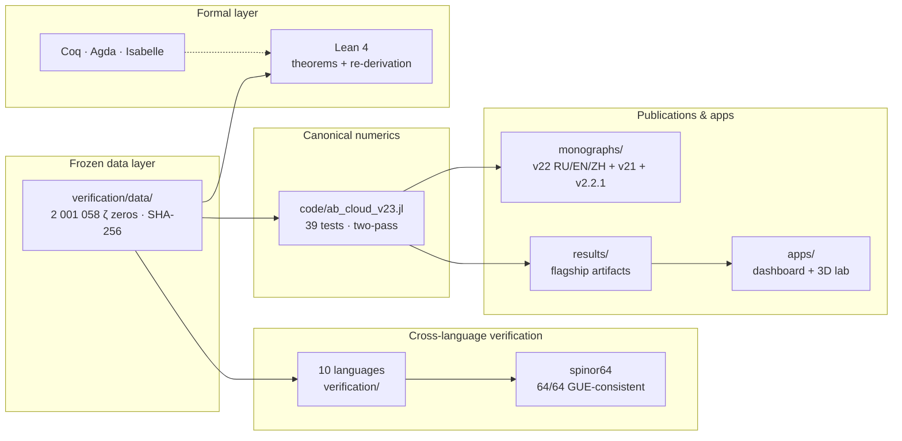

# Repository map

One page, the whole tree: what lives where, and which document explains it.
Every folder carries its own README with deeper detail.

## The pipeline

## The tree

| Path | What lives there | Read this |
|------|------------------|-----------|
| `code/` | the canonical Julia suite (v23, 39 tests), RH sweep benches, the H-P audit battery | [`code/README.md`](https://github.com/wild8highlander/ab-cloud-research/blob/main/code/README.md) |
| `code/julia/` | the v23 provenance copy + version lineage notes | [`code/julia/README.md`](https://github.com/wild8highlander/ab-cloud-research/blob/main/code/julia/README.md) |
| `verification/` | the 10-language cross-verification suite, spinor64, ζ datasets, per-section micro-verifications | [`verification/README.md`](https://github.com/wild8highlander/ab-cloud-research/blob/main/verification/README.md) |
| `formal/` | **the formal layer** — Lean 4 (theorems + executable), Coq, Agda, Isabelle/HOL, all dependency-free | [`formal/README.md`](formal.md) |
| `formal/lean4/` | the flagship Lean project: exact layer, numeric port, `abcloud-verify` executable | [`formal/lean4/ABCloud/README.md`](https://github.com/wild8highlander/ab-cloud-research/blob/main/formal/lean4/ABCloud/README.md) |
| `Hilbert_Polya/` | the Hilbert–Pólya bridge subproject: campaigns C1–C8, theorems T1–T10, monograph volumes | [`Hilbert_Polya/README.md`](https://github.com/wild8highlander/ab-cloud-research/blob/main/Hilbert_Polya/README.md) |
| `monographs/` | five monograph editions (v22 RU/EN/ZH + original v21 RU/EN) + v2.2.1 corrections, 600-dpi figure apparatus | [`monographs/README.md`](https://github.com/wild8highlander/ab-cloud-research/blob/main/monographs/README.md) |
| `lab-3d/` | the 3D lattice laboratory: code, committed outputs, preprint bundle | [`lab-3d/README.md`](https://github.com/wild8highlander/ab-cloud-research/blob/main/lab-3d/README.md) |
| `dirac-lab/` | the Dirac laboratory: D1–D14 ledger, 96 checks, all PASS | [`dirac-lab/README.md`](https://github.com/wild8highlander/ab-cloud-research/blob/main/dirac-lab/README.md) |
| `Vortex_optimization/` | the Test 34-ext vortex-density optimization study (best D = 0.0318) | [`Vortex_optimization/README.md`](https://github.com/wild8highlander/ab-cloud-research/blob/main/Vortex_optimization/README.md) |
| `Wave_attractors/` | the hyperbolic wave-attractors reproduction study (W1) | [`Wave_attractors/README.md`](https://github.com/wild8highlander/ab-cloud-research/blob/main/Wave_attractors/README.md) |
| `meridian-spectral-observatory/` | 24 standalone Julia spectral benches | [`meridian-spectral-observatory/README.md`](https://github.com/wild8highlander/ab-cloud-research/blob/main/meridian-spectral-observatory/README.md) |
| `apps/` | the React dashboard and the WebGL 3D laboratory (with prebuilt bundles) | [`apps/README.md`](https://github.com/wild8highlander/ab-cloud-research/blob/main/apps/README.md) |
| `results/` | the flagship run artifacts (453 files, 39 directories) + reference logs | [`results/README.md`](https://github.com/wild8highlander/ab-cloud-research/blob/main/results/README.md) |
| `docs/` | this MkDocs Material site | [`docs/README.md`](https://github.com/wild8highlander/ab-cloud-research/blob/main/docs/README.md) |
| `assets/` | the repo banner and shared art | [`assets/README.md`](https://github.com/wild8highlander/ab-cloud-research/blob/main/assets/README.md) |
| `.github/` | the nine CI workflows, templates, dependabot, labeler | [`.github/WORKFLOWS.md`](https://github.com/wild8highlander/ab-cloud-research/blob/main/.github/WORKFLOWS.md) |

## The one rule

**Every arrow in the pipeline reads the same frozen dataset.** The Julia
canon, the ten ports and the formal layer never re-download or regenerate
the ζ zeros — so a disagreement between any two boxes is immediately
visible rather than hidden by different inputs.
