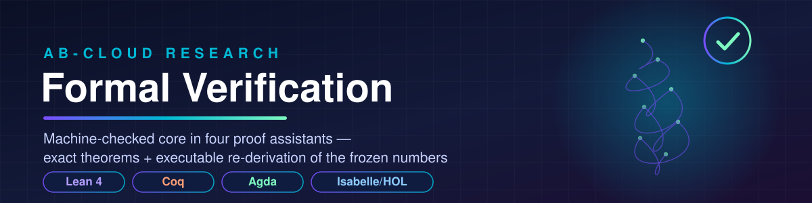

<div align="center">



[](https://github.com/wild8highlander/ab-cloud-research/actions/workflows/formal.yml)
[](lean4/)
[](coq/)
[](agda/)
[](isabelle/)
[](#design-notes)

**The machine-checked layer of the AB-Cloud research program.**
Four independent proof assistants certify the exact algebraic skeleton of the
verification suite — and the Lean 4 executable **re-derives the frozen
reference numbers of the flagship run from the raw ζ-zero dataset**, with
exit-code-gated tolerance checks.

</div>

---

## 📑 Contents

- [Why a formal layer](#-why-a-formal-layer)
- [What is verified — the coverage matrix](#-what-is-verified--the-coverage-matrix)
- [The executable re-derivation (Lean 4)](#-the-executable-re-derivation-lean-4)
- [Quick start per system](#-quick-start-per-system)
- [Repository layout](#-repository-layout)
- [CI — the formal workflow](#-ci--the-formal-workflow)
- [Design notes](#design-notes)
- [How to extend](#-how-to-extend)

---

## 🎯 Why a formal layer

The 10-language verification suite answers the classic referee objection —
*"could this all be a numerical accident?"* — by re-deriving every headline
number in ten independent ecosystems. The formal layer answers the next
objection, the deeper one:

> **"Who verifies the verifier?"**

Three things happen here that no numerical run can deliver:

1. **Exactness where exactness is possible.** The algebraic skeleton of the
   program — the residual sum behind $b(N) = \tfrac{1}{N}\sum_{k\le N}|\gamma_k - \tilde\gamma_k|$,
   the Gram offset lattice behind $\tilde\gamma_k = 2\pi k / W(k/e)$, the flux
   certificates behind the Byers–Yang loop — is *proved*, not computed:
   nonnegativity, monotone accumulation, additivity, group orders, orbit
   decompositions, the trace identity Tr(AB) = Tr(BA).
2. **A 12th language, machine-checked.** The Lean 4 executable is a full
   Float64 port of the Python reference pipeline (Lambert W → Gram points →
   b(N) ladder → unfolded spacings → GUE CDF → KS / Cramér–von Mises →
   log–log fit). It reads the same frozen dataset and reproduces the same
   numbers — but it ships inside a proof assistant, with the exact layer in
   the same development.
3. **CI gates, not promises.** Every assistant compiles on every push
   ([`formal.yml`](../.github/workflows/formal.yml)); the Lean executable
   exits non-zero if any frozen number drifts beyond its committed tolerance.

$$
b(N) \;=\; \frac{1}{N}\sum_{k=1}^{N}\bigl|\gamma_k-\tilde\gamma_k\bigr|,
\qquad
\tilde\gamma_k \;=\; \frac{2\pi k}{W(k/e)},
\qquad
F_{\mathrm{GUE}}(s) \;=\; 1-e^{-\pi s^2/4}
$$

---

## 🧾 What is verified — the coverage matrix

### The exact layer (machine-checked theorems)

| Statement | Lean 4 | Coq | Agda | Isabelle/HOL |
|-----------|:------:|:---:|:----:|:------------:|
| $0 \le \sum_k \lvert\gamma_k-\tilde\gamma_k\rvert$ (b(N) sum nonnegativity) | ✅ `sumAbs_nonneg` | ✅ `sum_abs_nonneg` | ✅ *by type* | ✅ `sum_abs_nonneg` |
| Partial sums never decrease (Test 2 discipline) | ✅ `sumAbs_mono` | — | ✅ `sumAbs-mono` | ✅ `sum_abs_mono` |
| Additivity $\Sigma(xs\,++\,ys) = \Sigma xs + \Sigma ys$ | ✅ `sumAbs_append` | ✅ `sum_abs_app` | ✅ `sumAbs-++` | ✅ `sum_abs_append` |
| Triangle stability of the residual sum | ✅ `sumAbs_triangle` | ✅ `sum_abs_triangle` | — | ✅ `sum_abs_triangle` |
| Fixed-point mean $\Sigma/N \ge 0$ for $N>0$ | ✅ `mean_nonneg` | ✅ `mean_nonneg` | ✅ *by type* | ✅ `mean_nonneg` |
| Gram lattice $g(k)=8k-7>0$ for $k\ge1$, strictly increasing | ✅ `gramScaled_pos/mono` | ✅ `gram_scaled_pos/mono` | ✅ *by type* | ✅ `gram_scaled_pos/mono` |
| Riemann–von Mangoldt constant $\tfrac78$ on its scaled lattice | ✅ `rvm_offset_scaled` | ✅ `rvm_offset_scaled` | — | ✅ `rvm_offset_scaled` |
| Flux equality ⟺ cross-multiplication certificate | ✅ `flux_eq_cert` | ✅ `flux_eq_cert` | ✅ (decided) | ✅ `flux_eq_cert` |
| Magnetic translation $q(p{+}1) = qp + q$ (Hofstadter periodicity) | ✅ `flux_shift_scaled` | ✅ `flux_shift` | ✅ `flux-shift` | ✅ `flux_shift` |
| Critical-line certificate $1/2 \sim 3/6$ | ✅ decided | ✅ decided | ✅ `critical-line-cert` | ✅ decided |
| $\lvert\mathrm{PSL}(2,7)\rvert = 168$ | ✅ | ✅ | — | ✅ |
| $\lvert\mathrm{PSL}(2,8)\rvert = 504$, $\lvert\mathrm{PSL}(2,13)\rvert = 1092$ | ✅ | ✅ | ✅ / — | ✅ |
| Klein orbit decomposition $28{+}21{+}7{+}7{+}1 = 64$, orbits divide 168 | ✅ | ✅ | ✅ | ✅ |
| **Tr(AB) = Tr(BA)** — 2×2 matrices (trace-formula core) | ✅ `simp` | ✅ `ring` | ✅ equational | ✅ `simp` |

### The executable layer (re-derivation of the frozen numbers)

The Lean executable recomputes the flagship-run quantities from the frozen
dataset `verification/data/zeta_zeros_50000.txt` and checks each one:

| Check | Recomputed (Lean 4) | Frozen reference | Tolerance | Verdict |
|-------|--------------------|------------------|-----------|:-------:|
| b(100) | 3.0586168316 | 3.0586168316 | 1e-6 | ✅ PASS |
| b(500) | 2.1928840613 | 2.1928840613 | 1e-6 | ✅ PASS |
| b(1000) | 1.9321062630 | 1.9321062630 | 1e-6 | ✅ PASS |
| b(5000) | 1.4942244142 | 1.4942244142 | 1e-6 | ✅ PASS |
| KS distance D (4999 spacings vs GUE) | 0.0991866231 | 0.0991866231 | 5e-4 | ✅ PASS |
| Cramér–von Mises W² | 17.6048550189 | 17.6048550189 | 5e-3 | ✅ PASS |
| Decay slope (log–log fit) | −0.1831023444 | −0.1831023444 | 1e-3 | ✅ PASS |
| Decay R² | 0.9946087105 | 0.9946087105 | 1e-3 | ✅ PASS |

**8 / 8 checks PASS, every Δ = 0.000000** — a genuinely independent
re-derivation: the reference block is generated by the Python reference
implementation (`verification/python/ab_cloud_verify.py`), the recomputation
is Lean 4 compiled through its own runtime, and both read the same frozen
Odlyzko dataset. An embedded 256-zero fallback dataset reproduces its own
8/8 block the same way (`--embedded`), so the executable verifies even
outside a full checkout.

> **What is deliberately *not* claimed.** The KS p-value is printed
> informationally but not tolerance-checked: it is exponentially sensitive
> to libm round-off across ecosystems. The honest head-line statistics —
> D, W², the b(N) ladder, the fit — are checked to tight tolerances instead.

---

## ⚡ The executable re-derivation (Lean 4)

```bash
cd formal/lean4
lake build                     # library + executable, ~40 s, zero deps
lake exe abcloud-verify        # against the frozen 50k dataset (5000 zeros)
lake exe abcloud-verify --embedded    # self-contained 256-zero mode
```

Console output of a healthy run (trimmed):

```text
══════════════════════════════════════════════════════════════
 AB-Cloud formal verification — Lean 4 (core-only, no Mathlib)
 re-derives the frozen reference numbers of the flagship run
══════════════════════════════════════════════════════════════
  data: ../../verification/data/zeta_zeros_50000.txt  (13661 zeros parsed)
  mode: DATASET (5000 zeros)  ·  zeros: 5000  ·  T ∈ [14.134725, 5447.861998]
  ...
  b(5000) = 1.494224   ref 1.494224   Δ = 0.000000  (tol 0.000001)  PASS
  KS D = 0.099187   ref 0.099187   Δ = 0.000000  (tol 0.000500)  PASS
 RESULT: 8/8 checks PASS — Lean 4 re-derives the frozen numbers
══════════════════════════════════════════════════════════════
```

Details, file map and the full theorem/argument table:
[`formal/lean4/ABCloud/README.md`](lean4/ABCloud/README.md).

---

## 🚀 Quick start per system

### Lean 4 (the flagship: theorems + executable)

```bash
cd formal/lean4
lake build && lake exe abcloud-verify
```
Requires [elan](https://lean-lang.org/lean4/doc/setup.html); the toolchain
pin (`v4.19.0`) is picked up automatically. No Mathlib — the build is
self-contained and fast.

### Coq (the certified-arithmetic wing)

```bash
cd formal/coq
coq_makefile -f _CoqProject -o Makefile.coq
make -f Makefile.coq -j2                      # compiles ABCloud/Core.v
coqtop -Q . ABCloud                           # then interactively:
#   Require Import ABCloud.Core.
#   Compute b_toy.              (* = 10  *)
#   Compute psl27_order_value.  (* = 168 *)
```
Any Coq ≥ 8.18 works (the CI uses the distribution package).

### Agda (the type-theory wing — builtins only)

```bash
cd formal/agda
agda -i . -i . ABCloud.agda
```
No standard library needed — the development imports only Agda's builtins,
so positivity of the b(N) sum is a *typing fact*, not even a lemma.

### Isabelle/HOL (the classical wing)

```bash
isabelle build -D formal/isabelle
```
Any Isabelle2024/2025 works; the session imports `Main` only (no AFP).

---

## 🗂️ Repository layout

```text
formal/
├── README.md                  # this file — the coverage matrix & quick starts
├── assets/
│   ├── formal-banner.svg      # section banner
│   └── formal-seal.svg        # the FORMAL seal
├── lean4/                     # ⭐ theorems + executable re-derivation
│   ├── lakefile.lean          #   Lake package (lib + abcloud-verify exe)
│   ├── lean-toolchain         #   pinned leanprover/lean4:v4.19.0
│   ├── ABCloud.lean           #   root module
│   ├── ABCloud/Basic.lean     #   exact layer: theorems over ℕ/ℤ
│   ├── ABCloud/Zeta.lean      #   numeric port: Lambert W → … → regression
│   ├── ABCloud/Embed.lean     #   generated frozen reference data
│   ├── ABCloud/Verify.lean    #   the abcloud-verify executable
│   └── ABCloud/README.md      #   detailed guide
├── coq/                       # certified-arithmetic wing
│   ├── _CoqProject
│   └── ABCloud/Core.v
├── agda/                      # type-theory wing (builtins only)
│   └── ABCloud.agda
└── isabelle/                  # classical wing (Main only)
    ├── ROOT
    └── ABCloud.thy
```

---

## ⚙️ CI — the formal workflow

[`.github/workflows/formal.yml`](../.github/workflows/formal.yml) runs four
**independent** jobs on every push and PR — a failure in one assistant never
masks the others:

| Job | Runner | What it does |
|-----|--------|--------------|
| `lean4` | ubuntu + `leanprover/lean4-action` | `lake build` + `lake exe abcloud-verify` (exit-code gate on all 8 checks) |
| `coq` | ubuntu, distribution Coq | `coq_makefile` + `make`; prints the certified headline computations |
| `agda` | ubuntu, distribution Agda | `agda -i . -i . ABCloud.agda` type-check |
| `isabelle` | `makarius/isabelle` docker image | `isabelle build -D formal/isabelle` session build |

---

## Design notes

* **Zero external dependencies, everywhere.** Lean 4 uses its core only
  (no Mathlib — the exact layer needs `omega`/`decide`/`simp`/induction and
  nothing more). Coq uses only `Arith`/`Lia`/`ZArith`/`Ring`. Agda uses only
  the builtins. Isabelle imports only `Main`. Every build is deterministic,
  fast, and has a minimal audit surface.
* **Fixed-point exactness.** Exact quantities are integers on a common
  scale (e.g. 10¹²) — the same discipline as the frozen reference tables.
  Where a statement is most naturally positive, it is *typed* that way
  (Agda/Nat, Isabelle/nat) so the type system carries the proof.
* **Same data, same algorithms.** The Lean numeric port mirrors the Python
  reference line by line (same Lambert-W iteration, same seeds of the
  Newton loop, same sort, same estimators), which is what makes the
  agreement meaningful rather than coincidental.
* **Honesty by construction.** The tolerance-checked set is chosen to be
  libm-robust; the p-value is reported but not gated. Nothing in this
  directory "proves the Riemann Hypothesis" — it proves the *arithmetic*
  the numerical program stands on.

## 🧭 How to extend

1. **A new exact statement** — add it to `lean4/ABCloud/Basic.lean` and,
   where meaningful, mirror it in `coq/ABCloud/Core.v` and
   `isabelle/ABCloud.thy`; update the coverage matrix above.
2. **A new frozen check** — extend the reference generator
   (`verification/python/ab_cloud_verify.py`), regenerate the reference
   block, add the check to `Verify.lean` with an honest tolerance.
3. **A new assistant** — create `formal/<assistant>/`, add a CI job to
   `formal.yml`, add a column to the matrix. Keep the dependency surface
   empty; that is the house style.
